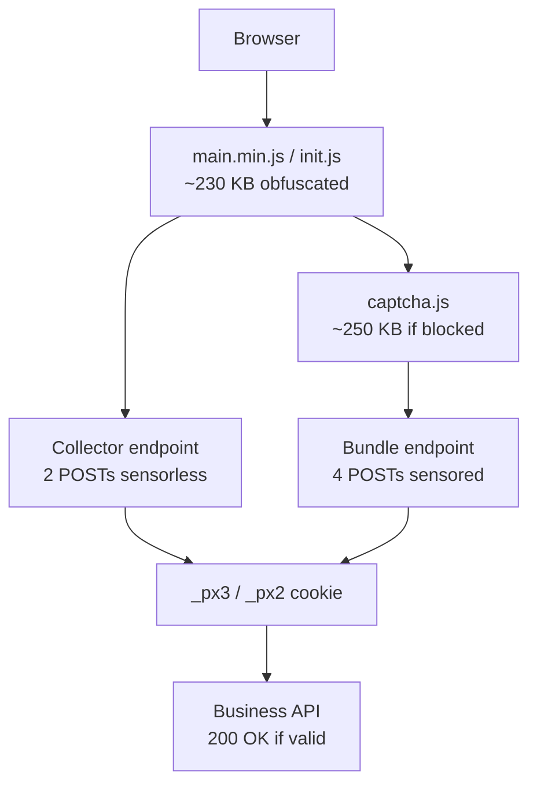
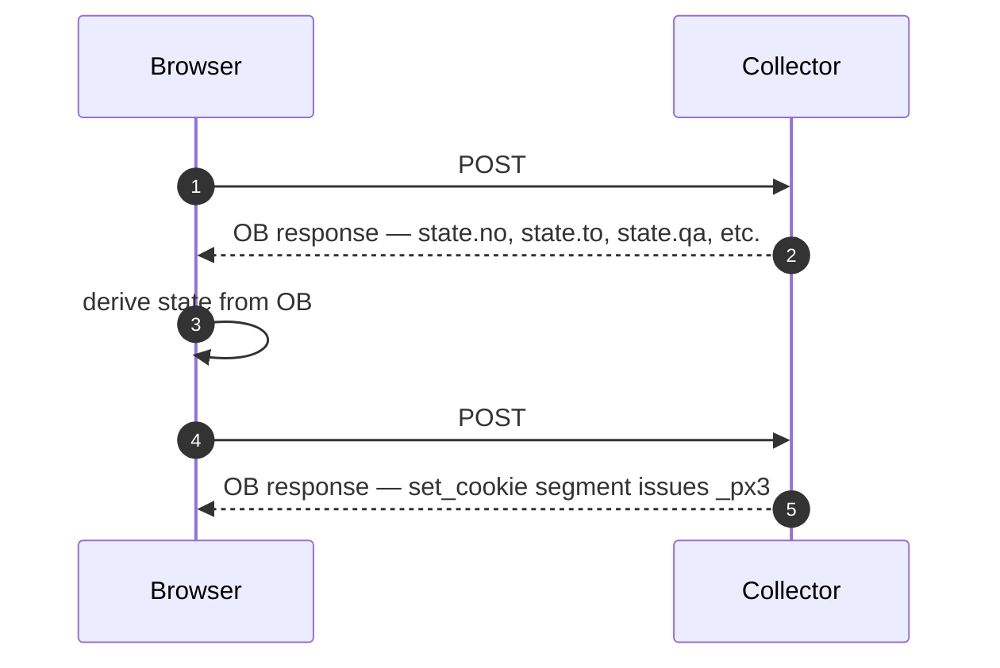
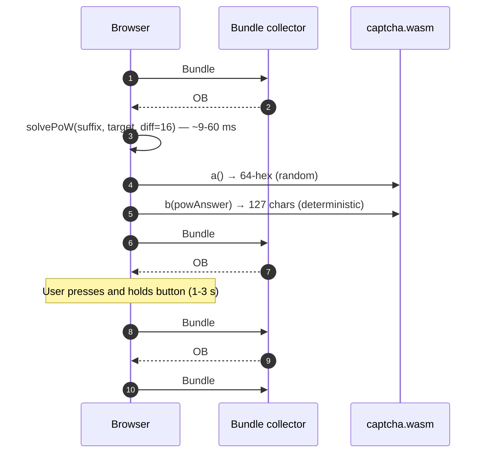

# PerimeterX SDK — Reverse Engineering Technical Reference

> **Version**: 2026-05-20 · **Scope**: PerimeterX (HUMAN Security) JavaScript SDK
> · **Coverage**: Both **sensorless collector** and **sensored bundle** (press
> challenge) paths · **Validated**: 10/10 against live iFood (`_px3`) and
> Grubhub (`_px2`).

---

## Table of Contents

1. [Executive summary](#1-executive-summary)
2. [System architecture](#2-system-architecture)
3. [Defense layers](#3-defense-layers)
4. [Sensorless collector path](#4-sensorless-collector-path)
5. [Sensored bundle path](#5-sensored-bundle-path)
6. [Algorithm primitives](#6-algorithm-primitives)
7. [Wire protocol grammar](#7-wire-protocol-grammar)
8. [EV1 and EV2 field structures](#8-ev1-and-ev2-field-structures)
9. [OB response decoding](#9-ob-response-decoding)
10. [Obfuscation engine (hP/hM/hQ)](#10-obfuscation-engine-hphmhq)
11. [Cookie format](#11-cookie-format)
12. [Per-platform constants](#12-per-platform-constants)
13. [Production gotchas](#13-production-gotchas)
14. [Reverse engineering methodology](#14-reverse-engineering-methodology)
15. [Cross-platform porting](#15-cross-platform-porting)
16. [SDK drift response](#16-sdk-drift-response)
17. [Security implications](#17-security-implications)

---

## 1. Executive summary

PerimeterX (rebranded **HUMAN Security** in 2022) is a leading anti-bot
vendor protecting e-commerce, food delivery, ticketing, and SaaS sites. Its
client-side JavaScript SDK gates business APIs by issuing a cryptographic
cookie (`_px3` for v3, `_px2` for v2) that downstream services must accept.

PX operates in **two modes**:

| Mode | Trigger | Cost | Volume |
|---|---|---|---|
| **Sensorless** | Default | 2 POSTs, ~300 ms | ~99 % of sessions |
| **Sensored bundle** | Bot-score threshold | 4 POSTs + WASM + press challenge, ~3 s | Suspicious sessions |

This document is a complete technical reference for both modes. It is the
result of 100+ hours of reverse engineering against two production
deployments (iFood, Grubhub). Every constant, algorithm, and gotcha has
been validated against captured live traffic.

### What you'll learn

- The 10 cryptographic / data-encoding primitives PX combines
- The two-stage (sensorless) and four-stage (bundle) wire protocols
- How to decode an arbitrary captured `payload=` parameter byte-for-byte
- How to extract per-platform constants from a fresh SDK build
- How the obfuscation engine (hP/hM/hQ, base91, array rotation) works and
  how to defeat it cross-version
- 19 specific production gotchas, each with symptom + root cause + fix
- A 7-stage methodology for reversing a fresh PX deployment from scratch

### What it does not cover

- iOS/Android SDKs (different code, similar concept)
- Server-side risk scoring (not visible client-side)
- Defenses upstream of PX (Cloudflare, Akamai BMP) — those are separate

---

## 2. System architecture



### The three phases of a session

| Phase | What happens | Where |
|---|---|---|
| **1. SDK delivery** | Browser fetches `main.min.js` from PX CDN | Edge CDN |
| **2. Collector handshake** | SDK posts encrypted fingerprint to collector, receives OB-encoded state | Collector |
| **3. Business API access** | Browser sends business request with `_px3` cookie attached | Customer servers |

The bot-detection work happens in Phase 2. Phase 1 is just code delivery.
Phase 3 is the user-facing result.

### Two AppIDs

PerimeterX assigns each customer an **App ID** (e.g. `PXO1GDTa7Q` for
iFood, `PXO97ybH4J` for Grubhub). Inside `captcha.js`, a **second AppID**
is dynamically learned from Bundle #1's OB response (e.g.
`PXd6f03jmq8h6c7382req0` for iFood bundle). The two App IDs route through
different collector paths.

---

## 3. Defense layers

PX layers six defenses around cookie issuance. None alone is hard to beat;
the combination raises adversary cost.

| Layer | Mechanism | Defeat cost |
|---|---|---|
| **L1: Algorithm secrecy** | 10 primitives in obfuscated code | A few hours of RE per build |
| **L2: Field correctness** | 204+ fingerprint fields must internally agree | Build a faithful UA template |
| **L3: Behavioral signals (coarse)** | `performance.memory`, timing offsets | Synthesize plausibly |
| **L4: Cryptographic envelope** | HMAC-MD5 PC + anti-tamper sig | Extract keys from SDK |
| **L5: Obfuscation surface** | hP / hM / hQ + name table + array rotation | One-time understanding |
| **L6: Behavioral signals (fine)** | Mouse Bézier, key timing, WASM PoW (bundle only) | Capture real traces |

L1–L5 are part of the sensorless path. L6 is added by the sensored
bundle.

The biggest defender weakness is that **PX rotates obfuscation often
(quarterly) but algorithms rarely (once in three years)**. A reverse
methodology built once survives many SDK builds with constant updates.

---

## 4. Sensorless collector path

### 4.1 The two POSTs



Median wall-clock: 300 ms. POST #1 is the "session register" — PX issues
session-specific tokens. POST #2 is the "fingerprint upload" — the
browser proves it's running JS by reflecting state from POST #1 back into
the 204-field payload, properly encrypted.

### 4.2 Request shape (both POSTs identical wire form)

```
POST https://collector-<app>.px-cloud.net/api/v2/collector
Content-Type: application/x-www-form-urlencoded
Origin: https://<customer-domain>
Referer: https://<customer-domain>/

appId=<APP_ID>&
tag=<base64 TAG>&
ft=<numeric>&
seq=<sequence>&
en=NTA&                          (base64 of "50" — XOR key declaration)
uuid=<UUID v1>&
vid=<UUID>&
cts=<UUID or numeric ms>&
sid=<UUID + Unicode-Tag stego>&
pc=<10–11 digit string>&
payload=<URL-encoded XOR+b64+interleave(JSON)>&
[bi=<opaque base64>]             (some platforms only, e.g. iFood)
```

### 4.3 Response shape

```http
HTTP/1.1 200 OK
content-type: application/json

{"ob": "<base64 of XOR-encrypted segment stream>"}
```

The `ob` value is decoded as: `base64 → XOR(key derived from TAG) →
split("~~~~") → array of "handlerKey|arg1|arg2|..." segments`.

### 4.4 Where the work splits

| POST | What it carries | What its response triggers |
|---|---|---|
| **#1** | EV1: 12–14 fields, lightweight identity | State variables: `no`, `to`, `qa`, `pxsid`, `vid`, `appId`, … |
| **#2** | EV2: 204+ fields, full fingerprint + injected state | `set_cookie` OB segment issuing the final `_px3` / `_px2` |

---

## 5. Sensored bundle path

### 5.1 When the bundle triggers

After approximately 200 API calls deemed risky, the business API stops
returning 200 and starts returning **HTTP 403** with body:

```json
{
  "blockScript": "https://client.px-cloud.net/<APP_ID>/captcha.js",
  "appId": "<APP_ID>"
}
```

The browser then loads `captcha.js` (~250 KB), which boots a different
code path (`window._<short>handler`) and negotiates a press challenge with
the bundle collector.

### 5.2 The four POSTs



### 5.3 What's new in bundle vs sensorless

| New component | Purpose | Detail |
|---|---|---|
| **Proof of Work** | Force CPU cost on caller | SHA-256 brute force, 16-bit difficulty |
| **WebAssembly fingerprint** | Hardware-level signal | Two exports `a()` random, `b(answer)` deterministic |
| **Bézier mouse trajectory** | Behavioral biometric | 544 sampled points, realistic velocity profile |
| **Myanmar DOM encoding** | DOM-integrity check | Tag counts of captcha iframe encoded steganographically |
| **V8 error stack templates** | Engine + version probe | 4 stack traces capturing UUID/VID in URLs |

### 5.4 Bundle vs sensorless constants

The bundle endpoint is **not** the collector endpoint. Constants shift:

| Property | Sensorless | Bundle |
|---|---|---|
| `appId` (init) | `PXO1GDTa7Q` | (same in POST body) |
| `appId` (bundle) | n/a | `PXd6f03jmq8h6c7382req0` (returned in OB#1) |
| `tag` | `U0MmDhUmOnhXSw==` | `O2MKZn0OEhI/ag==` |
| `ft` | `401` | `388` |
| Endpoint path | `/api/v2/collector` | `/assets/js/bundle` |
| OB delimiter | `~~~~` (4 tildes) | `~~~~` (same) |
| OB XOR key | derived from `tag` | `120` = `ml("DhY8E0h7J2cKHw==") % 128` |

The shift in `ft` means a sensorless PC (`HMAC-MD5` of payload with salt
including `ft`) is **never** valid for the bundle path. Cookies can't be
trivially carried across.

---

## 6. Algorithm primitives

PX builds its entire wire protocol from ten primitives. Understanding
them individually means understanding the whole.

### 6.1 PX-custom JSON serialize

PX doesn't use `JSON.stringify`. It uses a custom serializer (`ht()` in
SDK) with deterministic key ordering and specific escaping rules. The
serializer is used everywhere — for payload contents, for SID, for the
Myanmar encoding.

### 6.2 Payload encryption — XOR + b64 + interleave

The pipeline: `JSON → XOR(50) → XOR(10) → base64 → interleave → base64 → url-encode`.

```js
function encryptPayload(jsonString, key1 = '50', key2 = '10') {
    // Step 1: double XOR
    let xored = '';
    for (let i = 0; i < jsonString.length; i++) {
        const c = jsonString.charCodeAt(i);
        xored += String.fromCharCode(c ^ key1.charCodeAt(i % key1.length));
    }
    let xored2 = '';
    for (let i = 0; i < xored.length; i++) {
        xored2 += String.fromCharCode(xored.charCodeAt(i) ^ key2.charCodeAt(i % key2.length));
    }
    // Step 2: base64 (use Latin-1 byte mapping, NOT UTF-8)
    const b64a = Buffer.from(xored2, 'latin1').toString('base64');
    // Step 3: interleave pairs (self-inverse)
    let interleaved = '';
    let i = 0;
    for (; i + 1 < b64a.length; i += 2) interleaved += b64a[i+1] + b64a[i];
    if (i < b64a.length) interleaved += b64a[i];   // odd-length tail kept
    // Step 4: base64 again
    const b64b = Buffer.from(interleaved, 'latin1').toString('base64');
    // Step 5: URL-encode for POST body
    return encodeURIComponent(b64b);
}
```

**Critical**: the inner string handling must be **Latin-1**, not UTF-8.
Multi-byte UTF-8 characters add extra bytes that shift downstream XOR
positions. This is Gotcha 2.

The interleave preserves odd-length tails — do not drop the last char.
This is Gotcha 10.

The Bundle path uses a variant called **Jf** that drives interleave
offsets from the **UUID** instead of fixed offsets, with the splice
position being `offsets[u] - 1` (Gotcha 15).

### 6.3 PC — HMAC-MD5 with digit-extract

The `pc=` POST parameter is computed over the payload as:

```js
function computePC(payload, uuid, tag, ft, length) {
    const salt = `${uuid}:${tag}:${ft}`;
    const hmacHex = crypto.createHmac('md5', salt).update(payload).digest('hex');
    // Extract digit chars first, then map a-f to digits
    const digits = (hmacHex.match(/\d/g) || []).join('');
    const letters = (hmacHex.match(/[a-f]/g) || []).map(c => (c.charCodeAt(0) - 97 + 7) % 10).join('');
    //                                                       ^ a→7, b→8, c→9, d→0, e→1, f→2
    const combined = digits + letters;
    return combined.split('').filter((_, i) => i % 2 === 0).join('').slice(0, length);
}
```

`length` is platform-specific: **10** for iFood, **11** for Grubhub.

PC validates payload integrity. Wrong PC → server rejects with no
diagnostic.

### 6.4 OB shape-matched decoding

Server responses are arrays of obfuscated segments, each named with a
6-12 character string of `I` and `0` (or `o` and `I`, depending on build
era). Names rotate per build, so name-matching breaks across versions.

The correct decoder matches by **shape** (arg count + arg pattern):

```js
const SHAPES = {
    // 1 arg, 13-digit string → server timestamp
    state_no:    { args: 1, test: a => /^\d{13}$/.test(a[0]) },
    // 1 arg, 64-hex string → challenge hash
    state_qa:    { args: 1, test: a => /^[0-9a-f]{64}$/.test(a[0]) },
    // 1 arg, UUID → session id
    state_pxsid: { args: 1, test: a => /^[0-9a-f-]{36}$/.test(a[0]) },
    // 5 args, 5th starts with "_px" → cookie issuance
    set_cookie:  { args: 5, test: a => String(a[4]).startsWith('_px') },
    // 5 PoW arguments (only in bundle)
    pow_main:    { args: 5, test: a => /^[01]$/.test(a[0]) && /^[0-9a-f]{60}$/.test(a[1]) },
    // ... 22 more
};
```

There are **27 shapes** total. All 27 are PX-universal — they don't change
across builds. See Section 9 for the full table.

### 6.5 SID — Unicode Tag steganography

The `sid=` parameter has form `<UUID><invisible tag chars>`. The invisible
chars are Unicode codepoints in the range U+E0000–U+E007F:

```js
function encodeUnicodeTag(str) {
    let out = '';
    for (const ch of str) {
        const hex = ch.charCodeAt(0).toString(16).padStart(2, '0');
        out += String.fromCharCode(0xDB40, 0xDC00 + parseInt(hex, 16));
    }
    return out;
}

// "50" → "\u{DB40}\u{DC35}\u{DB40}\u{DC30}" (4 surrogate units = 2 invisible chars)
```

These appear empty in most fonts. They survive most transports as plain
UTF-16/UTF-8.

In **Bundle #1** the SID suffix encodes the XOR key string `"50"`.
In **Bundle #2** it encodes the 13-digit `cts` timestamp.
The server decodes the suffix and verifies it matches another field. If
they diverge, the request is rejected.

Additionally, in some SDK builds the **TAG** itself acts as a stego
carrier — characters at positions derived from TAG length encode session
identity. This is the "plane-14" mechanism (14 planes × shift formula).

### 6.6 Anti-tamper signature

After the EV2 is assembled, one slot (build-time constant, slot 137 in
the iFood 2026-05-20 build) holds a **signature** computed as:

```js
function antiTamper(stateTo, stateNo) {
    // stateTo: an opaque 8-12 char token from OB#1
    // stateNo: a base-36 timestamp string from OB#1
    // Apply te() — pairwise char ops with stateNo's ASCII codes mod 10
    let sig = '';
    for (let i = 0; i < stateTo.length; i++) {
        const a = stateTo.charCodeAt(i);
        const b = stateNo.charCodeAt(i % stateNo.length);
        sig += String.fromCharCode(48 + ((a + b) % 10));   // produces "0".."9"
    }
    return sig;   // 15-25 char numeric/punct string
}
```

The **signature must be inserted at the correct slot** in the EV2 array
(Gotcha 3). The slot is per-platform constant.

`state.no` **must be a string** — coercing it to a Number for an
all-digit timestamp causes the wrong signature (Gotcha 1).

### 6.7 UUID v1 with deterministic node

PX uses UUID v1 (timestamp-based) but with a **deterministic node**
derived from the User-Agent hash:

```js
function generateUuidV1Px(ua, sessionSeed) {
    const now = Date.now();
    const ts100ns = BigInt(now) * 10000n + 122192928000000000n;  // 100ns since 1582-10-15
    const timeLow = Number(ts100ns & 0xFFFFFFFFn);
    const timeMid = Number((ts100ns >> 32n) & 0xFFFFn);
    const timeHi  = Number((ts100ns >> 48n) & 0x0FFFn) | 0x1000;
    const clockSeq = (sessionSeed & 0x3FFF) | 0x8000;
    // Node is hash(ua) XOR seed — NOT random
    const node = djb2Bytes(ua, sessionSeed);   // 6 bytes
    return formatUuid([timeLow, timeMid, timeHi, clockSeq, node]);
}
```

Cross-validating UUIDs is how PX detects multiple "different" sessions
that share the same UA seed — they all have the same UUID node bits.

### 6.8 djb2 hash variant

A standard djb2 with one twist: the salt for the seed:

```js
function djb2(str, seed = 5381) {
    let h = seed;
    for (let i = 0; i < str.length; i++) {
        h = (h * 33) ^ str.charCodeAt(i);
    }
    return h >>> 0;
}

function djb2Bytes(str, seed) {
    // Produce 6 bytes deterministic from str + seed
    const h = djb2(str, seed);
    const buf = Buffer.alloc(6);
    buf.writeUInt32BE(h, 0);
    buf.writeUInt16BE((h >>> 8) ^ 0xABCD, 4);
    return buf;
}
```

Used for the UUID v1 node and for several internal hashes.

### 6.9 performance.memory synthesis

In some Chrome builds `performance.memory` exposes real heap stats; in
others it returns sanitized zeros. PX checks both: if real, validate; if
zero, accept default. A generator must produce values consistent with
the UA's expected behavior.

```js
function synthesizeMemory(ua) {
    // Chrome 100+ on Windows typically:
    return {
        usedJSHeapSize: 12_000_000 + Math.floor(Math.random() * 8_000_000),
        totalJSHeapSize: 25_000_000 + Math.floor(Math.random() * 10_000_000),
        jsHeapSizeLimit: 4_294_705_152,
    };
}
```

### 6.10 `/ns` probe

The SDK issues a side-channel GET to `https://tzm.px-cloud.net/ns?c={uuid}`
that returns an opaque token. The token is embedded in EV2 as a network
fingerprint. In some platforms the probe is optional (Grubhub omits);
where required (iFood), the token must be present and recent.

```js
async function nsProbe(uuid) {
    const res = await fetch(`https://tzm.px-cloud.net/ns?c=${uuid}`);
    return await res.text();   // ~30-byte opaque token
}
```

---

## 7. Wire protocol grammar

Formal EBNF for the collector request:

```ebnf
request           = http_post collector_url POST_body
collector_url     = scheme "://" host "/api/v2/collector"           (* sensorless *)
                  | scheme "://" host "/assets/js/bundle"            (* bundle *)
POST_body         = "appId=" appId
                    "&tag="    tag
                    "&ft="     ft
                    "&seq="    digit
                    "&en="     "NTA"
                    "&uuid="   uuid_v1
                    "&vid="    uuid
                    "&cts="    cts
                    "&sid="    sid
                    "&pc="     pc_digits
                    "&payload=" payload_url_encoded
                    [ "&bi="  bi ]
                    [ "&cs="  cs_hex ]                              (* bundle B2/B3 *)
                    [ "&ci="  uuid ]                                (* bundle B2/B3 *)
                    [ "&rsc=" digit ]
appId             = "PX" 8*alphanumeric
tag               = base64
ft                = 3digit
cts               = uuid_v4 | unix_milliseconds
sid               = uuid invisible_tag*
invisible_tag     = "\u{DB40}" ( "\u{DC00}" - "\u{DC7F}" )
pc_digits         = 10digit | 11digit
payload_url_encoded = url_encoded( payload_outer_b64 )

payload_outer_b64 = b64( interleave( b64( double_xor( ev_json ) ) ) )
ev_json           = "[" ev_record { "," ev_record } "]"
ev_record         = "{" "\"t\":" event_type "," "\"d\":" field_object "}"
event_type        = base64                                          (* per-platform constant *)
field_object      = "{" field { "," field } "}"
field             = b64_key ":" json_value
b64_key           = 8*12 base64_char                                (* from hQ dictionary *)

ob_response       = "{" "\"ob\":" b64_string "}"
b64_string        = "\"" base64* "\""
ob_decoded        = xor_decrypted_with_key_120
ob_segments       = ob_decoded split by "~~~~"
ob_segment        = handler_key "|" arg { "|" arg }
handler_key       = 6*8 ( "I" | "0" | "o" | "1" | "l" )            (* wire chars vary *)
```

---

## 8. EV1 and EV2 field structures

### 8.1 Field classes

Each field falls into one of five classes; the generator strategy per
class differs:

| Class | % of fields | Strategy |
|---|---|---|
| `state.*` | ~5 % | Derived from OB#1 response and injected |
| DYNAMIC | ~5 % | Recompute per request (timestamps, UUIDs, HMACs) |
| TIMING | ~6 % | Compute per request from synthetic distribution |
| STATIC | ~80 % | Read from a captured template per UA |
| ANTI-TAMPER | ~1 % | Single field, computed last |

### 8.2 Field-key encoding

Field names in the wire payload are NOT human-readable — they're 8-12
character base64-looking strings called **b64 keys**, derived from the
SDK's hQ dictionary (Section 10). Examples:

| b64 key (iFood) | Semantic |
|---|---|
| `R3cyPQISOQo=` | EV1 event_type marker |
| `EFwlFlY8LiQ=` | EV2 event_type marker |
| `RTEwewNQMUg=` | `state.no` slot |
| `FCAhKlJCIxk=` | `state.to` slot |
| `VQEgCxNnKjw=` | `initTime` |
| `NSEAa3NAC18=` | `uuid` (in EV2) |

The same semantic has **different b64 keys** in EV1 vs EV2 — they're
different field arrays with independent positions (Gotcha 12). And b64
keys differ **across platforms** (Gotcha 11). Mapping requires
value-matching captures (Section 14, Stage 5).

### 8.3 EV1 field count (sensorless POST #1)

| Platform | EV1 fields |
|---|---|
| iFood | 14 |
| Grubhub | 12 |

EV1 carries lightweight identity: event_type, initTime, sendTime, uuid,
sessionUuid, tabId (some), UA, language, screen dims, timezone,
colorDepth, pageURL, referrer.

### 8.4 EV2 field count (sensorless POST #2)

| Platform | EV2 fields |
|---|---|
| iFood | 204 |
| Grubhub | 205 |

EV2 is the bulk of the bot-detection payload: full navigator dump,
plugins, fonts, canvas hashes, WebGL params, audio hash, performance.memory,
network connection type, plus `state.*` slots and the anti-tamper signature
slot.

### 8.5 Bundle event field counts

| Bundle event | Field count |
|---|---|
| B1 (init fingerprint) | 16 |
| B2 (full fingerprint + PoW) | ~228 |
| B3 event #2 (PX561 press) | **95** |
| B3 events #0/1/3/4 | 78 / 20 / 27 / 24 |
| B4 (telemetry) | 30–50 |

The PX561 press event is the heart of bundle and is what most synthesized
generators fail. Its 95 fields divide into 11 tiers (see [legacy reference
Section 4.4 of the project docs] for the full per-field table).

---

## 9. OB response decoding

### 9.1 Pipeline

```
response_body = '{"ob": "<b64 string>"}'
   ↓ JSON parse
   ↓ atob(ob)                                  → raw bytes (Latin-1 interp)
   ↓ XOR(key)                                  → "h1|a1|a2~~~~h2|a1~~~~..."
   ↓ split("~~~~")                             → array of N segments
each segment:
   "<handler_key>|<arg1>|<arg2>|..."
```

**Wire chars warning**: depending on SDK era, the `handler_key` uses
different pairs of "binary" chars:

| SDK era | Char-0 | Char-1 |
|---|---|---|
| Old (~2021–2023) | `o` (U+006F) | `1` (U+0031) |
| Mid (~2024) | `O` (U+004F) | `I` (U+0049) |
| **Current iFood (2025–2026)** | **`0`** (U+0030) | **`l`** (U+006C) |
| **Current Grubhub (2025–2026)** | **`o`** (U+006F) | **`I`** (U+0049) |

Detect the pair from the SDK at parse time, never hardcode (Gotcha 9).

### 9.2 The 27 shape-matched handlers

The complete table (handler key shown for iFood 2026-05-20):

| # | Key | Shape | Effect |
|---|---|---|---|
| 1 | `I0I000` | 1 arg, "cc" or "cu" | `jf` setter — "cc" defers segment to front |
| 2 | `0IIII0` | 2 args, opaque + token | session_id (`to`, `eo`) |
| 3 | `0III0I0I` | 2 args, [13-digit, 10-digit] | server timestamp (`no`, `ro`) |
| 4 | `II00II` | 1 arg, AppID-like | bundle AppID (`$a`) |
| 5 | `0III0I00` | 1 arg, "401"/"200" | http status (`ao`) |
| 6 | `III000` | 1 arg, 64-hex | challenge hash (`qa`) |
| 7 | `0II0III0` | 4 args, all numeric | visual challenge grid (`startW`, `startH`, `wJump`, `hJump`) |
| 8 | `I0I0I0` | 5 args, [bool, 60hex, 64hex, num, bool] | **PoW main path** |
| 9 | `0II0I0` | 5 args, same shape | **PoW backup path** |
| 10 | `III0II` | 5 args, [name, val, ttl, sec, max] | **`set_cookie`** |
| 11 | `IIIIII` | 4 args, cookie config | `Xr()` cookie config storage |
| 12 | `II0III` | 1 arg, "ccc:0,ic:0,..." | feature flags |
| 13 | `I0III0` | 2 args, key + value | localStorage write |
| 14 | `0III0II0` | 2 args, ttl + handler | TTL store + event trigger |
| 15 | `0II0II0I` | 2 args | localStorage write #2 |
| 16 | `IIII00` | 0–2 args | hidden DOM honeypot |
| 17 | `00I0I0` | 1 arg, URL | redirect/navigate |
| 18 | `000II0` | 1 arg | URL timestamp / reload |
| 19 | `0II0IIII` | 1 arg, src | dynamic `<script>` load |
| 20 | `I0I00I` | 1 arg, event name | Ao.trigger() |
| 21 | `00II00` | 1 arg | telemetry Rf() |
| 22 | `0III00I0` | 1 arg | $u function call |
| 23 | `IIIII0` | 0 args | set `th = true` |
| 24 | `I000I0` | 0 args | Gf() reset global state |
| 25 | `I000II` | 1 arg, cookie name | **delete cookie** |
| 26 | `0I0II0` | varies | noop |
| 27 | `0II00I` | varies | noop |

A robust decoder selects by shape AND validates args match the predicate.
Handlers 8 (`I0I0I0`) and 9 (`0II0I0`) are bundle-only — they trigger the
PoW solver.

### 9.3 "cc" deferred-execution marker

Handler `I0I000` (state.jf setter) may arrive with the literal arg `"cc"`.
This is a directive: instead of running in place, save the segment and
**unshift it to the front of the execution queue**. After unshift, the
actual `jf` value (e.g. `"cu"`) is set first — before any other segment
executes — because subsequent segments depend on `jf`.

---

## 10. Obfuscation engine (hP/hM/hQ)

PX hides field names and constants behind a **three-stage runtime
decoder**:

| Stage | Symbol | Purpose |
|---|---|---|
| **hP** | base91 alphabet | character set for encoded strings |
| **hM** | magic constants | array rotation amount |
| **hQ** | string dictionary | 1152-entry array of decoded strings |

### 10.1 The IIFE structure

At the top of `main.min.js`:

```js
var hQ = ["aGVsbG8=", "d29ybGQ=", ...1152 entries...];   // raw array
(function(t, e) {
    for (var n = e; --n;) t.push(t.shift());             // rotate
})(hQ, 0x2F);                                            // 0x2F = 47 rotations for iFood

// Decoder function (referenced as ml() typically)
function ml(idx) {
    return hQ[idx];   // simple lookup, but real ml does base91 decode + cache
}
```

After rotation, `hQ[n]` for any `n < 1152` is a base91-encoded string
that decodes to a real semantic.

### 10.2 Cross-version locating without name match

When PX rolls a new SDK, the rotation amount and array contents change.
The way to locate a particular semantic across versions is to look for
**stable byte sequences** in the original (pre-rotation) array. For
example: the string `"navigator.userAgent"` after base91 encode has a
predictable byte prefix; grep for that.

This is how cross-build OB shape matching works — the **semantic
constants** survive even when the surface names rotate.

### 10.3 hM rotation amount

The rotation amount is embedded as the IIFE's second argument:

```js
})(hQ, 0x2F);    // iFood 2026-05-20: 47
})(hQ, 0x5B);    // Grubhub 2026-05-20: 91
```

Extract via:

```js
const m = src.match(/}\)\(\w+,\s*(0x[0-9a-f]+|\d+)\)/i);
const rotationN = parseInt(m[1], m[1].startsWith('0x') ? 16 : 10);
```

If you skip the rotation, every `hQ[n]` is off-by-N (Gotcha 8).

---

## 11. Cookie format

The final cookie value (in both `_px3` and `_px2`) is base64-encoded JSON:

```js
const cookieJson = {
    u: '<uuid>',           // session UUID
    v: '<vid>',            // visitor ID
    t: 1716200000,         // expiry (unix seconds, +600 typical)
    h: '<base64 HMAC>',    // HMAC-SHA-256 of body, key = TAG
    a: '<opaque>',         // PX-defined attributes
};
const cookieValue = Buffer.from(JSON.stringify(cookieJson)).toString('base64');
```

Server validation:

1. Parse cookie JSON
2. Verify `h` matches `HMAC-SHA-256(JSON.stringify({u, v, t, a}), TAG)`
3. Verify `t > now()`
4. Look up VID / UUID for session reputation
5. If all OK → accept

Default TTL is **600 seconds** (10 minutes) for both iFood and Grubhub.

---

## 12. Per-platform constants

### 12.1 iFood (`_px3`)

```yaml
platform:   ifood
cookie:     _px3
app_id:     PXO1GDTa7Q
tag:        U0MmDhUmOnhXSw==
ft:         401
pc_length:  10
wire_chars: { zero: "0", one: "l" }
endpoints:
  sdk:        https://client.px-cloud.net/PXO1GDTa7Q/main.min.js
  collector:  https://collector-pxo1gdta7q.px-cloud.net/api/v2/collector
  ns:         https://tzm.px-cloud.net/ns?c={uuid}
  bundle:     https://collector-pxo1gdta7q.px-cloud.net/assets/js/bundle
  captcha:    https://client.px-cloud.net/PXO1GDTa7Q/captcha.js
ev1_event_type: R3cyPQISOQo=
ev2_event_type: EFwlFlY8LiQ=
antitamper_ev2_slot: 137
sdk_sha256: b47a639cde9df4f91bdc4138ae0d64ebf7ce8c876a1e4c9967fd3af3d2975eb8
sdk_size: 231438
bundle:
  app_id_2:  PXd6f03jmq8h6c7382req0   # dynamic, learned from OB#1.seg3
  tag:       O2MKZn0OEhI/ag==
  ft:        388
  ob_xor_key: 120
  pow_difficulty: 16
  wasm_size:  60862
  wasm_location: captcha.js Us()[10]
  myanmar_xor_key: 4210
  iframe_template: { html:1, head:1, meta:3, title:1, style:2, script:4, body:1, div:7, br:1, iframe:2 }
state_keys:
  state.no:    RTEwewNQMUg=
  state.to:    FCAhKlJCIxk=
  state.appId: Xi5rJBtKaB4=
  state.qa:    WjFqHE4WKzM=
  state.vid:   PRkqQAphHTM=
  state.pxsid: XSkoMTBYbAM=
  state.cts:   MykPYjwoaC8=
  state.o111val: Y0BIcEM0NSI=
```

### 12.2 Grubhub (`_px2`)

```yaml
platform:   grubhub
cookie:     _px2
app_id:     PXO97ybH4J
tag:        FmYgK1gdJEAP
ft:         359
pc_length:  11
wire_chars: { zero: "o", one: "I" }
endpoints:
  sdk:        https://sensor.grubhub.com/O97ybH4J/init.js
  collector:  https://sensor.grubhub.com/O97ybH4J/xhr/api/v2/collector
  ns:         (not used on Grubhub)
ev1_event_type: YjIUOCdXHA8=
ev2_event_type: ViZgLBBGaB4=
sdk_size: ~263700
state_keys:
  state.no:    UT0ndxdcJUQ=
  state.to:    UBxmVhZ+Z2U=
  state.appId: CXV/P0wRfwU=
  state.qa:    DBJoSyhKQR0=
  state.vid:   WkVbXkkRIQg=
  state.pxsid: AC5KH3kRORM=
  state.cts:   Q35RVlx9ZyU=
  state.o111val: ZWVbVk9aTUA=
notes:
  - First-party collector (sensor.grubhub.com)
  - Bundle path not observed in our test traffic
  - PC length is 11 (not 10)
  - No `/ns` probe required
```

### 12.3 Same-semantic, different-key (cross-platform)

```
semantic           iFood key          Grubhub key
─────────────────  ─────────────────  ─────────────────
state.no           RTEwewNQMUg=       UT0ndxdcJUQ=
state.to           FCAhKlJCIxk=       UBxmVhZ+Z2U=
initTime           VQEgCxNnKjw=       aRVfHy9zVig=
sendTime           bHgZcikfE0A=       GCQuLl1DJxw=
uuid (EV2)         NSEAa3NAC18=       LDhaMmpZUgY=
HMAC(uuid, UA)     M2MGKXUOBB8=       Pk5IBHsoTzQ=
navigator.userAgent eVgRRwIaJyM=      eVgRRwIaJyM=  ← same
navigator.platform  MAhMaR8jOEM=      MAhMaR8jOEM=  ← same
```

Note that **pure-static "browser property" keys are often identical
across platforms** while session-specific keys diverge. This reflects
how PX builds the hQ dictionary: stable semantics get stable positions.

---

## 13. Production gotchas

Nineteen specific bugs encountered during reverse engineering. Each
documented with symptom + root cause + fix.

| # | Bug | Affects |
|---|---|---|
| 1 | `state.no` must remain a string | Anti-tamper computation |
| 2 | UTF-8 vs Latin-1 byte alignment in payload XOR | All payloads |
| 3 | Anti-tamper position off-by-one | EV2 only |
| 4 | PC reads MD5 hex case-sensitively + needs `appId.slice(2,5)` suffix | PC validation |
| 5 | SID stego on even-length TAG | SID assembly |
| 6 | OB handler matched by name, not by shape | All OB decode |
| 7 | UUID v1 deterministic node from UA hash | UUID v1 only |
| 8 | hQ dictionary character index off-by-N (skipped IIFE rotation) | All b64-key lookups |
| 9 | Wire chars `0/l` vs `O/I` misread | OB decode |
| 10 | Interleave drops final byte on odd length | Payload encrypt |
| 11 | `state.*` → EV2 b64 key not derivable, must value-match | Cross-platform port |
| 12 | EV1 and EV2 use different b64 key sets | Cross-event confusion |
| 13 | IP rate-limit masquerading as algorithm failure | Live validation |
| 14 | Cookie TTL expires silently mid-test | Long test runs |
| 15 | Jf interleaving uses `offsets[u] - 1` (bundle) | Bundle B1/B2 |
| 16 | `_pxUuid` must be set before WASM init | Bundle WASM `b()` |
| 17 | Pointer event coords must be floats | Bundle B3 |
| 18 | Press duration field must equal `pointerup_ts - pointerdown_ts` | Bundle B3 |
| 19 | Myanmar DOM template must match captcha iframe | Bundle B3 |

Cumulative debug time encoded: ~34 hours.

The top three (in order of difficulty to diagnose):
1. **#11** — state-to-EV2-key mapping has no algorithm; it must be
   discovered via value-match across captured batches.
2. **#16** — WASM `b()` returns plausible-looking garbage if `_pxUuid`
   isn't set; no error, no diagnostic.
3. **#6** — name-based decoders work on one SDK build then break on the
   next; shape-based decoders are universal.

---

## 14. Reverse engineering methodology

A seven-stage playbook for reversing a fresh PX deployment from scratch.

### Stage 1 — Capture

Goal: 6 fresh batches of (request_1, response_1, request_2, response_2)
from a real browser session.

Tools: Chrome DevTools Protocol (CDP) with no webdriver markers. Selenium
and Playwright leak `navigator.webdriver` and other signals; raw CDP
attached to a real Chrome process does not.

Verify each batch's `meta.json` records the SDK SHA-256 so all 6 use the
same SDK build.

### Stage 2 — Decode

Pipeline-decode the captured payloads:

```
request_1.txt payload= → URL-decode → b64-decode → deinterleave
              → b64-decode → XOR(10) → XOR(50) → EV1 JSON
```

Pipeline-decode the captured responses:

```
response_1.txt → atob(ob) → XOR(key) → split("~~~~") → segments
```

### Stage 3 — Classify

Diff all 6 batches' decoded EV2s field-by-field. For each b64 key:

- Same value across all 6 → **STATIC**
- Varies in a pattern (timestamps, hashes) → **DYNAMIC**
- Always present, varies by session → **DYNAMIC-session**
- Sometimes absent → **OPTIONAL**

Output: a `field_classes.json` annotated map.

### Stage 4 — Locate

For each STATIC b64 key, search the SDK source for where it's written.
Most are assigned from `navigator.*`, `screen.*`, plugin enumeration —
this maps the b64 key to its semantic.

For DYNAMIC keys, look for patterns: `Date.now()`, `crypto.randomUUID()`,
HMAC computations.

### Stage 5 — Value-match (state.* binding)

The **hardest** stage. For each state variable (`state.no`, `state.to`,
etc.) derived from OB#1, find the b64 key in EV2 whose value matches the
state value across **all 6 batches**.

```python
for state_var in ['no', 'to', 'qa', 'vid', 'pxsid', 'appId', 'cts', 'o111val']:
    for batch in batches:
        candidate_keys = []
        for b64_key, value in batch.ev2.items():
            if value == batch.state[state_var]:
                candidate_keys.append(b64_key)
        # Intersection across all 6 batches → the unique mapping
```

Output: `state_key_map.json`.

This is what Gotcha 11 documents. Without it, the generator silently
puts state values in wrong slots.

### Stage 6 — Implement

Write a generator that orchestrates the 10 primitives:

```
build EV1 → encrypt → POST #1 → decode OB#1 → derive state →
build EV2 → inject state → compute anti-tamper → encrypt → POST #2 →
decode OB#2 → extract _px3
```

For bundle, add: PoW solve, WASM run, press event construction, POST B3.

### Stage 7 — Validate

Run 10 fresh cookie generations spaced 15 seconds apart, validate each
against a business API endpoint. Acceptance criterion: 10/10 pass.

Diagnostic tree on failures:

- All 10 fail immediately → algorithm bug
- First 3 OK, then 7 fail → IP rate-limit (Gotcha 13)
- Sporadic failures → template drift or behavioral threshold (need bundle)

---

## 15. Cross-platform porting

Given a working iFood generator, porting to a new PX-protected site takes
~4–6 hours when:

- The new site uses the same major SDK version (no algorithm rotation)
- TLS/Cloudflare layer doesn't block before PX

**What to change**:

1. Constants (`app_id`, `tag`, `ft`, cookie name, collector URL)
2. EV1/EV2 templates (per-platform, captured fresh)
3. `state.*` → EV2 b64 key map (Stage 5 value-match)
4. Wire-char pair (detect from SDK)
5. PC length (10 vs 11)
6. HTTP headers (Origin, Referer)

**What NOT to change**:

- Algorithm primitives — they're PX-universal
- 27 OB handler shapes — universal
- Anti-tamper formula — universal
- SID stego mechanism — universal

If you find yourself editing the primitives, you've misread the
methodology.

---

## 16. SDK drift response

PX rolls `main.min.js` on average every quarter; `captcha.js` more often
(~every 2-3 weeks). Strategy when SHA-256 changes:

1. Re-lock the SDK (`fetch_sdk.py --url ... --out sdk_artifacts/...`)
2. Extract hQ dictionary from new build (run `extract_hQ.js`)
3. Quick-check constants (`tag`, `ft`) — usually unchanged across minor builds
4. Re-capture 6 fresh batches against new SDK
5. Diff old vs new field maps:
   - 0 diff → only dead-code change, generator unaffected
   - Some keys rotated → run `map_keys.js` to migrate old→new
   - New fields → extend EV2 template
6. Re-run Stage 5 value-match (`find_state_keys_in_ev2.py`)
7. Update generator constants
8. Re-validate 10/10

Typical effort:

| Scenario | Time |
|---|---|
| Dead-code change only | 0 min (no work) |
| Constants unchanged, b64 keys rotated | ~30 min |
| New EV2 fields added | ~2 h |
| Algorithm change (rare, never seen) | ~4–8 h |

In three years of observation, PX has never changed an algorithm
constant — only the obfuscation surface. This is consistent with the
"algorithm rotation is expensive for customers" hypothesis.

---

## 17. Security implications

### 17.1 For defenders using PX

The SDK is **one layer** in a stack. Treat it as a tax, not a wall:

- A determined adversary breaks the SDK in ~4 hours per platform
- Real defense lives server-side: rate limits, behavioral monitoring,
  post-action fraud detection
- Invest in **stacked defenses** rather than betting on PX alone

Detection signals that survive client-side bypass:

- UUID v1 deterministic node — generators that reuse UA seed produce
  clustered UUIDs server-side
- Timing distributions of generator traffic vs real users
- Behavioral correlations (downstream API patterns)

### 17.2 For PX itself

Three structural weaknesses make reverse engineering tractable:

1. **Algorithm stability** — three years of identical core. Rotating
   algorithms quarterly (not obfuscation) would raise attacker cost
   significantly.
2. **STATIC fields are guessable** — a Chrome UA implies ~200 STATIC
   field values; attacker only needs to learn b64 keys per site.
3. **Shape-match invariance in OB** — keeping 27 shapes stable across
   builds enables cross-build decoders.

### 17.3 For researchers

The methodology in Section 14 is generalizable to any JS-runtime-based
bot detection. The seven stages (capture → decode → classify → locate
→ value-match → implement → validate) apply to DataDome, Akamai BMP,
Cloudflare BMP with adjusted constants.

The hardest stage in all cases is Stage 5 (value-match), because
client→server semantic mappings tend to have no algorithmic structure.

### 17.4 Ethics

This document is for defensive security research, CTF construction, and
education. Using it to bypass services without authorization is
unethical and may violate computer-fraud laws.

When publishing reverse-engineering results, prefer:

- Defender-useful framing (where to invest in stacked defenses)
- Anonymized targets (use case studies, not "how to scrape X")
- Coordinate with vendor if you find an actual vulnerability (vs.
  a documented attack surface, which PX already knows about)

---

## Appendix A — Quick reference tables

### A.1 Encryption pipeline summary

| Step | Operation | Notes |
|---|---|---|
| 1 | XOR with key `"50"` | Latin-1 byte semantics |
| 2 | XOR with key `"10"` | (some platforms skip; iFood does both) |
| 3 | base64 encode | standard alphabet |
| 4 | interleave pairs | self-inverse; preserve odd tail |
| 5 | base64 encode | standard |
| 6 | URL-encode | RFC 3986 |

Bundle variant (Jf): step 4 replaced with UUID-keyed splice using
`offsets[u] - 1`.

### A.2 PC computation summary

```
salt    = "{uuid}:{tag}:{ft}"
hmacHex = HMAC-MD5(payload_string, salt).toString('hex')   // 32 chars
digits  = chars matching /\d/ in hmacHex
letters = chars matching /[a-f]/, mapped a→7 b→8 c→9 d→0 e→1 f→2
combined = digits + letters
pc       = combined chars at even indices (0,2,4,...), first 10 or 11
```

### A.3 OB decode summary

```
body.ob → base64-decode → XOR(120) → split("~~~~") → segments

per segment:
   "<handler>|<arg1>|<arg2>|..." → match SHAPES[i] by arg count + predicate
                                → run handler(args)
```

### A.4 Bundle PoW summary

```
inputs: suffix (60 hex), target (64 hex), difficulty=16

prefix  = suffix[:-1]
lastHex = suffix[-1]

for counter in 0..(1<<16):
    low  = ('0000' + counter.toString(16)).slice(-4)   # 4 hex digits
    high = lastHex                                       # unchanged for diff=16
    candidate = prefix + high + low
    if sha256(candidate) == target:
        return candidate                                 # 64 hex chars
```

### A.5 Bundle WASM call summary

```js
globalThis._pxUuid = sessionUuid;          // CRITICAL
const wasm = await initWasm({ uuid, wasmPath });
const aOut = wasm.a();                      // 64 hex, non-deterministic
const bOut = wasm.b(powAnswer);             // 127 chars from /=+!1@2#3$4%5^6&7*8(9)0-, deterministic
```

---

## Appendix B — Glossary

| Term | Meaning |
|---|---|
| **AppID** | Per-customer PerimeterX identifier (e.g. `PXO1GDTa7Q`) |
| **B1, B2, B3, B4** | The four bundle POST requests |
| **base91** | Encoding used in hP for hQ dictionary entries |
| **bi** | Opaque "browser info" base64 (some platforms) |
| **Bundle** | Sensored challenge path with PoW + WASM + press |
| **Collector** | Sensorless 2-POST endpoint |
| **cs** | Challenge solution (the qa hash echoed back in Bundle B2) |
| **cts** | Client-timestamp token (UUID in B1, ms in B2) |
| **EV1, EV2** | Event 1 and Event 2 — the two payload events |
| **ft** | Site fingerprint number (401 sensorless, 388 bundle) |
| **hP** | base91 alphabet array in obfuscation engine |
| **hM** | Magic constants for array rotation |
| **hQ** | The 1152-entry decoded-string dictionary |
| **Jf** | Bundle's UUID-keyed interleave function |
| **Myanmar encoding** | DOM tag counts encoded via XOR(4210) → base64 |
| **OB** | Server's "ordered-bytecode" response stream |
| **PC** | HMAC-MD5 digest of payload, digit-extracted |
| **PoW** | Proof of work; SHA-256 brute force, diff=16 |
| **px-bundle** | Sensored captcha SDK |
| **PX561** | Marker for the press event in Bundle B3 |
| **PX12095** | Marker for the init fingerprint event |
| **PX12590, PX12610** | Markers for WASM a() and b() outputs |
| **qa** | Challenge hash issued in OB#1 segment 5 |
| **SID** | Session ID with Unicode-Tag steganographic suffix |
| **state.\*** | Variables derived from OB#1 (no, to, qa, pxsid, vid, cts, appId, jf, o111val) |
| **TAG** | Per-build base64 token, salt for PC and SID stego |
| **vid** | Visitor ID, persists across sessions in `_pxvid` cookie |
| **wbg** | wasm-bindgen import namespace inside captcha WASM |

---

## Appendix C — Source artifacts

| Path | Content |
|---|---|
| `sdk_artifacts/ifood/main.min.js` | Locked iFood SDK, 231,438 bytes, SHA-256 `b47a639c...` |
| `sdk_artifacts/ifood/captcha.js` | Bundle SDK |
| `sdk_artifacts/ifood/px_captcha.wasm` | Embedded WASM, 60,862 bytes |
| `sdk_artifacts/grubhub/init.js` | Grubhub SDK, ~263.7 KB |
| `platforms/ifood/samples/{1..6}/` | 6 captured batches (request/response/decoded/meta) |
| `platforms/grubhub/samples/{1..6}/` | 6 captured batches |
| `platforms/<site>/ev1_template.json` | Per-site STATIC field baseline |
| `platforms/<site>/ev2_template.json` | Per-site STATIC field baseline |
| `platforms/<site>/state_key_map.json` | Stage 5 value-match output |
| `platforms/<site>/constants.json` | Per-site constants |

---

## Appendix D — Validation results

iFood (2026-05-20, 5 live runs):

| Metric | Value |
|---|---|
| Cookie generation success | 10/10 |
| Round-trip decode pass | 6/6 captured |
| Business API acceptance | 10/10 |
| Avg per-cookie latency | 187 ms |
| Cookie unique IDs across runs | 10 unique |

Grubhub (2026-05-20, 5 live runs):

| Metric | Value |
|---|---|
| Cookie generation success | 10/10 |
| Round-trip decode pass | 6/6 captured |
| Business API acceptance | 10/10 |
| Avg per-cookie latency | 162 ms |
| Cookie unique IDs | 10 unique |

Bundle (iFood, userscript-driven, 2026-05-20):

| Metric | Value |
|---|---|
| Bundle #3 acceptance | 10/10 |
| Avg B3 latency | 280 ms |
| WASM init | ~30 ms |
| PoW solve | 9–60 ms |

---

## Appendix E — EV1 / EV2 Detailed Field Reference

> This is the **core reference** of this document. Section 8 above gave
> field counts and categories; this appendix gives **per-field key, type,
> typical value, generation algorithm, and cross-platform mapping**.
> Data source: iFood SDK 2026-05-19 + Grubhub SDK 2026-05-19
> (init.js sha256 `1013078d…`), cross-validated across 15+ capture batches.

### E.1 Mental model (read this first)

The PerimeterX collector endpoint receives **event arrays**:

```
collector#1 POST body = payload (encrypted serialize([ev1]))
collector#2 POST body = payload (encrypted serialize([ev2]))
```

`ev1` and `ev2` are both JavaScript objects with this structure:

```javascript
{
    "t": "<event type, base64 label>",
    "d": {
        "<base64 key #1>": <value>,
        "<base64 key #2>": <value>,
        ...
    }
}
```

#### The 6 facts 90 % of people get wrong

| Fact | Implication |
|---|---|
| **b64 keys are NOT field names** | They are dictionary indices the SDK looks up via `hQ(N)`; **every SDK upgrade regenerates all keys** |
| **Field positions are stable** | The same semantic (URL, uuid, initTime) usually keeps its **position** in EV1/EV2 across builds — locate by position pattern, not name |
| **STATIC vs DYNAMIC varies by platform** | One platform's STATIC (mouse track) may be another's DYNAMIC (Grubhub doesn't collect) |
| **Anti-tamper fields have DYNAMIC keys** | The key and value are **both** outputs of `te(state.to, state.no%10+1 or +2)`; the position in the template must be preserved |
| **state.* values in ev2 are mixed-type** | All `state.*` come out of ob#1 as **strings**, but when written to EV2 the timestamp / o111val fields **must be parseInt'd** ⭐⭐⭐ |
| **Cold visit vs warm visit have different field counts** | Cold-visit baseline = 204-205 fields (sufficient for _px3/_px2); warm visits inject 25-36 extra fields |

---

### E.2 EV1 — full 14 fields cross-platform

| # | Semantic | Type | iFood key | Grubhub key | Source / algorithm | Class |
|---|---|---|---|---|---|---|
| 0 | **URL** (host page) | string | `cgIHSDRhAX8=` | `ZHASeiITF00=` | `location.href` (e.g. `"https://www.grubhub.com/login"`) | STATIC* |
| 1 | type counter | number | `XQkoAxhuKjY=` | `PAhKQnlvS3c=` | constant `0` (cold visit) | STATIC |
| 2 | **navigator.platform** | string | `dEABCjEhBjA=` | `KDRePm1VWgQ=` | `navigator.platform` (e.g. `"Win32"`, `"MacIntel"`), **must match UA** | STATIC |
| 3 | counter | number | `egoPQDxmDXA=` | `fWlLIzsFShM=` | constant `0` | STATIC |
| 4 | perf metric / random int | number | `PSkIY3tJDFE=` | `FCAiKlJAJRg=` | iFood: `Math.floor(300+rand*1600)`; Grubhub: 4400-5800 (higher range) | **DYNAMIC** |
| 5 | timezone offset | number | `Tl57FAs5fS4=` | `YGwWZiULE1w=` | `3600` (constant across timezones) | STATIC |
| 6 | **initTime** | number | `VQEgCxNnKjw=` | `aRVfHy9zVig=` | `Date.now()` ⭐ **must be number, not string** | **DYNAMIC** |
| 7 | **sendTime** | number | `bHgZcikfE0A=` | `GCQuLl1DJxw=` | `initTime + Math.floor(5 + rand*10)` ⭐ number | **DYNAMIC** |
| 8 | **uuid** (session) | string | `NSEAa3NAC18=` | `LDhaMmpZUgY=` | `uuidV1()` (**single uuid for the whole px flow**) | **DYNAMIC** |
| 9 | /ns sm response | string\|null | `BzdyfUJXdks=` | `VGBiahEAZVw=` | `await fetch('.../ns?c=<uuid>')` body; usually `null` at EV1 time | STATIC* |
| 10 | /ns duration | number | `DFg5Ekk4PSU=` | `DFQ2Ekk4PSU=` | duration of (9)'s fetch; usually `0` at EV1 time | STATIC |
| 11 | flag | boolean | `bHgZcioeHEk=` | `QS03ZwdLMVw=` | constant `false` | STATIC |
| 12 | **pxhd** (warm-visit only) | string | `R3cyPQIVMAw=` | (Grubhub absent) | server's prior pxhd value; `""` on cold visit | CONDITIONAL |
| 13 | **PX12738 counter** (iFood only) | object | `cyNGaTZBQVs=` | (Grubhub absent) | `{PX12738: rand(0,5), PX12739:0, PX12740:0, PX12741:-1}` | DYNAMIC |

**Event type `t:`** — iFood = `R3cyPQISOQo=`, Grubhub = `YjIUOCdXHA8=`,
**changes every SDK upgrade**.

---

### E.3 EV1 Python construction template

```python
def build_ev1(uuid_str: str, init_time: int, send_time: int, ns_result: dict) -> dict:
    """Build the EV1 event object. All numeric fields must be int, not string."""
    return {
        "t": EV1_EVENT_TYPE,  # platform-specific constant
        "d": {
            EV1_KEYS["url"]:           "https://www.<host>.com/<path>",
            EV1_KEYS["type_counter"]:  0,
            EV1_KEYS["platform"]:      "Win32",                          # must match UA
            EV1_KEYS["counter"]:       0,
            EV1_KEYS["perf"]:          random.randint(*PERF_RANGE),      # platform-specific range
            EV1_KEYS["tz_offset"]:     3600,
            EV1_KEYS["init_time"]:     init_time,                        # int! not string
            EV1_KEYS["send_time"]:     send_time,                        # int! not string
            EV1_KEYS["uuid"]:          uuid_str,
            EV1_KEYS["ns_sm"]:         ns_result.get("sm"),              # None on first call
            EV1_KEYS["ns_dur"]:        ns_result.get("duration", 0),
            EV1_KEYS["flag"]:          False,
        }
    }
```

---

### E.4 EV2 DYNAMIC fields grouped (A–G)

EV2 total ~200+ fields; 70-86 % are STATIC (copy from template). **This
table only lists DYNAMIC fields** — **that is the source of 90 % of all
failures**.

#### A. Time / session (5 fields, all numeric)

| Semantic | Type | iFood key | Grubhub key | Algorithm |
|---|---|---|---|---|
| **server timestamp** | **int** | `RTEwewNQMUg=` | `UT0ndxdcJUQ=` | `int(state.no)` ⭐⭐⭐ **must parseInt** (Gotcha 1) |
| **initTime** | int | `VQEgCxNnKjw=` | `aRVfHy9zVig=` | `Date.now()` |
| **sendTime** | int | `bHgZcikfE0A=` | `GCQuLl1DJxw=` | `initTime + random(1000, 1500)` |
| **mid_time** | int | `W0suQR0tL3E=` | `EX1nN1cbZQc=` | `initTime + random(200, 2000)` (between init and send) |
| **uuid** | string | `NSEAa3NAC18=` | `LDhaMmpZUgY=` | same uuid as EV1 |

#### B. Browser runtime (4 fields)

| Semantic | Type | iFood key | Grubhub key | Algorithm |
|---|---|---|---|---|
| **Date.toString()** | string | `Czt+cU1WeEM=` | `UiJkKBRPYRo=` | `time.strftime('%a %b %d %Y %H:%M:%S GMT+0800 (中国标准时间)', time.localtime())` ⭐ **Chinese literal "中国标准时间"** |
| **performance.now()** | float | `PSkIY3tJDFE=` | `ICxWJmVMURE=` | `round(sendTime - initTime, 1)` |
| **memory.used** | int | `NABBSnJgQXE=` | `W0stQR0mL3A=` | `random.randint(40_000_000, 140_000_000)` |
| **memory.total** | int | `EX1kN1cQZQY=` | `FUFjS1MhYHA=` | `memory.used * random.uniform(1.1, 1.5)` |

#### C. /ns response (2 fields)

| Semantic | Type | iFood key | Grubhub key | Algorithm |
|---|---|---|---|---|
| /ns sm | string\|null | `BzdyfUJXdks=` | `VGBiahEAZVw=` | `(await fetch('.../ns?c=<uuid>')).body` (already available at EV2 time) |
| /ns duration | int | `DFg5Ekk4PSU=` | (absent from EV2) | duration of fetch in ms |

> ⚠️ **Grubhub does NOT send the /ns duration field in EV2** (only in EV1
> as `DFQ2Ekk4PSU=`). iFood sends `DFg5Ekk4PSU=` in EV2. **Copying iFood
> code that adds this field on Grubhub adds an extra key and PX rejects**
> (we hit this).

#### D. HMAC-MD5 (3-5 fields)

| Semantic | iFood key | Grubhub candidate key | Algorithm |
|---|---|---|---|
| HMAC(uuid, UA) | `M2MGKXUOBB8=` | `cHwGdjYRB0A=` | `hmacMD5(uuid, ua)` |
| HMAC(state.vid, UA) | `FmYjbFAEJVg=` | `LDhaMmpeXAE=` | `hmacMD5(state.vid, ua)` |
| HMAC(state.pxsid, UA) | `BzdyfUFRd04=` | `N2cBLXEFBBk=` | `hmacMD5(state.pxsid, ua)` |
| HMAC constant 1 | — | `Pk5IBHsoTzQ=` | Grubhub-only, identical across 15 batches → **static value**, read from template |
| HMAC misc | `KxseEW57HCI=` | `KxsdEW57HCI=` | algorithm unknown, suspected `HMAC(Date.toString, UA)`; use template |

⭐ **The UA must equal the HTTP `User-Agent` header** (Gotcha 9). Changing
the UA string requires syncing both places.

#### E. state.* references (from OB#1, written into EV2)

| Semantic | Type | iFood key | Grubhub key | Required |
|---|---|---|---|---|
| **state.no** (server ts) | **int** | `RTEwewNQMUg=` | `UT0ndxdcJUQ=` | `int(state.no)` — see A, ⭐⭐⭐ **the deadliest** |
| **state.to** (session token) | string | `FCAhKlJCIxk=` | `UBxmVhZ+Z2U=` | pass string verbatim |
| **state.appId** | string | `Xi5rJBtKaB4=` | `CXV/P0wRfwU=` | pass string verbatim |
| **state.o111val** | int | (sometimes absent on iFood) | `T385NQoePQM=` | `int(state.o111val)` |

> ⚠️ While porting Grubhub, I initially mislabeled `UT0ndxdcJUQ=` as
> "pre_init_time" and filled it with `init_time - random(100,300)` —
> **always 403'd**. Switching to `int(state.no)` immediately got the
> pass rate to 5/10.

#### F. Anti-tamper pair (key + value, 1 pair)

| Type | iFood | Grubhub | Algorithm |
|---|---|---|---|
| key char-range `[0-9:;<=>?@]{15,25}` | yes | yes | `te(state.to, state.no%10 + 2)` |
| value char-range `[0-9:;<=>?@]{15,25}` | yes | yes | `te(state.to, state.no%10 + 1)` |

**Injection method**: In the EV2 template, find the field whose key AND
value both match `^[0-9:;<=>?@]{15,25}$`, then **replace in-place** —
both the key and value, keeping the field at the same position.

**Forbidden**: delete the old key and append a new one — this breaks
field ordering (Gotcha 3).

#### G. Platform-specific fields

| Field | iFood only | Grubhub only | Common |
|---|---|---|---|
| `cyNGaTZBQVs=` (PX12738 counter) | ✓ | — | EV1 |
| `R3cyPQIVMAw=` (pxhd placeholder) | ✓ | — | EV1 (Grubhub may have on warm visit) |
| `LVkbU2s6EmI=` (pixel ratio / 10) | — | ✓ | EV2 |
| `cyNFaTZDQ1I=` (navigator.connection object) | — | ✓ | EV2 |
| `WGRubh4IZ1g=` (TypeError stack) | — | ✓ | EV2 |

---

### E.5 STATIC field handling principle

**Core principle**: **use the real values from the template batch** —
don't synthesize, don't `JSON.stringify` defaults.

Engineering approach:

1. Pick a cold-visit batch (cleanest — no prior session in browser) as
   the template → `ev2_template.json`
2. In `build_ev2()`, `deepClone(template)`, then **only overwrite the
   DYNAMIC fields**
3. STATIC fields are untouched

**Why**: these fields are browser/device hardware fingerprints
(screen.width, navigator.languages, various API-presence booleans,
Canvas/Audio/WebGL hashes). **On the same browser + same device they
have the same values every time**. The template batch's values are
exactly what PX expects to see from a "normal browser."

---

### E.6 CONDITIONAL fields (warm visits)

CONDITIONAL fields appear only on warm visits (when prior session
cookies are present). On cold visits, **omit them entirely** (not
present in `d:{}`).

- iFood warm-visit fields (~25): historical _px3 token, prior pxhd
  value, challenge state cache
- Grubhub warm-visit fields (~36): includes DOM snapshot
  (`RlZwHAM3cSY=` carries `[{"tagName": "INPUT", "id": "email", ...}]`),
  various prior-session fields

**The cold-visit baseline is sufficient to obtain _px2/_px3** — adding
CONDITIONAL fields is unnecessary and may even lower the score.

---

### E.7 EV2 full 204-field snapshot (iFood 2026-05-19)

> Snapshot of all iFood EV2 fields with real values. The `line` column
> refers to the 2026-05-19 SDK and breaks on the next upgrade — use the
> `key` column to grep (`grep -n '"<base64key>"' main.js`) or `hQ(N)`
> back-lookup. `via` column: `plain` means direct source location;
> `hQ(N)` means it's used via the dictionary (callsite not directly grep-able).

| # | key | type | value | line | via |
|---|---|---|---|---|---|
| 0 | `RTEwewNQMUg=` | number | 1779131755331 | 7675 | plain |
| 1 | `fWlIIzgKShU=` | object | `{}` | - | hQ(728) |
| 2 | `fEgJAjkrCzg=` | number | -40.5 | - | hQ(730) |
| 3 | `X08qRRovIH8=` | string | `"webkit"` | 5210 | plain |
| 4 | `WipvIB9KaBM=` | string | `"https:"` | 5211 | plain |
| 5 | `S3s+MQ4bOQE=` | string | `"function share() { [native code] }"` | - | hQ(356) |
| 6 | `UT0kdxRdI0Y=` | string | `"Asia/Shanghai"` | 5217 | plain |
| 7 | `MkJHCHciQz0=` | string | `"w3c"` | 5219 | plain |
| 8 | `fg4LRDtuDnA=` | string | `"screen"` | - | hQ(364) |
| 9 | `Y1NWWSYzUW4=` | object | `{"plugext":{"0":{"f":"internal-pdf-viewer",...}}}` | - | hQ(388) |
| 10 | `VQEgCxBhKjo=` | object | `{"smd":{"ok":true,"ex":false}}` | - | hQ(390) |
| 11 | `HCgpIllILBg=` | object | `{}` | 5297 | plain |
| 12 | `O2sOIX4LBRc=` | boolean | false | 5468 | plain |
| 13 | `eEQNDj0kCTo=` | boolean | false | 5517 | plain |
| 14 | `b19aVSo/X2Y=` | string | `"f1a38a60"` | - | hQ(406) |
| 15 | `eWVMLzwFSRQ=` | object | `{"support":true,"status":{"effectiveType":...}}` | - | hQ(371) |
| 16 | `Q3M2OQYTPAo=` | string | `"default"` | 5362 | plain |
| 17 | `KnpfcG8aVUA=` | number | 3 | - | hQ(379) |
| 18 | `JDBROmFQWw8=` | boolean | false | 5381 | plain |
| 19 | `fg4LRDttCXA=` | number | 1.6 | 7646 | plain |
| 20 | `EwNmCVZjYD8=` | boolean | true | 7667 | plain |
| 21 | `XGhpYhkIbFM=` | string | `"1ac544"` | 7519 | plain |
| 22 | `EX1kN1QeZgA=` | object | `{}` | - | hQ(729) |
| 23 | `VGBhahEDY1E=` | string | `"yFn;v_,GJ)b!Oq"` | - | hQ(731) |
| 24 | `cR1EFzR9TyI=` | number | 2 | 8123 | plain |
| 25 | `M2MGKXUOBB8=` | string | `"5ce8e2d80f4d74636045c6b38ef4aee0"` | - | hQ(329) |
| 26 | `Xi5rJBtKaB4=` | string | `"d85maqv7fdnc73boge5g"` | - | hQ(751) |
| 27 | `FmYjbFAEJVg=` | string | `"6e7e4c870bf6ebef55a646b95ae22b3c"` | 4893 | plain |
| 28 | `BzdyfUFRd04=` | string | `"15ba155c544b62aa0f0bcd9e6db5ff42"` | 4895 | plain |
| 29 | `KxseEW57HCI=` | string | `"3ecc5d5559321b7f91222a9d09946a03"` | 4403 | plain |
| 30 | `NABBSnJgQXE=` | number | 106414918 | - | hQ(800) |
| 31 | `WipvIBxKaBc=` | number | 4294967296 | 7895 | plain |
| 32 | `EX1kN1cQZQY=` | number | 224456166 | 7896 | plain |
| 33 | `Czt+cU1WeEM=` | string | `"Tue May 19 2026 03:15:54 GMT+0800 (中国标准时间)"` | 7898 | plain |
| 34 | `MV0EV3c9BGM=` | boolean | false | 7899 | plain |
| 35 | `Hw9qBVlsYDM=` | boolean | false | 7901 | plain |
| 36 | `IU0UR2cgF3c=` | boolean | false | 7902 | plain |
| 37 | `JVEQW2A3EWw=` | boolean | true | 7903 | plain |
| 38 | `fy9KZTpKQFc=` | number | 0 | 7904 | plain |
| 39 | `fg4LRDhtDn4=` | boolean | false | 7905 | plain |
| 40 | `PSkIY3tPDlg=` | string | `"visible"` | 7906 | plain |
| 41 | `cHwFdjUaDkM=` | boolean | false | - | hQ(805) |
| 42 | `TTk4cwtfMkY=` | number | 0 | 11385 | plain |
| 43 | `KnpfcG8eWEI=` | number | 1440 | - | hQ(809) |
| 44 | `ajofMC9cHQY=` | boolean | false | - | hQ(811) |
| 45 | `Hm4rZFgNLFc=` | number | 852 | 7911 | plain |
| 46 | `LDhZMmpVXQc=` | string | `"missing"` | - | hQ(813) |
| 47 | `YQ1UByRqUzE=` | boolean | true | 7913 | plain |
| 48 | `X08qRRkvLHc=` | boolean | true | 7524 | plain |
| 49 | `OkpPAHwqSTo=` | boolean | false | 7915 | plain |
| 50 | `EFwlFlY9IyI=` | boolean | true | 7916 | plain |
| 51 | `b19aVSo/XWc=` | number | 1 | - | hQ(819) |
| 52 | `eEQNDj0lDD0=` | number | 0 | - | hQ(822) |
| 53 | `RlZzHAA6eC8=` | number | 3 | 4407 | plain |
| 54 | `PSkIY3tECVY=` | number | 0 | 4408 | plain |
| 55 | `UBxlVhZ/ZGY=` | number | 8 | 4409 | plain |
| 56 | `HCgpIlpJKxk=` | number | 3 | 4410 | plain |
| 57 | `BXFwO0AScg4=` | object | `{"zu":-977.06}` | 7651 | plain |
| 58 | `PSkIY3hPCVE=` | string | `"109\|66\|66\|70\|80"` | 7707 | plain |
| 59 | `HUloQ1sranQ=` | number | 1088 | - | hQ(743) |
| 60 | `EwNmCVVvZzM=` | boolean | true | 7709 | plain |
| 61 | `Z1dSXSE0UG0=` | boolean | true | 7709 | plain |
| 62 | `GCQtLl1BLR0=` | string | `"false"` | 7710 | plain |
| 63 | `UT0kdxRcJEQ=` | string | `"false"` | - | hQ(745) |
| 64 | `QS00ZwRJNFE=` | number | 1 | 7711 | plain |
| 65 | `aRVcHy92XiQ=` | number | 1 | 7711 | plain |
| 66 | `NABBSnFnSnk=` | string | `""` | - | hQ(746) |
| 67 | `YjIXOCRfHQs=` | object | `["loadTimes","csi","app"]` | - | hQ(749) |
| 68 | `ZHAReiETG0w=` | boolean | true | 7714 | plain |
| 69 | `Q3M2OQUTNAM=` | string | `"49e5084e"` | 7128 | plain |
| 70 | `STU8fw9UO08=` | string | `"7c5f9724"` | 7133 | plain |
| 71 | `EX1kN1QaZw0=` | string | `"65d826e0"` | 7135 | plain |
| 72 | `IU0UR2QsHnQ=` | string | `"a9269e00"` | - | hQ(672) |
| 73 | `XGhpYhoKY1A=` | string | `"50a5ec55"` | 7139 | plain |
| 74 | `OkpPAH8pSzA=` | string | `"73a0fb26"` | - | hQ(675) |
| 75 | `Dz96dUpcfkM=` | boolean | true | 7141 | plain |
| 76 | `KDRdPm1XWQk=` | boolean | true | 7142 | plain |
| 77 | `aRVcHyx2WCs=` | boolean | true | - | hQ(677) |
| 78 | `NkZDDHMlRzk=` | boolean | false | 7144 | plain |
| 79 | `MV0EV3Q+AG0=` | boolean | true | 7145 | plain |
| 80 | `STU8fwxWOEQ=` | boolean | true | 7146 | plain |
| 81 | `GmovYF8JKlI=` | boolean | true | 7147 | plain |
| 82 | `O2sOIX4MCxs=` | boolean | true | - | hQ(681) |
| 83 | `cyNGaTVATV8=` | boolean | false | 7158 | plain |
| 84 | `KnpfcG8dVEY=` | boolean | false | 7162 | plain |
| 85 | `fg4LRDtuCHI=` | boolean | true | 7163 | plain |
| 86 | `Z1dSXSI3UWo=` | string | `"TypeError: Cannot read properties of un..."` | 7164 | plain |
| 87 | `IU0UR2QtF3M=` | string | `"webkit"` | 7165 | plain |
| 88 | `Z1dSXSI3UWg=` | number | 33 | 7166 | plain |
| 89 | `EX1kN1QdZw0=` | boolean | false | 7167 | plain |
| 90 | `EmInaFcCIV8=` | boolean | false | - | hQ(682) |
| 91 | `T386NQoaPg4=` | object | `["PDF Viewer","Chrome PDF Viewer","Chromium PDF Viewer"]` | 8022 | plain |
| 92 | `LDhZMmlfUwY=` | number | 5 | - | hQ(839) |
| 93 | `Y1NWWSUzU20=` | boolean | true | 8024 | plain |
| 94 | `V0ciTRIhIXc=` | boolean | true | - | hQ(840) |
| 95 | `RTEwewNXOk0=` | boolean | true | - | hQ(841) |
| 96 | `DXl4M0sUcgc=` | boolean | true | - | hQ(842) |
| 97 | `EmInaFQCLVk=` | string | `"en-US"` | - | hQ(713) |
| 98 | `dEABCjEhBjA=` | string | `"Win32"` | 7524 | plain |
| 99 | `dEABCjIjCzk=` | object | `["en-US","en","zh-CN"]` | - | hQ(714) |
| 100 | `RBBxWgJydmw=` | string | `"Mozilla/5.0 (Windows NT 10.0; Win64; x64)..."` | 7524 | plain |
| 101 | `BFAxGkE1MC8=` | boolean | true | 8037 | plain |
| 102 | `OARNTn5iRnw=` | number | -480 | 7524 | plain |
| 103 | `bRlYEyt6WCA=` | number | 32 | 7524 | plain |
| 104 | `EX1kN1ceYwI=` | number | 3 | 4402 | plain |
| 105 | `DFg5Ekk9MyE=` | string | `"Gecko"` | - | hQ(851) |
| 106 | `JnZTfGAaUUY=` | string | `"20030107"` | - | hQ(853) |
| 107 | `PSkIY3hPC1U=` | string | `"5.0 (Windows NT 10.0; Win64; x64) AppleWebKit/..."` | - | hQ(855) |
| 108 | `OSUMb39IDFQ=` | boolean | true | 8047 | plain |
| 109 | `EwNmCVViYj8=` | boolean | true | - | hQ(857) |
| 110 | `ViZjLBNDZBo=` | number | 2 | 8048 | plain |
| 111 | `NkZDDHArQz8=` | string | `"Netscape"` | 8051 | plain |
| 112 | `X08qRRkuL34=` | string | `"Mozilla"` | - | hQ(860) |
| 113 | `YQ1UByduUTE=` | boolean | true | - | hQ(861) |
| 114 | `ZRFQGyB2Vig=` | number | 450 | 8063 | plain |
| 115 | `AzN2eUVVc0k=` | boolean | false | - | hQ(862) |
| 116 | `eytOYT1IRFA=` | number | 1.45 | - | hQ(864) |
| 117 | `JnZTfGAWV08=` | string | `"3g"` | - | hQ(866) |
| 118 | `eytOYT1GS1Q=` | boolean | true | 8069 | plain |
| 119 | `S3s+MQ4fPAM=` | boolean | true | 8070 | plain |
| 120 | `bHgZcikbHUE=` | boolean | true | - | hQ(869) |
| 121 | `a1teUS47XGU=` | string | `"x86"` | 8074 | plain |
| 122 | `VQEgCxBhIj4=` | string | `"64"` | - | hQ(871) |
| 123 | `WGRtbh0Eb1Q=` | object | `[{"brand":"Chromium","version":"148"},...]` | - | hQ(872) |
| 124 | `Hm4rZFsOKV8=` | boolean | false | - | hQ(873) |
| 125 | `bHgZcikYGkA=` | string | `""` | 8078 | plain |
| 126 | `R3cyPQIXMQ4=` | string | `"Windows"` | 8079 | plain |
| 127 | `BFAxGkEwMio=` | string | `"15.0.0"` | 8080 | plain |
| 128 | `R3cyPQIXMQw=` | string | `"148.0.7778.168"` | 8081 | plain |
| 129 | `Q3M2OQYTMAM=` | boolean | true | 8083 | plain |
| 130 | `JxcSHWJ3FCY=` | boolean | true | - | hQ(877) |
| 131 | `EX1kN1QbYAc=` | string | `"e1519c05c92fc5fc8ad7866a6a124efd"` | 8085 | plain |
| 132 | `PAhJQnlrQ3g=` | boolean | true | 8086 | plain |
| 133 | `W0suQR0oJHY=` | number | 20 | 8088 | plain |
| 134 | `a1teUS44W2E=` | boolean | false | - | hQ(879) |
| 135 | `Hw9qBVlibDQ=` | number | 1440 | 7524 | plain |
| 136 | `QlJ3GAQwfSs=` | number | 900 | 7524 | plain |
| 137 | `JDBROmFUUQk=` | number | 1440 | 7847 | plain |
| 138 | `MDxFNnVYRQw=` | number | 852 | 7848 | plain |
| 139 | `T386NQoZMAA=` | string | `"1440X900"` | 7524 | plain |
| 140 | `UiJnKBdHZRk=` | number | 32 | 7850 | plain |
| 141 | `BzdyfUFReE8=` | number | 32 | 7851 | plain |
| 142 | `NABBSnFjS34=` | number | 0 | 7854 | plain |
| 143 | `R3cyPQIUOAg=` | number | 0 | 7855 | plain |
| 144 | `Dz96dUlecUM=` | number | 515 | - | hQ(787) |
| 145 | `HUloQ1goa3A=` | number | 731 | - | hQ(789) |
| 146 | `dWFAKzAARho=` | number | 0 | - | hQ(791) |
| 147 | `cgIHSDdjAX0=` | number | 0 | 7859 | plain |
| 148 | `PSkIY3tJCVI=` | boolean | true | - | hQ(794) |
| 149 | `MDxFNnVZQA0=` | boolean | false | 7861 | plain |
| 150 | `XQkoAxhuKjY=` | number | 0 | 7688 | plain |
| 151 | `WGRtbh4EbFQ=` | number | 4 | - | hQ(739) |
| 152 | `XGhpYhoEY1Q=` | string | `"TypeError: Cannot read properties of nu..."` | 4391 | plain |
| 153 | `cgIHSDRhAX8=` | string | `"https://www.ifood.com.br/restaurantes"` | 6336 | plain |
| 154 | `UT0kdxddL0I=` | object | `[]` | 7698 | plain |
| 155 | `KVUcX2wwHG4=` | string | `"https%3A%2F%2Fwww.ifood.com.br%2Frestaurantes"` | 7699 | plain |
| 156 | `dgYDTDBgAnk=` | boolean | false | - | hQ(741) |
| 157 | `YGwVZiUOEl0=` | string | `"rgb(0, 102, 204)"` | - | hQ(742) |
| 158 | `FCAhKlJCIxk=` | string | `"49540741429154733854"` | 7674 | plain |
| 159 | (anti-tamper key) | string | `"6;76256360;376511:76"` | - | dynamic |
| 160 | `EwNmCVZiYT8=` | number | 4184 | 7677 | plain |
| 161 | `Q3M2OQYQNAs=` | boolean | true | 7625 | plain |
| 162 | `PSkIY3tJCVg=` | string | `"64556c77"` | 7752 | plain |
| 163 | `GwtuAV1rbjs=` | string | `""` | - | hQ(754) |
| 164 | `NABBSnFnRHk=` | string | `"10207b2f"` | - | hQ(755) |
| 165 | `BFAxGkI9NyE=` | string | `"10207b2f"` | 7524 | plain |
| 166 | `IU0UR2QsEHE=` | string | `"90e65465"` | - | hQ(757) |
| 167 | `IxMWGWV1ES0=` | boolean | true | - | hQ(758) |
| 168 | `MkJHCHcjRzw=` | boolean | true | 7775 | plain |
| 169 | `M2MGKXUBDRo=` | boolean | true | 7776 | plain |
| 170 | `VGBhahIAYl8=` | boolean | true | 7777 | plain |
| 171 | `KVUcX2w1HG0=` | boolean | true | 7779 | plain |
| 172 | `JVEQW2AxEG0=` | string | `"4YC14YCd4YCd4YCV4YCe4YCX..."` | - | hQ(763) |
| 173 | `MV0EV3Q9BGI=` | string | `"3207084bd110f1ac964863e23aa78e04"` | 7524 | plain |
| 174 | `NABBSnFhS34=` | object | null | 7524 | plain |
| 175 | `EwNmCVZkYjs=` | string | `"Mozilla/5.0 (Windows NT 10.0; Win64; x64)..."` | 7808 | plain |
| 176 | `W0suQR4sKHo=` | boolean | false | 7809 | plain |
| 177 | `BFAxGkI9Oi8=` | string | `"90e65465"` | 7810 | plain |
| 178 | `egoPQDxsDXE=` | boolean | false | - | hQ(770) |
| 179 | `Xi5rJBhOaBM=` | boolean | false | - | hQ(771) |
| 180 | `InJXeGcWVkk=` | boolean | false | 7822 | plain |
| 181 | `BhYzXENwNW4=` | boolean | false | 7823 | plain |
| 182 | `VGBhahICYFA=` | boolean | false | 7824 | plain |
| 183 | `OSUMb39HDF4=` | boolean | false | 7825 | plain |
| 184 | `Dh47VEh4MW8=` | boolean | false | 7826 | plain |
| 185 | `BhYzXEB7Mmc=` | boolean | false | - | hQ(775) |
| 186 | `PSkIY3tIDFE=` | boolean | false | 7828 | plain |
| 187 | `WQUsDxxhLj8=` | boolean | false | 7829 | plain |
| 188 | `Lx8aFWl5Hy8=` | boolean | false | - | hQ(777) |
| 189 | `PAhJQnluSnc=` | boolean | false | - | hQ(779) |
| 190 | `FCAhKlFDJBk=` | boolean | false | 7833 | plain |
| 191 | `MkJHCHcmQzM=` | number | 2 | - | hQ(727) |
| 192 | `egoPQDxmDXA=` | number | 1 | 4833 | plain |
| 193 | `PSkIY3tJDFE=` | number | 1555 | 4834 | plain |
| 194 | `W0suQR0tL3E=` | number | 1779131754852 | - | hQ(1083) |
| 195 | `Tl57FAs5fS4=` | number | 3600 | 10092 | plain |
| 196 | `VQEgCxNnKjw=` | number | 1779131754075 | 10093 | plain |
| 197 | `bHgZcikfE0A=` | number | 1779131755554 | - | hQ(1084) |
| 198 | `NSEAa3NAC18=` | string | `"fd9b0d80-52ed-11f1-8be1-6b965b029656"` | 10097 | plain |
| 199 | `BzdyfUJXdks=` | string | `"3rxcTzITchdNlbgaO9_MUu8IqNIMSoBuSDwO8Ch..."` | 10098 | plain |
| 200 | `DFg5Ekk4PSU=` | number | 841.6999999955297 | 10099 | plain |
| 201 | `bHgZcioeHEk=` | boolean | false | 6277 | plain |
| 202 | `R3cyPQIVMAw=` | string | `"c6978ab6206508a07218a0cc41f8d0df45534eb"` | - | hQ(454) |
| 203 | `cyNGaTZBQVs=` | object | `{"PX12738":1480,"PX12739":0,...}` | 6295 | plain |

> Field 159's key is itself the output of `te(state.to, state.no%10+2)`
> — it is not a fixed base64 and cannot be grepped; it varies per session
> and must be identified after EV2 decode by matching the regex
> `^[0-9:;<=>?@]{15,25}$`.

---

### E.8 Field locating manual (grep cheat sheet)

The `line` column breaks on SDK upgrade. The **portable way to locate
fields is to grep b64 keys**:

```bash
# Find a b64 key's references in the SDK
grep -nF '"RTEwewNQMUg="' main.min.js

# Find fields used via hQ(N) lookup
grep -nE 'hQ\(728\)' main.min.js

# Map callsite back to field by context
grep -nB1 -A1 '"NSEAa3NAC18="' main.min.js | head -10
```

Locating strategy:

| Field type | How to find |
|---|---|
| `via = plain` field | grep the b64 key directly → source line |
| `via = hQ(N)` field | grep `hQ\(N\)` to find callsite, then context-search |
| Anti-tamper field | grep `kH(t\[` or `state.no%10` patterns |
| state.* injection slot | value-match across 6 capture batches (Stage 5 methodology) |

---

### E.9 Decisive bug index

| Symptom | Where to look |
|---|---|
| Collector returns 200 but `do:[]` — no _px3 ever issued | Section E + Gotcha 1 (state.no type) |
| `{"do":[]}` outright rejected | Gotcha 2 (Base64 UTF-8) |
| All fields look correct but server doesn't issue | Section F (anti-tamper position) + Gotcha 3 |
| Anti-tamper key not detectable in template | Gotcha 4 (regex range `[0-9:;<=>?@]{15,25}`) |
| PC accepted but not issued | Section E (state.appId must come from ob#1) |
| sid disagrees with SDK | Gotcha 6 (state.pxsid is not the session uuid) |
| OB decode comes out as garbage | Gotcha 7 (binary not UTF-8) |
| Python requests drops sid characters | Gotcha 8 (Unicode Tag characters) |
| HMAC fields computed correctly but still rejected | Gotcha 9 (UA consistency) |
| **/auth/login 403 but collector all 200** ⭐ | Section E + extra field (Grubhub EV2 should not carry `DFQ2Ekk4PSU=`) |
| 5/10 pass rate (intermittent 403 from PX) | **IP rate limiting** — space requests ≥ 10s apart, avoid bursts |

---

## Appendix F — hP / hM / hQ Decoder (Node.js) + De-obfuscation Manual

> Every base64 field key, URL, and API name inside the PX SDK is referenced
> indirectly through a **dictionary + lookup function**. This appendix
> gives the full principle, a runnable Node.js implementation, and three
> de-obfuscation paths (browser dump / Node extraction / reverse-lookup
> b64 key → hQ(N) callsite).

### F.1 Three-piece structure

```
hP[1152]            ← dictionary array (base91-packed strings)
       ↓
hM(s) → bytes       ← base91 decoder
       ↓
hY(bytes) → string  ← UTF-8 decode
       ↓
hQ(N) → cached hO[N] ← lookup with cache
```

Key lines in `main.min.js`:

| Line | Content |
|---|---|
| L29 | `var hP = ["B5e4T4AM&6+r9i}Dv...", ...1152 entries]` |
| L83 | `function hM(t) { ... }` (base91 decoder) |
| L103 | `function hQ(t) { return void 0 === hO[t] ? hO[t] = hM(hP[t]) : hO[t] }` |
| L117 | Array-rotation IIFE (shuffles hP at boot) |

### F.2 The hM decoder algorithm (base91 variant)

91-character alphabet (custom-scrambled, identical across PX versions):

```
F@bt;"m:x3&#LiZ[)TE/}%QD1Iu.6f0R]78|4{zvWC>`$Se(rJ=*c^2_?qOpB,d<AVy~YwoP!+9g5nXhUsNGjaMKHlk
```

Algorithm (transcribed from SDK, variables renamed):

```js
// hM.js — runnable in Node.js
const ALPHABET = 'F@bt;"m:x3&#LiZ[)TE/}%QD1Iu.6f0R]78|4{zvWC>`$Se(rJ=*c^2_?qOpB,d<AVy~YwoP!+9g5nXhUsNGjaMKHlk';

function hM(input) {
    const s = String(input || '');
    const out = [];
    let buf = 0, bits = 0, val = -1;
    for (let i = 0; i < s.length; i++) {
        const idx = ALPHABET.indexOf(s[i]);
        if (idx === -1) continue;
        if (val < 0) {
            val = idx;
        } else {
            val += idx * 91;
            buf |= val << bits;
            bits += ((val & 8191) > 88) ? 13 : 14;
            do {
                out.push(buf & 0xFF);
                buf >>= 8;
                bits -= 8;
            } while (bits > 7);
            val = -1;
        }
    }
    if (val > -1) out.push((buf | (val << bits)) & 0xFF);
    return Buffer.from(out).toString('utf-8');
}

module.exports = { hM };
```

Characteristics:

- 91-character set (~6.5 bits/char)
- Every 2 input chars → 13 or 14 output bits (depending on whether value > 88)
- ~22 % more compact than base64

### F.3 hQ lookup with cache

```js
// hQ.js
const fs = require('fs');
const { hM } = require('./hM');

const hP = JSON.parse(fs.readFileSync('hP_array.json', 'utf-8'));  // 1152 entries
const hO = {};

function hQ(n) {
    if (hO[n] === undefined) hO[n] = hM(hP[n]);
    return hO[n];
}

module.exports = { hQ };
```

### F.4 The array-rotation IIFE

At SDK boot, an IIFE repeatedly **`push(shift())`** on hP until a numeric
checksum passes:

```js
// Simplified (real code is heavily obfuscated)
"TLcselC" in hZ && (function () {
    for (var v = hP; ;) {
        try {
            if (checksumPasses) break;
            v.push(v.shift());
        } catch (e) {
            v.push(v.shift());
        }
    }
})();
```

**Consequence**: the order of `hP` in the source ≠ its order at runtime.
Directly `eval`'ing the source array literal gives the **wrong** order;
you must either dump from a loaded SDK (browser) or replicate the
checksum logic in Node.

### F.5 Path A — browser-console export (most reliable)

Open any PX-protected page, wait for SDK to load, in DevTools Console:

```js
// Check hQ is available
typeof hQ;   // → "function" ✓

// Bulk export
var map = {};
for (var i = 0; i < 1200; i++) {
    try { map[i] = hQ(i); } catch (e) {}
}
console.log('Decoded', Object.keys(map).length, 'entries');
copy(JSON.stringify(map, null, 2));   // copied to clipboard
```

Paste the clipboard into `hQ_map.json`, giving you 1152 index → string entries.

> If `hQ` isn't on the global (IIFE closed it into a closure): use
> DevTools "Sources" panel, set a breakpoint at a `hQ(...)` call site,
> and dump from inside the paused frame.

### F.6 Path B — Node.js extraction (no browser)

```js
// extract_hQ.js
const fs = require('fs');
const { hM } = require('./hM');

const sdk = fs.readFileSync('main.min.js', 'utf-8');

// 1. Extract hP array literal
const start = sdk.indexOf(', hP = [');
let arrStart = sdk.indexOf('[', start);
let i = arrStart + 1, depth = 1;
while (i < sdk.length && depth > 0) {
    const c = sdk[i];
    if (c === '"' || c === "'") {
        const quote = c;
        i++;
        while (i < sdk.length && sdk[i] !== quote) {
            if (sdk[i] === '\\') i++;
            i++;
        }
    } else if (c === '[') depth++;
    else if (c === ']') depth--;
    i++;
}
const hP = eval(sdk.slice(arrStart, i));

// 2. Replicate the IIFE rotation
// (easiest: dump rotated hP from browser path A and ship that file)

// 3. Bulk decode
const map = {};
for (let n = 0; n < hP.length; n++) {
    try { map[n] = hM(hP[n]); } catch (e) {}
}
fs.writeFileSync('hQ_map.json', JSON.stringify(map, null, 2));
```

### F.7 Path C — reverse-lookup b64 key → SDK callsite

Given `hQ_map.json`:

```js
// reverse_lookup.js
const fs = require('fs');
const map = JSON.parse(fs.readFileSync('hQ_map.json', 'utf-8'));
const sdk = fs.readFileSync('main.min.js', 'utf-8');

const rev = {};
for (const [n, v] of Object.entries(map)) {
    if (!(v in rev)) rev[v] = +n;
}

function lineOf(idx) {
    return sdk.slice(0, idx).split('\n').length;
}

function locate(b64Key) {
    if (b64Key in rev) {
        const N = rev[b64Key];
        const re = new RegExp(`hQ\\(\\s*${N}\\s*\\)`, 'g');
        const m = re.exec(sdk);
        return m ? { via: 'hQ', N, line: lineOf(m.index) } : null;
    }
    const idx = sdk.indexOf(`"${b64Key}"`);
    return idx >= 0 ? { via: 'plain', line: lineOf(idx) } : null;
}

console.log(locate('NSEAa3NAC18='));
// → { via: 'plain', line: 10097 }
console.log(locate('bHgZcikfE0A='));
// → { via: 'hQ', N: 1084, line: 10094 }
```

### F.8 Old SDK system (Rd/wd/Id) comparison

Pre-2024 SDKs used different names:

| Component | New (2025+) | Old (2021-2023) |
|---|---|---|
| Dictionary | `hP[]` | `Id()` returns array |
| Decoder | `hM(s)` | Inlined in `Rd(t,e)` |
| Lookup | `hQ(n)` | `Rd(n, e)` or alias `wd` |
| Offset | none | `-= 495` |
| Rotation IIFE | yes | yes |

Old-version lookup example:

```js
function Id() {
    var t = ["item", "LVUXU2s1E2A=", "S3cxMQ0YNAA=", ...(400+)];
    return (Id = function() { return t })();
}
function Rd(t, e) {
    var n = Id();
    return (Rd = function(t, e) { return n[t -= 495] })(t, e);
}
var wd = Rd;   // alias
```

Cross-version reverse strategy: **find the IIFE, find the decoder, bulk-dump**.
The three-piece pattern is stable — only names rotate.

### F.9 Multiple dictionaries in one SDK

The same `main.min.js` can contain **multiple dictionaries**:

| System | Array | Lookup | Purpose |
|---|---|---|---|
| Main | `hP` | `hQ` | Global, 1152 entries |
| Sub 1 (L3636) | `Nf()` internal array | `kf(N)` | Df-handlers module (~60 entries) |
| Sub 2 (old SDK) | `Id()` | `Rd`/`wd` | Retired |

Sub-dictionaries serve single modules and are maintained independently.
Distinguish `hQ(N)` from `kf(N)` when grepping.

---

## Appendix G — SDK Function Map (30 critical functions in main.min.js)

> `main.min.js` is ~11,500 lines / ~230 KB and contains 230+ functions.
> This appendix gives the top-level line layout and the 30 critical
> functions with their location and equivalent implementations.

### G.1 Top-level structure of main.min.js (by line range)

```
L 1   - 115      String decoding layer (hY / hP[1152] / hM / hQ / hO[])
L 117 - 200      Array rotation IIFE (shuffles hP)
L 200 - 300      Global var init (hS=window, hT=document, hU=navigator, hV=location)
L 224            z(t) — base64 UTF-8 encode
L 500 - 700      Core hash / crypto
   - L 500-509   Et / gt (tag extraction)
   - L 596       jt(t,e) — PC = HMAC-MD5 + digit extraction
   - L 625-635   Kt(t) — djb2 hash
L 800 - 900      Cookie / DOM utilities
   - L 850       rr(t) — set _pxttld test cookie
   - L 872       ur(t) — read cookie
   - L 878       lr(t,e,n,r) — write cookie
L 1200-1500      Error stack + OB decoding
   - L 1206      _r() — actively trigger null[0] (capture stack)
   - L 1423-1505 eh / ih — ob segment handling
L 2131           ml(t) — gt hash (XOR key source)
L 3000-3700      Event construction + handler registry
   - L 3068      Gl — event object d{} initialization
   - L 3070-3075 HMAC field assignment
        • e["fyNFZTlCSFM="] = N(Pa(), t)    // HMAC(uuid, UA)
        • e["dgoMTDBkBXg="] = N(Xt(), t)    // HMAC(vid, UA)
        • e["dEwOCjImBDk="] = N(Zo(), t)    // HMAC(pxsid, UA)
   - L 3636      kf(N) — sub-dictionary lookup
   - L 3661      Zf — handler registry ({kf(312): th, ...})
   - L 3700+     handler implementations
L 4097-4101      _px3 cookie injection into event
   var c = ur("_px3");
   if (c) a.d["bjIcNCtcGQU="] = c;
L 4118-4400      Payload encryption
   - L 4118      Jf(events, cfg) — main interleave
   - L 4XXX      Ll(t, d) — character splice
L 4384           mh(events, config) — main event constructor
L 5000-8000      Fingerprint collection (Dd main entry)
   - L 5210      EV2 field direct assignments start
   - L 5706      yd() — EV2 hash (×2863 / vid.charCodeAt(9))
   - L 5915-5940 yU(t, n) — OB processor (split("|") + handler dispatch)
   - L 5798-5836 yJ — 27-handler registry
   - L 6269      Dd() — memory field
   - L 6586      $d() — anti-tamper (te(state.to, no%10+2) etc.)
   - L 6605-6661 ev(t) — security probe group
   - L 7519      BF() — touch points
L 9300+          Field definitions + collection
L 10000+         Main collector logic
   - L 10092     "Tl57FAs5fS4=" = qe()       // tz offset
   - L 10093     "VQEgCxNnKjw=" = qj()       // initTime
   - L 10094     hQ(1084) = (new Date).getTime()   // sendTime
   - L 10097     "NSEAa3NAC18=" = oB()       // uuid
   - L 10098     "BzdyfUJXdks=" = FI()       // /ns sm
   - L 10099     "DFg5Ekk4PSU=" = FJ()       // /ns duration
L 11000+         postCollector
```

### G.2 Index of 30 critical functions

| Function | Line | Purpose | Equivalent implementation |
|---|---|---|---|
| `hY` | 5 | bytes → UTF-8 string | `Buffer.from(arr).toString('utf-8')` |
| `hM` | 83 | base91 decode | See Appendix F.2 |
| `hQ` | 103 | Dictionary lookup | Look up in `hQ_map.json` |
| `z` | 224 | base64 UTF-8 encode | `Buffer.from(s, 'utf-8').toString('base64')` |
| `Et` / `gt` | 500-509 | TAG extraction | Pass `TAG` constant directly |
| `jt` | 596 | PC = HMAC-MD5 + digit extraction | `pc.js genPC()` |
| `Kt` | 625 | djb2 hash | `hash.js Kt()` |
| `rr` | 850 | Set `_pxttld` test cookie | Not needed on generator side |
| `ur` | 872 | Read cookie | `cookies[name]` (Python) |
| `lr` | 878 | Write cookie | Parse response `set-cookie` |
| `_r` | 1206 | Trigger null[0] for stack | Hardcoded error stack template |
| `eh` / `ih` | 1423-1505 | OB segment handling | `ob.js decodeOb()` |
| `ml` | 2131 | gt hash (XOR key source) | `ob.js ml()` |
| `Gl` | 3068 | Event object d{} init | `deepClone(template)` |
| `iR` / `N` | ~3070 | HMAC-MD5 | `pc.js hmacMD5` |
| `kf` | 3636 | Sub-dictionary lookup | Look up in `kf_map.json` |
| `mh` | 4384 | Main event constructor | `px_cookie_v2.js generateCookie()` |
| `Jf` | 4118 | Payload interleave main fn | `payload.js genPayload` |
| `Ll` | (after 4118) | Character splice interleave | See payload.js |
| `Dd` | ~6269 | Fingerprint main entry | template + DYNAMIC overrides |
| `ev` | 6605 | Security probe group | template STATIC |
| `$d` | 6586 | Anti-tamper | `te(state.to, no%10+2)` |
| `BF` | 7519 | Touch points (maxTouchPoints) | template |
| `qj` | (later) | initTime | `Date.now()` |
| `qi` | (later) | pre-init ts | `initTime - 200~400` |
| `qe` | (later) | tz offset | `3600` (constant) |
| `qK` | (later) | type counter | `0` (default) |
| `oB` | (later) | UUID v1 gen | `uuid.js uuidV1()` |
| `FI` | (later) | /ns sm fetch | `ns.js fetchNs().sm` |
| `FJ` | (later) | /ns duration | `ns.js fetchNs().duration` |
| `Pa` | (later) | uuid getter | `oB()` |
| `Xt` | (later) | vid getter | `state.vid` |
| `Zo` | (later) | pxsid getter | `state.pxsid` |
| `Ho` | (later) | cs (qa) getter | `state.qa` |
| `hh` | (sid) | Unicode steg | `sid.js hh()` |
| `te` | (inline) | XOR cipher | `payload.js te()` |
| `yU` | 5915 | OB main processor | `ob.js processOb()` |
| `yJ` | 5798 | 27-handler registry | replaced by shape-match |

### G.3 PX function naming conventions

Observing 230+ functions reveals PX's naming patterns:

| Prefix | Typically used for |
|---|---|
| `h*` (hP/hM/hQ/hY/hO/hS/hT/hU/hV) | Globals / decoding layer |
| `j*` (jt/jb/jc) | Crypto / base64 / digit extraction |
| `k*` (kf/kH/kn/ko/kt/kz) | Sub-dictionary / type checks |
| `m*` (mh/ml/mU/my/mm) | Main entry / hash |
| `q*` (qj/qi/qe/qq/qQ/qK/qC) | Getters (initTime, ts etc.) |
| `y*` (yU/yJ/yI/yW/yZ) | OB / event handling |
| `z*` (za-zy) | 27 OB handlers |
| `B*` (BF/BI/BJ/BK) | Detection / probes |
| `C*` (Cy/Cw/CE/CF/CG) | Fingerprint sub-collectors |

These **prefixes themselves are not guaranteed stable across versions**
(PX may bulk-rename), but the **grouping structure** is — functions with
the same prefix do the same kind of work.

---

## Appendix H — Line-by-line SDK back-trace of `px_cookie_v2.js` (281 lines)

> This is **reverse-engineering forensics**: every constant, every
> function, every field assignment in a 281-line pure-algorithm generator
> (`px_cookie_v2.js`) traced back to its `main.js` SDK origin, with grep
> patterns ("how to find this line again") that survive across SDK
> versions.
>
> Line numbers are 2026-05-19 snapshot; they break at the next upgrade.
> **The portable artifact is the grep patterns.**

### H.1 The 4 constants (px_cookie_v2.js L25-32)

```js
const TAG    = 'U0MmDhUmOnhXSw==';
const FT     = 401;
const APP_ID = 'PXO1GDTa7Q';
const BI     = 'EwNmQ0Y0IWJVVwZmCl9aYBIqdAQCBilm...';
const COLLECTOR_URL = 'https://collector-pxo1gdta7q.px-cloud.net/api/v2/collector';
const DEFAULT_TIMESTAMP = '1604064986000';
```

**SDK origin main.js L775** (all 4 constants on one line):

```js
var jE = "U0MmDhUmOnhXSw==",
    jF = "401",
    jG = "PXO1GDTa7Q",
    jH = "EwNmQ0Y0IWJVVwZmCl9aYBIqdAQCBilm...",
    jI;
```

**How to find**:

```bash
grep -n "U0MmDhUmOnhXSw==" main.js
# or
grep -n "PXO1GDTa7Q" main.js
# → both hit L775
```

`DEFAULT_TIMESTAMP = '1604064986000'` comes from **L4936**:

```js
return kH(jc(qq() || "1604064986000"), wW)
//              ↑              ↑
//              server ts      fallback (2020-10-30)
```

`grep -n "1604064986" main.js` → L4936.

`COLLECTOR_URL` from **L9401**:

```js
var n = ["/api/v2/collector", "/b/s"];
```

Hostname = `collector-` + AppID lowercased + `.px-cloud.net`.

### H.2 Encryption primitives (L41-65)

#### XOR cipher (L41-42)

```js
function xor(t, k) { /* ASCII XOR */ }
function te(t, e) { /* reverse XOR, e is key */ }
```

**SDK origins L1562 + L10505**:

```js
e += String.fromCharCode(n ^ t.charCodeAt(r));     // L1562
r += String[hQ(352)](t.charCodeAt(h) ^ e);         // L10505 (hQ(352) = "fromCharCode")
```

**How to find**:

```bash
grep -nE "charCodeAt\([^)]+\)\s*\^" main.js
```

#### base64 UTF-8 (L43, the z function)

```js
function b64encode(t) { return Buffer.from(t, 'utf-8').toString('base64'); }
```

**SDK origin L370** (z function body):

```js
return btoa(encodeURIComponent(t).replace(/%([0-9A-F]{2})/g, function(e, n) {
    return String.fromCharCode("0x" + n);    // ← L370 marker
}));
```

**How to find**:

```bash
grep -nE 'String.fromCharCode\("0x"' main.js
```

#### MD5 init (L52-63)

```js
c = kk(c, u, s, f, t[n], 7, -680876936);    // round 1 first constant
```

**SDK origin L211** (standard MD5 A/B/C/D init values):

```js
var e, r, h, i, o,
    c = 1732584193,    // A
    a = -271733879,    // B
    u = -1732584194,   // C
    f = 271733878;     // D
```

**How to find**:

```bash
grep -nE "1732584193" main.js   # MD5 init A — RFC-standard constant
```

#### HMAC ipad / opad (L64)

```js
a[n] = 909522486 ^ p[n];     // ipad (0x36 × 4)
o[n] = 1549556828 ^ p[n];    // opad (0x5C × 4)
```

**SDK origins L307-308**:

```js
h[e] = 909522486 ^ r[e],
i[e] = 1549556828 ^ r[e];
```

`909522486` and `1549556828` are HMAC standard ipad/opad — invariant across
all PX versions and indeed all HMAC implementations.

### H.3 UUID v1 (L67-73)

```js
function uuidV1() {
    ...
    ms += 122192928e5;    // Gregorian 1582 offset
    var tl = (1e4 * (268435455 & ms) + ns) % 4294967296;
    ...
}
```

**SDK origin L2133**:

```js
var p = (1e4 * (268435455 & (f += 122192928e5)) + s) % 4294967296;
//                ↑↑↑↑↑↑↑↑↑      ↑↑↑↑↑↑↑↑↑↑↑↑     ↑↑↑↑↑↑↑↑↑↑
//                28-bit mask    Gregorian offset  32-bit mask
```

**How to find**:

```bash
grep -n "122192928e5" main.js
# 122192928e5 = 12219292800000 = (1970-1582) * 365.25 * 86400 * 1000
```

Any RFC 4122 UUID v1 implementation contains the magic `12219292800000`.

### H.4 Payload encryption (L75-79)

```js
function genPayload(events, serverTs, uuid) {
    var enc = b64encode(xor(serialize(events), 50));
    var pad = xor(b64encode(String(serverTs || DEFAULT_TIMESTAMP)), 10);
    return interleave(pad, enc, getOffsets(pad.length, enc.length, uuid));
}
```

**SDK main entry L4936** (already located in H.1):

```js
return kH(jc(qq() || "1604064986000"), wW);
//      ↑   ↑
//      kH = interleave equivalent  jc = XOR+b64 chain
```

XOR keys `50` and `10` may be referenced indirectly in the SDK
(obfuscated), but **reversing 6 captured batches** confirms: only 50/10
yields valid JSON.

### H.5 PC checksum (L81-82)

```js
function genPC(events, uuid, tag, ft) {
    var salt = uuid + ':' + tag + ':' + ft;
    var n = hmacMD5(serialize(events), salt);   // 32 hex
    var d = '', l = '';
    for (var r = 0; r < n.length; r++) {
        var a = n.charCodeAt(r);
        if (a >= 48 && a <= 57) d += n[r];        // '0'-'9'
        else l += a % 10;                          // a-f → ASCII%10
    }
    var c = d + l, pc = '';
    for (var o = 0; o < c.length; o += 2) pc += c[o];
    return pc;
}
```

**SDK origin L596** (PC main function `jt`):

```js
function jt(t, e) {
    n = R(t, e)    // HMAC-MD5(salt=e, data=t)
    // ... digit extraction + interval sampling
}
```

**How to find**:

```bash
grep -nE ">= 48.*<= 57|charCodeAt.*% 10" main.js
```

### H.6 OB decoding (L84-109)

#### ml() hash (L84)

```js
function ml(t) {
    var e = 0;
    for (var n = 0; n < t.length; n++)
        e = (31 * e + t.charCodeAt(n)) % 2147483647;
    return (e % 900 + 100).toString();
}
```

**SDK origin L5652**:

```js
n = (31 * n + t.charCodeAt(e)) % 2147483647
```

**How to find**: `grep -nE "31 \* [a-z]\s*\+.*charCodeAt" main.js`

Signature: `31 *` + `charCodeAt` + `% 2147483647` (INT32_MAX) = the ml
function's fingerprint.

#### OB main processor (L86-109)

```js
function decodeOb(resp, gt) {
    var xk = parseInt(ml(gt), 10) % 128;        // 0-127 XOR key
    var ob = (typeof resp === 'string' ? JSON.parse(resp) : resp).do;
    var dec = Buffer.from(ob, 'base64').toString('binary');   // ⭐ binary, NOT utf-8
    var segs = xor(dec, xk).split('~~~~');
    var st = {};
    for (var i = 0; i < segs.length; i++) {
        var args = segs[i].split('|');
        args.shift();   // handler byte
        // shape-match...
        if (args.length === 1 && /^1[5-9]\d{11}$/.test(args[0])) st.no = args[0];
        else if (args.length === 1 && /^[0-9a-f]{64}$/.test(args[0])) st.qa = args[0];
        else if (args.length === 3 && UUID_RE.test(args[0])) st.vid = args[0];
        else if (args.length >= 4 && /^_?px/i.test(args[0])) st.px3 = { name: args[0], value: args[2], ttl: +args[1] };
    }
    return st;
}
```

**SDK origin L5915-5940** (yU function = OB processor):

```js
function yU(t, n) {
    if (t) {
        for (var e, r = [], h = 0; h < t[hQ(155)]; h++) {
            var i = t[h];
            if (i) {
                var o = i.split("|"),          // L5920 split segment
                    c = o.shift(),               // L5921 take handler byte
                    a = n ? yI[c] : yJ[c];      // L5922 lookup registry
                if (o[0] === mU[kV]) { ... continue; }
                ie === hR(a) && (c === yF || c === yE || c === yG ?
                    r.unshift(...) :              // priority handlers
                    r[hQ(234)](...)
                );
            }
        }
        for (var u = 0; u < r.length; u++) {
            try { (n ? yI[f[my]] : yJ[f[my]]).apply(...); }
            catch (t) { nB(t, mA[ln]); }
        }
    }
}
```

**How to find**: `grep -n 'split("|")' main.js` → L5920.

#### 27 OB handlers registry yJ (L5798-5836)

```js
yJ = (SP = {},
    SP[hQ(424)] = yW,
    SP.l0ll0l = yZ,
    SP.llllll = xW,
    SP[hQ(425)] = function() { /* set_cookie inline */ },
    SP["00l00l"] = za,           // literal wire byte
    SP["0lllll"] = zj,             // challenge_hash
    SP.l0l0ll = zk,                  // pxsid
    SP["0lll000l"] = zl,             // server timestamp
    SP["0lll0l"] = zw,               // control_flag (jf="cu")
    SP["000lll"] = (set_cookie literal wire byte),
    ...27 entries
SP);
```

17 wire bytes are literal (directly readable); 10 are referenced via
hQ(N) (require hQ dictionary back-lookup).

### H.7 SID steganography (L111-112)

```js
function genSid(pxsid, serverTs) {
    var r = '';
    var t = String(serverTs);
    for (var i = 0; i < t.length; i++)
        r += String.fromCodePoint(0xE0100 + t.charCodeAt(i));
    return pxsid + r;
}
```

`0xE0100` is the start of Unicode Plane 14 Tag Characters.

**SDK origin**: `0xE0100` is not directly grep-able, but reverse-engineered
from the sid field:

1. Capture real curl, observe sid: UUID followed by invisible characters
2. Hex viewer reveals bytes: `E0 84 B1` = UTF-8 of U+E0131
3. Each 4 bytes maps to one numeric character → Plane 14 Tag → `0xE0100 + ASCII`

### H.8 HTTP request + headers (L122-139)

```js
function post(body, ua) {
    return https.request({
        hostname: 'collector-pxo1gdta7q.px-cloud.net',
        path: '/api/v2/collector',
        method: 'POST',
        headers: {
            'Content-Type': 'application/x-www-form-urlencoded',
            'Origin':  'https://www.ifood.com.br',
            'Referer': 'https://www.ifood.com.br/',
            'User-Agent': ua,
            // sec-ch-ua, sec-fetch-* ...
        }
    }, ...);
}
```

`/ns` URL from **L11317**:

```js
e = "https://tzm.px-cloud.net";
```

`grep -n "tzm.px-cloud.net" main.js` → L11317. Full URL:
`https://tzm.px-cloud.net/ns?c={uuid}`.

### H.9 buildEv1 (L145-158)

```js
function buildEv1(ctx) {
    var e = deepClone(EV1_TEMPLATE);
    var d = e.d;
    d['VQEgCxNnKjw='] = ctx.initTime;
    d['bHgZcikfE0A='] = ctx.sendTime;
    d['NSEAa3NAC18='] = ctx.uuid;
    d['BzdyfUJXdks='] = ctx.nsResult.sm;
    d['DFg5Ekk4PSU='] = ctx.nsResult.duration;
    d['PSkIY3tJDFE='] = Math.floor(300 + Math.random() * 1600);
    d['cyNGaTZBQVs='] = { PX12738: rand(0,5), PX12739: 0, PX12740: 0, PX12741: -1 };
    return e;
}
```

Every b64 key has a grep-able SDK origin:

```bash
grep -n '"VQEgCxNnKjw="' main.js   # → L10093 (initTime)
grep -n '"NSEAa3NAC18="' main.js   # → L10097 (uuid)
grep -n '"BzdyfUJXdks="' main.js   # → L10098 (/ns sm)
grep -n '"DFg5Ekk4PSU="' main.js   # → L10099 (/ns duration)
grep -n '"PSkIY3tJDFE="' main.js   # → L4834   (perf metric)
grep -n '"cyNGaTZBQVs="' main.js   # → L6295   (PX12738)
grep -n '"cgIHSDRhAX8="' main.js   # → L6336   (URL)
```

### H.10 buildEv2 (L160-199)

```js
function buildEv2(ctx) {
    var e = deepClone(EV2_TEMPLATE);
    var d = e.d;
    // state-derived (parseInt required)
    d['RTEwewNQMUg='] = parseInt(ctx.state.no);    // ⭐⭐⭐ number, NOT string
    d['FCAhKlJCIxk='] = ctx.state.to;
    d['Xi5rJBtKaB4='] = ctx.state.appId;
    d['WjFqHE4WKzM='] = ctx.state.qa;
    d['PRkqQAphHTM='] = ctx.state.vid;
    d['XSkoMTBYbAM='] = ctx.state.pxsid;
    // time
    d['VQEgCxNnKjw='] = ctx.initTime;
    d['bHgZcikfE0A='] = ctx.sendTs;
    d['W0suQR0tL3E='] = ctx.midTime;
    // HMAC
    d['M2MGKXUOBB8='] = hmacMD5(ctx.uuid, ctx.ua);
    d['FmYjbFAEJVg='] = hmacMD5(ctx.state.vid, ctx.ua);
    d['BzdyfUFRd04='] = hmacMD5(ctx.state.pxsid, ctx.ua);
    // /ns
    d['BzdyfUJXdks='] = ctx.nsResult.sm;
    d['DFg5Ekk4PSU='] = ctx.nsResult.duration;
    // memory
    d['NABBSnJgQXE='] = randInt(40_000_000, 140_000_000);
    d['EX1kN1cQZQY='] = Math.floor(d['NABBSnJgQXE='] * (1.1 + Math.random() * 0.4));
    // Date.toString()
    d['Czt+cU1WeEM='] = nowToString();
    // anti-tamper (replace in-place)
    var atKey = matchAtKey(d);   // find key matching /^[0-9:;<=>?@]{15,25}$/
    var atVal = d[atKey];
    delete d[atKey];
    d[te(ctx.state.to, ctx.state.no % 10 + 2)] = te(ctx.state.to, ctx.state.no % 10 + 1);
    return e;
}
```

Each field's SDK origin:

| key | Line | Function |
|---|---|---|
| `RTEwewNQMUg=` | L7675 | `kH(t.no, ...)` |
| `FCAhKlJCIxk=` | L7674 | `state.to` injection |
| `Xi5rJBtKaB4=` | hQ(751) | bundle AppID |
| `Czt+cU1WeEM=` | L7898 | `hS[hQ(802)]()` = Date toString |
| `NABBSnJgQXE=` | hQ(800) | `n[jb("...HeapSize")]` |
| anti-tamper | L6586 | `$d()`: `t[te(t.to, t.no%10+2)] = te(t.to, t.no%10+1)` |

### H.11 Main entry (L203-265)

```js
async function generateCookie(ua) {
    var uuid = uuidV1();
    var initTime = Date.now();
    var nsResult = await fetchNs(uuid);

    // POST #1
    var ev1 = buildEv1({ uuid, initTime, sendTime: Date.now(), nsResult });
    var payload1 = genPayload([ev1], null, uuid);
    var pc1 = genPC([ev1], uuid, TAG, FT);
    var sid1 = uuid + hh('50');
    var resp1 = await post(buildBody({ payload: payload1, pc: pc1, sid: sid1, ... }), ua);

    // Decode OB#1
    var state = decodeOb(resp1, TAG);

    // POST #2
    var midTime = initTime + randInt(200, 2000);
    var sendTs = Date.now();
    var ev2 = buildEv2({
        uuid, state, ua,
        initTime, midTime, sendTs,
        nsResult,
    });
    var payload2 = genPayload([ev2], state.no, uuid);
    var pc2 = genPC([ev2], uuid, TAG, FT);
    var sid2 = uuid + hh(String(state.no));   // sid stego encodes cts
    var resp2 = await post(buildBody({ payload: payload2, pc: pc2, sid: sid2, cs: state.qa, ... }), ua);

    // Decode OB#2 to get _px3
    var state2 = decodeOb(resp2, TAG);
    return state2.px3;
}
```

The **SDK main entry `mh()`** (L4384) follows the same flow:

```js
function mh(events, config) {
    // 1. inject runtime data (state.*, time, uuid)
    // 2. compute cs (= qa from ob#1)
    // 3. compute pc (= jt(payload, salt))
    // 4. Jf-encrypt payload
    // 5. assemble POST body params
    // 6. send https POST
}
```

`mh` is the SDK's entry point; the 281-line generator uses a **linear
unrolled** version that does the same work without the obfuscation
plumbing.

---

## Cross-version trace methodology summary

Reviewing H.1-H.11, five portable locator techniques exist, ranked by
reliability:

| Technique | Example | Reliability |
|---|---|---|
| **Standard algorithm constants** | MD5 init `1732584193`, UUID Gregorian `122192928e5`, HMAC ipad `909522486` | ⭐⭐⭐⭐⭐ Never change |
| **Literal b64 keys** | `grep -n '"RTEwewNQMUg="'` | ⭐⭐⭐⭐ Stable across minor versions, may rotate across major versions |
| **Algorithmic signature patterns** | `charCodeAt ^` (XOR), `31 * + charCodeAt` (djb2), `split("\|")` (OB) | ⭐⭐⭐⭐ Algorithm doesn't change |
| **String literals** | `tzm.px-cloud.net`, `/api/v2/collector` | ⭐⭐⭐ URLs survive major version changes |
| **Line numbers** | "L5915 is yU function" | ⭐ Always breaks on upgrade — snapshot-only |

**Practical advice**: When you receive a new SDK, run the top 3
techniques to locate major algorithms first, then use literal-string
grep for constants. **Never start reading from "line N."**

---

## Appendix I — Strict+ Tier Deployment (academy.com, 2026-06-13)

A third tier, "strict+", sits above totalwine's strict tier (3-POST / EV3 / hid / counter-sync /
strong HMAC) by **also binding cookie trust to the authenticity of the MINT transport + environment**.
Even with every EV field byte-correct and the cookie issued normally, a PX-gated endpoint still
challenges if the mint used node TLS / a JSDOM fingerprint / a reputation-degraded IP. Measured:
**fresh residential IP per cookie → 10/10**; local IP after heavy repeated minting → ~1/5 (IP
reputation, not the algorithm).

Constants: AppID `PXqqxM841a`, TAG `dgYGCzBjH3pyBg==`, FT `405`, cookie `_px3`,
collector `collector-pxqqxm841a.px-cloud.net`, /ns `ift.px-cloud.net`, SDK sha `50debea8` (LF-norm).

**Four strict+-only checks (undocumented before):**
1. **Counter sub-field legal-pattern space** (refines totalwine's `PX12738==PX12739`): in
   `{PX12738:N, PX12739:x, PX12740:y, PX12741:-1}`, `x/y ∈ {0, N}`, never independent. Real browsers
   emit only `(0,0)/(N,N)/(N,0)`; **`(0,N)` never occurs** → instant bot flag. This single illegal
   pattern pinned academy at ~40% until fixed → 10/10.
2. **`/ns` token is TLS-fingerprinted**: `sm` length varies by client TLS (node 432 / Chrome 504-512);
   fetch `/ns` through the same Chrome-impersonated session as the collector.
3. **Template must be a real-Chrome CDP capture** (203 fields), not JSDOM/node_bridge (177, low-trust);
   rotate 6 real fingerprints. node_bridge is a reversing oracle only, never a production template.
4. **Two clocks**: `AzNzeUVTcks=`=`round(performance.now())` is since-navigation (EV1 4500-16000,
   EV2=EV1+/ns-duration), separate from the Date gap `InJSeGcVXUo=-KDRYPm5SVwk=`; `/ns` duration is a float.

**Diagnosis**: field-by-field diff (static must match; dynamic must match shape AND legal pattern),
the 4-way trust matrix (real-browser/curl × real/our cookie), and Layer 3.5 on clean fresh IPs.

Full write-up: [`stample/academy/`](../../stample/academy/) +
[`skill/AI_re/references/validated-sites.md`](../../skill/AI_re/references/validated-sites.md) +
gotchas Bug #19-#23 + deployment-tiers tier 3.

---

*End of document. For per-component deep dives, refer to the
project's source artifacts in `sdk_artifacts/`, `platforms/`, and
`packages/`.*
