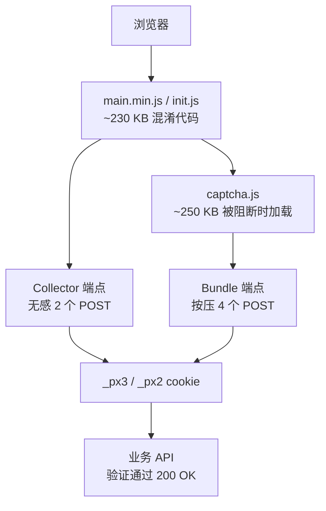
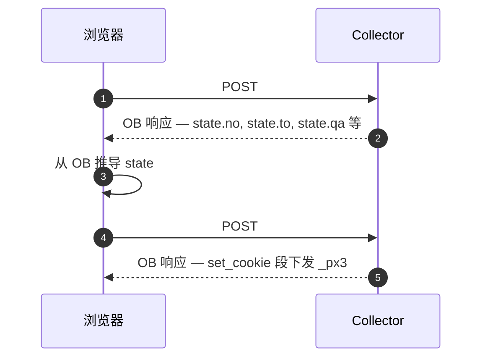
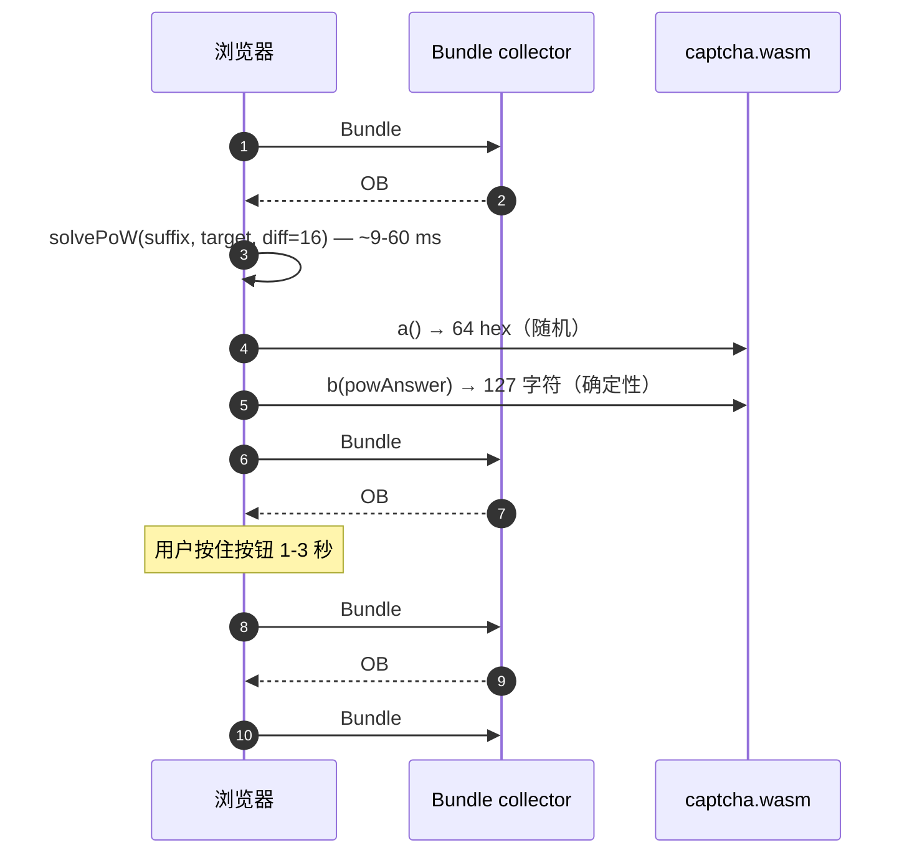

# PerimeterX SDK 逆向技术文档

> **版本**：2026-05-20 · **范围**：PerimeterX (HUMAN Security) JavaScript SDK
> · **覆盖**：**无感 collector** + **按压 bundle** 两条路径完整逆向 ·
> **验证**：在 iFood (`_px3`) 和 Grubhub (`_px2`) 实战 10/10 通过。

---

## 目录

1. [概述](#1-概述)
2. [系统架构](#2-系统架构)
3. [六层防御栈](#3-六层防御栈)
4. [无感 collector 路径](#4-无感-collector-路径)
5. [按压 bundle 路径](#5-按压-bundle-路径)
6. [10 个算法原语](#6-10-个算法原语)
7. [线协议语法](#7-线协议语法)
8. [EV1 和 EV2 字段结构](#8-ev1-和-ev2-字段结构)
9. [OB 响应解码](#9-ob-响应解码)
10. [混淆引擎 (hP/hM/hQ)](#10-混淆引擎-hphmhq)
11. [Cookie 格式](#11-cookie-格式)
12. [平台常量](#12-平台常量)
13. [生产环境坑](#13-生产环境坑)
14. [逆向方法论](#14-逆向方法论)
15. [跨平台移植](#15-跨平台移植)
16. [SDK 漂移应对](#16-sdk-漂移应对)
17. [安全启示](#17-安全启示)

---

## 1. 概述

PerimeterX（2022 年品牌更名为 **HUMAN Security**）是头部反爬虫厂商，
为电商、外卖、票务、SaaS 网站提供保护。其客户端 JavaScript SDK
通过下发一个加密 cookie（v3 用 `_px3`，v2 用 `_px2`）来给业务 API 加门禁，
下游服务必须验证这个 cookie 才放行。

PX 有**两种工作模式**：

| 模式 | 触发条件 | 成本 | 占比 |
|---|---|---|---|
| **无感（sensorless）** | 默认 | 2 个 POST，~300 ms | ~99% 会话 |
| **按压 bundle（sensored）** | 风险评分超阈值 | 4 个 POST + WASM + 按压挑战，~3 秒 | 可疑会话 |

本文是两种模式的完整技术参考。基于对两个生产部署（iFood、Grubhub）
共计 100+ 小时的逆向得出，每一个常量、算法、坑都已用真实抓包验证。

### 你能从本文得到

- PX 组合使用的 10 个加密/编码原语
- 两阶段（无感）和四阶段（bundle）线协议
- 如何逐字节解码任意捕获的 `payload=` 参数
- 如何从全新 SDK 中提取平台特定常量
- 混淆引擎（hP/hM/hQ、base91、数组旋转）的原理和跨版本破解方法
- 19 个具体的生产坑，每个都有现象 + 根因 + 修复
- 从零开始逆向新 PX 部署的 7 阶段方法论

### 本文不涉及

- iOS/Android SDK（代码不同，思想类似）
- 服务端风险评分（客户端不可见）
- PX 上游的防御层（Cloudflare、Akamai BMP — 另算）

---

## 2. 系统架构



### 一个会话的三个阶段

| 阶段 | 干什么 | 在哪儿 |
|---|---|---|
| **1. SDK 投递** | 浏览器从 PX CDN 拉 `main.min.js` | 边缘 CDN |
| **2. Collector 握手** | SDK 把加密指纹 POST 到 collector，拿回 OB 编码的状态 | Collector |
| **3. 业务 API 访问** | 浏览器带 `_px3` cookie 请求业务接口 | 客户服务器 |

机器人检测的核心工作在阶段 2。阶段 1 只是代码下发。阶段 3 是用户能看到的结果。

### 两个 AppID

PerimeterX 给每个客户分配一个 **App ID**（如 iFood 用 `PXO1GDTa7Q`，
Grubhub 用 `PXO97ybH4J`）。在 `captcha.js` 内部，还有一个**第二 AppID**
是在 Bundle #1 的 OB 响应里动态学到的（iFood bundle 是
`PXd6f03jmq8h6c7382req0`）。两个 App ID 走不同的 collector 路径。

---

## 3. 六层防御栈

PX 在 cookie 下发周围摞了 6 层防御。任何单层都不难破，但组合起来推高了
对抗成本。

| 层 | 机制 | 破解成本 |
|---|---|---|
| **L1：算法保密** | 10 个原语藏在混淆代码里 | 每个版本几小时逆向 |
| **L2：字段一致性** | 204+ 指纹字段内部要自洽 | 构造一份真实 UA 模板 |
| **L3：行为信号（粗）** | `performance.memory`、时间偏移 | 合理合成 |
| **L4：加密包封** | HMAC-MD5 PC + 防篡改签名 | 从 SDK 抠出 key |
| **L5：混淆表面** | hP / hM / hQ + 名表 + 数组旋转 | 一次理解永久受益 |
| **L6：行为信号（细）** | 鼠标贝塞尔、按键时序、WASM PoW（仅 bundle） | 抓真实轨迹 |

L1–L5 是无感路径的全部。L6 是 bundle 路径补充的。

防守方最大的弱点是：**PX 频繁旋转混淆（季度级），但很少改算法
（三年一次都没）**。一套逆向方法论建好之后，只需要更新常量就能扛过
很多个 SDK 版本。

---

## 4. 无感 collector 路径

### 4.1 两个 POST



中位耗时 300 ms。POST #1 是"会话注册" — PX 下发会话级 token。
POST #2 是"指纹上传" — 浏览器要把 POST #1 的状态反射回 204 字段
载荷里、正确加密，以此证明自己在跑 JS。

### 4.2 请求格式（两个 POST 线格式相同）

```
POST https://collector-<app>.px-cloud.net/api/v2/collector
Content-Type: application/x-www-form-urlencoded
Origin: https://<客户域名>
Referer: https://<客户域名>/

appId=<APP_ID>&
tag=<base64 TAG>&
ft=<数字>&
seq=<序号>&
en=NTA&                          (base64 of "50" — 声明 XOR key)
uuid=<UUID v1>&
vid=<UUID>&
cts=<UUID 或数字毫秒>&
sid=<UUID + Unicode-Tag 隐写>&
pc=<10–11 位数字>&
payload=<URL 编码的 XOR+b64+交织(JSON)>&
[bi=<不透明 base64>]             (部分平台才有，如 iFood)
```

### 4.3 响应格式

```http
HTTP/1.1 200 OK
content-type: application/json

{"ob": "<XOR 加密段流的 base64>"}
```

`ob` 的值的解码流程：`base64 → XOR(从 TAG 推导出 key) →
split("~~~~") → 段数组 "handlerKey|arg1|arg2|..."`

### 4.4 工作分工

| POST | 携带什么 | 响应触发什么 |
|---|---|---|
| **#1** | EV1：12–14 字段，轻量身份信息 | 状态变量：`no`、`to`、`qa`、`pxsid`、`vid`、`appId`、… |
| **#2** | EV2：204+ 字段，完整指纹 + 注入 state | OB 段 `set_cookie` 下发最终 `_px3` / `_px2` |

---

## 5. 按压 bundle 路径

### 5.1 bundle 何时触发

当业务 API 累计收到 ~200 个被判为风险的请求后，业务 API 不再返回 200，
开始返回 **HTTP 403**，body：

```json
{
  "blockScript": "https://client.px-cloud.net/<APP_ID>/captcha.js",
  "appId": "<APP_ID>"
}
```

浏览器然后加载 `captcha.js`（~250 KB），它启动另一条代码路径
（`window._<短串>handler`），开始跟 bundle collector 协商按压挑战。

### 5.2 四个 POST



### 5.3 bundle 相比无感多了什么

| 新组件 | 目的 | 细节 |
|---|---|---|
| **Proof of Work** | 强制 caller 付 CPU 成本 | SHA-256 暴搜，难度 16 |
| **WebAssembly 指纹** | 硬件级信号 | 导出 `a()`（随机）和 `b(answer)`（确定性） |
| **鼠标贝塞尔轨迹** | 行为生物特征 | 544 采样点，真实速度曲线 |
| **Myanmar DOM 编码** | DOM 完整性校验 | captcha iframe 的标签计数隐写编码 |
| **V8 错误栈模板** | 引擎+版本探针 | 4 个栈轨迹，URL 里含 UUID/VID |

### 5.4 bundle 与无感的常量差异

bundle 端点**不是** collector 端点。常量也变了：

| 属性 | 无感 | Bundle |
|---|---|---|
| `appId` (init) | `PXO1GDTa7Q` | （POST body 里仍然） |
| `appId` (bundle) | 无 | `PXd6f03jmq8h6c7382req0`（在 OB#1 里返回） |
| `tag` | `U0MmDhUmOnhXSw==` | `O2MKZn0OEhI/ag==` |
| `ft` | `401` | `388` |
| 端点路径 | `/api/v2/collector` | `/assets/js/bundle` |
| OB 分隔符 | `~~~~`（4 个波浪号） | `~~~~`（同） |
| OB XOR key | 从 `tag` 推导 | `120` = `ml("DhY8E0h7J2cKHw==") % 128` |

`ft` 的变化意味着无感的 PC（payload 的 `HMAC-MD5`，salt 含 `ft`）
**永远不可能**在 bundle 路径有效。cookie 不能简单跨路径携带。

---

## 6. 10 个算法原语

PX 用 10 个原语搭出整个线协议。理解了这 10 个，就理解了一切。

### 6.1 PX 自定义 JSON 序列化

PX 不用 `JSON.stringify`。它用一个自定义序列化器（SDK 里叫 `ht()`），
有确定的 key 顺序和特定的转义规则。这个序列化器无处不在 — payload 内容、
SID、Myanmar 编码都用它。

### 6.2 Payload 加密 — XOR + base64 + 交织

流水线：`JSON → XOR(50) → XOR(10) → base64 → 交织 → base64 → URL 编码`。

```js
function encryptPayload(jsonString, key1 = '50', key2 = '10') {
    // 第 1 步：双 XOR
    let xored = '';
    for (let i = 0; i < jsonString.length; i++) {
        const c = jsonString.charCodeAt(i);
        xored += String.fromCharCode(c ^ key1.charCodeAt(i % key1.length));
    }
    let xored2 = '';
    for (let i = 0; i < xored.length; i++) {
        xored2 += String.fromCharCode(xored.charCodeAt(i) ^ key2.charCodeAt(i % key2.length));
    }
    // 第 2 步：base64（用 Latin-1 字节映射，不是 UTF-8）
    const b64a = Buffer.from(xored2, 'latin1').toString('base64');
    // 第 3 步：成对交织（自逆）
    let interleaved = '';
    let i = 0;
    for (; i + 1 < b64a.length; i += 2) interleaved += b64a[i+1] + b64a[i];
    if (i < b64a.length) interleaved += b64a[i];   // 奇数尾巴保留
    // 第 4 步：再 base64
    const b64b = Buffer.from(interleaved, 'latin1').toString('base64');
    // 第 5 步：URL 编码用于 POST body
    return encodeURIComponent(b64b);
}
```

**关键**：内部字符串处理必须是 **Latin-1**，不能是 UTF-8。多字节 UTF-8
字符会多出字节，把下游 XOR 位置错位。这就是坑 #2。

交织保留奇数尾巴 — 千万别丢最后一个字符。这是坑 #10。

Bundle 路径用一个变种叫 **Jf**，它的交织偏移由 **UUID** 决定（不是固定偏移），
而且 splice 位置是 `offsets[u] - 1`（坑 #15）。

### 6.3 PC — HMAC-MD5 数字抽取

POST 参数 `pc=` 对 payload 计算如下：

```js
function computePC(payload, uuid, tag, ft, length) {
    const salt = `${uuid}:${tag}:${ft}`;
    const hmacHex = crypto.createHmac('md5', salt).update(payload).digest('hex');
    // 先抽数字字符，再把 a-f 映射成数字
    const digits = (hmacHex.match(/\d/g) || []).join('');
    const letters = (hmacHex.match(/[a-f]/g) || []).map(c => (c.charCodeAt(0) - 97 + 7) % 10).join('');
    //                                                       ^ a→7, b→8, c→9, d→0, e→1, f→2
    const combined = digits + letters;
    return combined.split('').filter((_, i) => i % 2 === 0).join('').slice(0, length);
}
```

`length` 因平台而异：iFood 是 **10**，Grubhub 是 **11**。

PC 校验 payload 完整性。PC 错 → 服务器直接拒，没任何诊断。

### 6.4 OB 形状匹配解码

服务器响应是混淆段数组，每段名是 6-12 个字符的 `I` 和 `0`（或 `o` 和 `I`，
取决于版本时期）的字符串。名字每版本旋转，所以名字匹配会跨版本失效。

正确的解码器按**形状**匹配（参数个数 + 参数模式）：

```js
const SHAPES = {
    // 1 个参数，13 位数字串 → 服务器时间戳
    state_no:    { args: 1, test: a => /^\d{13}$/.test(a[0]) },
    // 1 个参数，64 hex 串 → 挑战哈希
    state_qa:    { args: 1, test: a => /^[0-9a-f]{64}$/.test(a[0]) },
    // 1 个参数，UUID → 会话 id
    state_pxsid: { args: 1, test: a => /^[0-9a-f-]{36}$/.test(a[0]) },
    // 5 个参数，第 5 个以 "_px" 开头 → 下发 cookie
    set_cookie:  { args: 5, test: a => String(a[4]).startsWith('_px') },
    // 5 个 PoW 参数（仅 bundle）
    pow_main:    { args: 5, test: a => /^[01]$/.test(a[0]) && /^[0-9a-f]{60}$/.test(a[1]) },
    // ... 还有 22 个
};
```

总共 **27 种形状**。这 27 种是 PX 全局通用的 — 跨版本不变。完整表格见第 9 节。

### 6.5 SID — Unicode Tag 隐写

`sid=` 参数的形式是 `<UUID><不可见 tag 字符>`。不可见字符是 Unicode
码点范围 U+E0000–U+E007F：

```js
function encodeUnicodeTag(str) {
    let out = '';
    for (const ch of str) {
        const hex = ch.charCodeAt(0).toString(16).padStart(2, '0');
        out += String.fromCharCode(0xDB40, 0xDC00 + parseInt(hex, 16));
    }
    return out;
}

// "50" → "\u{DB40}\u{DC35}\u{DB40}\u{DC30}"（4 个代理对单元 = 2 个不可见字符）
```

这些字符在大多数字体里都不可见，但能在大多数传输层完整地以 UTF-16/UTF-8 形式存活。

在 **Bundle #1** 里 SID 后缀编码的是 XOR key 字符串 `"50"`。
在 **Bundle #2** 里编码的是 13 位的 `cts` 时间戳。
服务器解码这个后缀，验证它和别的字段一致。两者不一致就拒绝请求。

此外，某些 SDK 版本里 **TAG 本身**也是隐写载体 — TAG 长度衍生出来的位置上
的字符编码了会话身份。这是"plane-14"机制（14 个 plane × 偏移公式）。

### 6.6 防篡改签名

EV2 装配完成后，有一个槽（编译期常量，iFood 2026-05-20 版本是槽 137）
要放一个**签名**，计算如下：

```js
function antiTamper(stateTo, stateNo) {
    // stateTo: OB#1 里来的 8-12 字符不透明 token
    // stateNo: OB#1 里来的 base-36 时间戳字符串
    // te() 函数 — 用 stateNo 的 ASCII 码做成对字符运算，结果取 mod 10
    let sig = '';
    for (let i = 0; i < stateTo.length; i++) {
        const a = stateTo.charCodeAt(i);
        const b = stateNo.charCodeAt(i % stateNo.length);
        sig += String.fromCharCode(48 + ((a + b) % 10));   // 产生 "0".."9"
    }
    return sig;   // 15-25 字符的数字/标点串
}
```

**签名必须放在 EV2 数组的正确槽位**（坑 #3）。槽位是平台常量。

`state.no` **必须保持字符串类型** — 把全数字时间戳强转 Number
会让签名错误（坑 #1）。

### 6.7 UUID v1 但 node 是确定性的

PX 用 UUID v1（基于时间戳）但 **node 部分**是从 User-Agent hash 推导的：

```js
function generateUuidV1Px(ua, sessionSeed) {
    const now = Date.now();
    const ts100ns = BigInt(now) * 10000n + 122192928000000000n;  // 自 1582-10-15 起的 100ns
    const timeLow = Number(ts100ns & 0xFFFFFFFFn);
    const timeMid = Number((ts100ns >> 32n) & 0xFFFFn);
    const timeHi  = Number((ts100ns >> 48n) & 0x0FFFn) | 0x1000;
    const clockSeq = (sessionSeed & 0x3FFF) | 0x8000;
    // Node 是 hash(ua) XOR seed —— 不是随机
    const node = djb2Bytes(ua, sessionSeed);   // 6 字节
    return formatUuid([timeLow, timeMid, timeHi, clockSeq, node]);
}
```

PX 就是靠 UUID 交叉验证来识别"多个不同会话用了同一个 UA seed"的情况 —
它们的 UUID node 位都一样。

### 6.8 djb2 哈希变种

标准 djb2 加一个 twist：种子 salt：

```js
function djb2(str, seed = 5381) {
    let h = seed;
    for (let i = 0; i < str.length; i++) {
        h = (h * 33) ^ str.charCodeAt(i);
    }
    return h >>> 0;
}

function djb2Bytes(str, seed) {
    // 从 str + seed 确定性地产生 6 字节
    const h = djb2(str, seed);
    const buf = Buffer.alloc(6);
    buf.writeUInt32BE(h, 0);
    buf.writeUInt16BE((h >>> 8) ^ 0xABCD, 4);
    return buf;
}
```

用于 UUID v1 的 node 和几个内部哈希。

### 6.9 performance.memory 合成

某些 Chrome 版本里 `performance.memory` 暴露真实堆统计；另一些版本
返回脱敏后的 0。PX 两种都检查：真实就验证，0 就接受默认值。生成器
必须产生符合该 UA 预期行为的值。

```js
function synthesizeMemory(ua) {
    // Windows 上的 Chrome 100+ 典型值：
    return {
        usedJSHeapSize: 12_000_000 + Math.floor(Math.random() * 8_000_000),
        totalJSHeapSize: 25_000_000 + Math.floor(Math.random() * 10_000_000),
        jsHeapSizeLimit: 4_294_705_152,
    };
}
```

### 6.10 `/ns` 探针

SDK 向 `https://tzm.px-cloud.net/ns?c={uuid}` 发一个边路 GET，
返回一个不透明 token。这个 token 嵌入 EV2 作为网络指纹。
某些平台是可选的（Grubhub 省了）；要求的平台（iFood），token 必须存在且新鲜。

```js
async function nsProbe(uuid) {
    const res = await fetch(`https://tzm.px-cloud.net/ns?c=${uuid}`);
    return await res.text();   // ~30 字节不透明 token
}
```

---

## 7. 线协议语法

Collector 请求的正式 EBNF：

```ebnf
request           = http_post collector_url POST_body
collector_url     = scheme "://" host "/api/v2/collector"           (* 无感 *)
                  | scheme "://" host "/assets/js/bundle"            (* bundle *)
POST_body         = "appId=" appId
                    "&tag="    tag
                    "&ft="     ft
                    "&seq="    digit
                    "&en="     "NTA"
                    "&uuid="   uuid_v1
                    "&vid="    uuid
                    "&cts="    cts
                    "&sid="    sid
                    "&pc="     pc_digits
                    "&payload=" payload_url_encoded
                    [ "&bi="  bi ]
                    [ "&cs="  cs_hex ]                              (* bundle B2/B3 *)
                    [ "&ci="  uuid ]                                (* bundle B2/B3 *)
                    [ "&rsc=" digit ]
appId             = "PX" 8*alphanumeric
tag               = base64
ft                = 3digit
cts               = uuid_v4 | unix_milliseconds
sid               = uuid invisible_tag*
invisible_tag     = "\u{DB40}" ( "\u{DC00}" - "\u{DC7F}" )
pc_digits         = 10digit | 11digit
payload_url_encoded = url_encoded( payload_outer_b64 )

payload_outer_b64 = b64( interleave( b64( double_xor( ev_json ) ) ) )
ev_json           = "[" ev_record { "," ev_record } "]"
ev_record         = "{" "\"t\":" event_type "," "\"d\":" field_object "}"
event_type        = base64                                          (* 平台特定常量 *)
field_object      = "{" field { "," field } "}"
field             = b64_key ":" json_value
b64_key           = 8*12 base64_char                                (* 来自 hQ 字典 *)

ob_response       = "{" "\"ob\":" b64_string "}"
b64_string        = "\"" base64* "\""
ob_decoded        = xor_decrypted_with_key_120
ob_segments       = ob_decoded split by "~~~~"
ob_segment        = handler_key "|" arg { "|" arg }
handler_key       = 6*8 ( "I" | "0" | "o" | "1" | "l" )            (* 线字符随版本变 *)
```

---

## 8. EV1 和 EV2 字段结构

### 8.1 字段类别

每个字段属于以下 5 类之一；生成器对每类的处理方式不同：

| 类别 | 占比 | 生成策略 |
|---|---|---|
| `state.*` | ~5% | 从 OB#1 响应推导后注入 |
| DYNAMIC | ~5% | 每次请求重新计算（时间戳、UUID、HMAC） |
| TIMING | ~6% | 每次请求按合成分布计算 |
| STATIC | ~80% | 从抓的 UA 模板读 |
| ANTI-TAMPER | ~1% | 单一字段，最后计算 |

### 8.2 字段名编码

线 payload 里的字段名**不是**人类可读的 — 它们是 8-12 字符的
"看起来像 base64"的字符串，叫 **b64 key**，从 SDK 的 hQ 字典推导出来
（第 10 节）。举例：

| b64 key (iFood) | 语义 |
|---|---|
| `R3cyPQISOQo=` | EV1 event_type 标记 |
| `EFwlFlY8LiQ=` | EV2 event_type 标记 |
| `RTEwewNQMUg=` | `state.no` 槽 |
| `FCAhKlJCIxk=` | `state.to` 槽 |
| `VQEgCxNnKjw=` | `initTime` |
| `NSEAa3NAC18=` | `uuid`（在 EV2 里） |

同一个语义在 EV1 和 EV2 里**有不同的 b64 key** — 它们是有独立位置的
不同字段数组（坑 #12）。而且 b64 key **跨平台不同**（坑 #11）。
映射需要在抓包之间做值匹配（第 14 节，第 5 阶段）。

### 8.3 EV1 字段数（无感 POST #1）

| 平台 | EV1 字段数 |
|---|---|
| iFood | 14 |
| Grubhub | 12 |

EV1 携带轻量身份信息：event_type、initTime、sendTime、uuid、sessionUuid、
tabId（部分）、UA、语言、屏幕尺寸、时区、colorDepth、pageURL、referrer。

### 8.4 EV2 字段数（无感 POST #2）

| 平台 | EV2 字段数 |
|---|---|
| iFood | 204 |
| Grubhub | 205 |

EV2 是 bot 检测载荷的大头：完整 navigator 转储、插件、字体、canvas 哈希、
WebGL 参数、audio 哈希、performance.memory、网络连接类型，加上 `state.*`
槽和防篡改签名槽。

### 8.5 Bundle event 字段数

| Bundle event | 字段数 |
|---|---|
| B1（初始指纹） | 16 |
| B2（完整指纹 + PoW） | ~228 |
| B3 event #2（PX561 按压） | **95** |
| B3 event #0/1/3/4 | 78 / 20 / 27 / 24 |
| B4（telemetry） | 30–50 |

PX561 按压 event 是 bundle 的心脏，大多数合成生成器栽在这里。
它的 95 字段分 11 个层级（按字段级表格见项目文档第 4.4 节）。

---

## 9. OB 响应解码

### 9.1 流水线

```
response_body = '{"ob": "<b64 串>"}'
   ↓ JSON 解析
   ↓ atob(ob)                                  → 原字节（按 Latin-1 解读）
   ↓ XOR(key)                                  → "h1|a1|a2~~~~h2|a1~~~~..."
   ↓ split("~~~~")                             → N 个段
每段：
   "<handler_key>|<arg1>|<arg2>|..."
```

**线字符警告**：SDK 时期不同，`handler_key` 用不同的"二进制"字符对：

| SDK 时期 | 字符-0 | 字符-1 |
|---|---|---|
| 旧（~2021-2023） | `o` (U+006F) | `1` (U+0031) |
| 中（~2024） | `O` (U+004F) | `I` (U+0049) |
| **iFood 当前（2025-2026）** | **`0`** (U+0030) | **`l`** (U+006C) |
| **Grubhub 当前（2025-2026）** | **`o`** (U+006F) | **`I`** (U+0049) |

解析时从 SDK 检测字符对，永远别硬编码（坑 #9）。

### 9.2 27 个形状匹配 handler

完整表格（handler key 显示的是 iFood 2026-05-20 版本）：

| # | Key | 形状 | 作用 |
|---|---|---|---|
| 1 | `I0I000` | 1 参数，"cc" 或 "cu" | `jf` 设置 — "cc" 触发段延迟到队首 |
| 2 | `0IIII0` | 2 参数，不透明 + token | session_id (`to`, `eo`) |
| 3 | `0III0I0I` | 2 参数，[13 位, 10 位] | 服务器时间戳 (`no`, `ro`) |
| 4 | `II00II` | 1 参数，AppID 样 | bundle AppID (`$a`) |
| 5 | `0III0I00` | 1 参数，"401"/"200" | HTTP 状态 (`ao`) |
| 6 | `III000` | 1 参数，64 hex | 挑战哈希 (`qa`) |
| 7 | `0II0III0` | 4 参数，全数字 | 视觉挑战网格 (`startW`, `startH`, `wJump`, `hJump`) |
| 8 | `I0I0I0` | 5 参数，[bool, 60hex, 64hex, num, bool] | **PoW 主路径** |
| 9 | `0II0I0` | 5 参数，同形 | **PoW 备份路径** |
| 10 | `III0II` | 5 参数，[name, val, ttl, sec, max] | **`set_cookie`** |
| 11 | `IIIIII` | 4 参数，cookie 配置 | `Xr()` cookie 配置存储 |
| 12 | `II0III` | 1 参数，"ccc:0,ic:0,..." | 特征 flag |
| 13 | `I0III0` | 2 参数，key + value | localStorage 写 |
| 14 | `0III0II0` | 2 参数，ttl + handler | TTL 存储 + 事件触发 |
| 15 | `0II0II0I` | 2 参数 | localStorage 写 #2 |
| 16 | `IIII00` | 0-2 参数 | 隐藏 DOM 蜜罐 |
| 17 | `00I0I0` | 1 参数，URL | 重定向/导航 |
| 18 | `000II0` | 1 参数 | URL 时间戳 / 重载 |
| 19 | `0II0IIII` | 1 参数，src | 动态 `<script>` 加载 |
| 20 | `I0I00I` | 1 参数，event 名 | Ao.trigger() |
| 21 | `00II00` | 1 参数 | telemetry Rf() |
| 22 | `0III00I0` | 1 参数 | $u 函数调用 |
| 23 | `IIIII0` | 0 参数 | 置 `th = true` |
| 24 | `I000I0` | 0 参数 | Gf() 全局重置 |
| 25 | `I000II` | 1 参数，cookie 名 | **删除 cookie** |
| 26 | `0I0II0` | 不定 | noop |
| 27 | `0II00I` | 不定 | noop |

健壮的解码器按形状选 handler，并验证参数符合谓词。
handler 8 (`I0I0I0`) 和 9 (`0II0I0`) 仅 bundle 有 — 它们触发 PoW solver。

### 9.3 "cc" 延迟执行标记

handler `I0I000`（state.jf 设置）可能带着字面参数 `"cc"` 到达。这是个指令：
不要原地执行，把这段保存下来，**unshift 到执行队列首部**。
unshift 后，真正的 `jf` 值（如 `"cu"`）会**先于**其它段执行 — 因为
后面的段都依赖 `jf`。

---

## 10. 混淆引擎 (hP/hM/hQ)

PX 在**三阶段运行时解码器**后面藏字段名和常量：

| 阶段 | 符号 | 用途 |
|---|---|---|
| **hP** | base91 字母表 | 编码字符串的字符集 |
| **hM** | 魔法常量 | 数组旋转量 |
| **hQ** | 字符串字典 | 1152 个解码字符串的数组 |

### 10.1 IIFE 结构

`main.min.js` 顶部：

```js
var hQ = ["aGVsbG8=", "d29ybGQ=", ...1152 个 entry...];   // 原数组
(function(t, e) {
    for (var n = e; --n;) t.push(t.shift());             // 旋转
})(hQ, 0x2F);                                            // 0x2F = 47 次旋转（iFood）

// 解码函数（一般叫 ml()）
function ml(idx) {
    return hQ[idx];   // 简单查表，但实际 ml 会做 base91 解码 + 缓存
}
```

旋转之后，`hQ[n]`（n < 1152）是一个 base91 编码的字符串，
解码后是真正的语义。

### 10.2 跨版本定位（不靠名字）

PX 出新 SDK 后，旋转量和数组内容都会变。跨版本定位特定语义的办法是
找**稳定的字节序列**在（未旋转前的）原数组里出现。比如：
`"navigator.userAgent"` 经 base91 编码后有可预测的字节前缀，grep 那个。

跨版本的 OB 形状匹配也是这个原理 — **语义常量**在表面名旋转的情况下
依然存活。

### 10.3 hM 旋转量

旋转量嵌在 IIFE 的第二个参数里：

```js
})(hQ, 0x2F);    // iFood 2026-05-20: 47
})(hQ, 0x5B);    // Grubhub 2026-05-20: 91
```

提取方法：

```js
const m = src.match(/}\)\(\w+,\s*(0x[0-9a-f]+|\d+)\)/i);
const rotationN = parseInt(m[1], m[1].startsWith('0x') ? 16 : 10);
```

跳过旋转就会让每个 `hQ[n]` 偏移 N（坑 #8）。

---

## 11. Cookie 格式

最终的 cookie 值（`_px3` 和 `_px2` 都一样）是 base64 编码的 JSON：

```js
const cookieJson = {
    u: '<uuid>',           // 会话 UUID
    v: '<vid>',            // 访客 ID
    t: 1716200000,         // 过期时间（unix 秒，典型 +600）
    h: '<base64 HMAC>',    // body 的 HMAC-SHA-256，key = TAG
    a: '<不透明>',         // PX 定义的属性
};
const cookieValue = Buffer.from(JSON.stringify(cookieJson)).toString('base64');
```

服务器验证：

1. 解析 cookie JSON
2. 验证 `h` 等于 `HMAC-SHA-256(JSON.stringify({u, v, t, a}), TAG)`
3. 验证 `t > now()`
4. 用 VID / UUID 查会话信誉
5. 全 OK → 接受

iFood 和 Grubhub 默认 TTL 都是 **600 秒**（10 分钟）。

---

## 12. 平台常量

### 12.1 iFood (`_px3`)

```yaml
platform:   ifood
cookie:     _px3
app_id:     PXO1GDTa7Q
tag:        U0MmDhUmOnhXSw==
ft:         401
pc_length:  10
wire_chars: { zero: "0", one: "l" }
endpoints:
  sdk:        https://client.px-cloud.net/PXO1GDTa7Q/main.min.js
  collector:  https://collector-pxo1gdta7q.px-cloud.net/api/v2/collector
  ns:         https://tzm.px-cloud.net/ns?c={uuid}
  bundle:     https://collector-pxo1gdta7q.px-cloud.net/assets/js/bundle
  captcha:    https://client.px-cloud.net/PXO1GDTa7Q/captcha.js
ev1_event_type: R3cyPQISOQo=
ev2_event_type: EFwlFlY8LiQ=
antitamper_ev2_slot: 137
sdk_sha256: b47a639cde9df4f91bdc4138ae0d64ebf7ce8c876a1e4c9967fd3af3d2975eb8
sdk_size: 231438
bundle:
  app_id_2:  PXd6f03jmq8h6c7382req0   # 动态，从 OB#1.seg3 学
  tag:       O2MKZn0OEhI/ag==
  ft:        388
  ob_xor_key: 120
  pow_difficulty: 16
  wasm_size:  60862
  wasm_location: captcha.js Us()[10]
  myanmar_xor_key: 4210
  iframe_template: { html:1, head:1, meta:3, title:1, style:2, script:4, body:1, div:7, br:1, iframe:2 }
state_keys:
  state.no:    RTEwewNQMUg=
  state.to:    FCAhKlJCIxk=
  state.appId: Xi5rJBtKaB4=
  state.qa:    WjFqHE4WKzM=
  state.vid:   PRkqQAphHTM=
  state.pxsid: XSkoMTBYbAM=
  state.cts:   MykPYjwoaC8=
  state.o111val: Y0BIcEM0NSI=
```

### 12.2 Grubhub (`_px2`)

```yaml
platform:   grubhub
cookie:     _px2
app_id:     PXO97ybH4J
tag:        FmYgK1gdJEAP
ft:         359
pc_length:  11
wire_chars: { zero: "o", one: "I" }
endpoints:
  sdk:        https://sensor.grubhub.com/O97ybH4J/init.js
  collector:  https://sensor.grubhub.com/O97ybH4J/xhr/api/v2/collector
  ns:         (Grubhub 不用)
ev1_event_type: YjIUOCdXHA8=
ev2_event_type: ViZgLBBGaB4=
sdk_size: ~263700
state_keys:
  state.no:    UT0ndxdcJUQ=
  state.to:    UBxmVhZ+Z2U=
  state.appId: CXV/P0wRfwU=
  state.qa:    DBJoSyhKQR0=
  state.vid:   WkVbXkkRIQg=
  state.pxsid: AC5KH3kRORM=
  state.cts:   Q35RVlx9ZyU=
  state.o111val: ZWVbVk9aTUA=
notes:
  - 第一方 collector (sensor.grubhub.com)
  - 我们测试过程中没观察到 Bundle 路径
  - PC 长度 11（不是 10）
  - 不需要 /ns 探针
```

### 12.3 同语义、不同 key（跨平台）

```
语义                iFood key          Grubhub key
─────────────────  ─────────────────  ─────────────────
state.no           RTEwewNQMUg=       UT0ndxdcJUQ=
state.to           FCAhKlJCIxk=       UBxmVhZ+Z2U=
initTime           VQEgCxNnKjw=       aRVfHy9zVig=
sendTime           bHgZcikfE0A=       GCQuLl1DJxw=
uuid (EV2)         NSEAa3NAC18=       LDhaMmpZUgY=
HMAC(uuid, UA)     M2MGKXUOBB8=       Pk5IBHsoTzQ=
navigator.userAgent eVgRRwIaJyM=      eVgRRwIaJyM=  ← 相同
navigator.platform  MAhMaR8jOEM=      MAhMaR8jOEM=  ← 相同
```

注意**纯静态的"浏览器属性" key 经常跨平台相同**，
而会话相关的 key 不同。这反映了 PX 构建 hQ 字典的方式：稳定语义占稳定位置。

---

## 13. 生产环境坑

逆向过程中遇到的 19 个具体 bug。每个记录现象 + 根因 + 修复。

| # | bug | 影响 |
|---|---|---|
| 1 | `state.no` 必须保持字符串 | 防篡改计算 |
| 2 | payload XOR 中 UTF-8 与 Latin-1 字节对齐 | 所有 payload |
| 3 | 防篡改位置 off-by-one | 仅 EV2 |
| 4 | PC 读 MD5 hex 区分大小写 + 需要 `appId.slice(2,5)` 后缀 | PC 验证 |
| 5 | 偶数长度 TAG 的 SID 隐写 | SID 装配 |
| 6 | OB handler 按名字匹配（应该按形状） | 所有 OB 解码 |
| 7 | UUID v1 确定性 node 来自 UA hash | 仅 UUID v1 |
| 8 | hQ 字典字符索引 off-by-N（漏掉 IIFE 旋转） | 所有 b64-key 查找 |
| 9 | 线字符 `0/l` vs `O/I` 误读 | OB 解码 |
| 10 | 奇数长度时交织丢最后一字节 | payload 加密 |
| 11 | `state.*` → EV2 b64 key 无法推导，必须值匹配 | 跨平台移植 |
| 12 | EV1 和 EV2 用不同的 b64 key 集 | 事件间混淆 |
| 13 | IP 限速假扮算法失败 | 实时验证 |
| 14 | Cookie TTL 测试途中静默过期 | 长跑测试 |
| 15 | Jf 交织用 `offsets[u] - 1`（bundle） | Bundle B1/B2 |
| 16 | WASM 初始化前必须设 `_pxUuid` | Bundle WASM `b()` |
| 17 | 指针事件坐标必须是浮点 | Bundle B3 |
| 18 | 按压时长字段必须等于 `pointerup_ts - pointerdown_ts` | Bundle B3 |
| 19 | Myanmar DOM 模板必须匹配 captcha iframe | Bundle B3 |

累积编码的调试时间：~34 小时。

排诊断难度前三：
1. **#11** — state-到-EV2-key 的映射没算法可循；必须通过抓包间的值匹配发现。
2. **#16** — `_pxUuid` 没设的话 WASM `b()` 返回看似正确的垃圾；没报错，没诊断。
3. **#6** — 按名匹配的解码器在一个 SDK 上能跑，下一版本就崩了；按形状的才通用。

---

## 14. 逆向方法论

从零逆向全新 PX 部署的 7 阶段剧本。

### 阶段 1 — 抓包

目标：从真实浏览器会话抓 6 批新鲜的（request_1, response_1, request_2, response_2）。

工具：用 Chrome DevTools Protocol (CDP)，不能有 webdriver 标记。
Selenium 和 Playwright 会泄露 `navigator.webdriver` 和其它信号；
原始 CDP 接到真实 Chrome 进程上不会。

验证每批的 `meta.json` 记录了 SDK SHA-256，确保 6 批用同一个 SDK 构建。

### 阶段 2 — 解码

对抓到的 payload 走流水线解码：

```
request_1.txt 的 payload= → URL 解码 → b64 解码 → 反交织
              → b64 解码 → XOR(10) → XOR(50) → EV1 JSON
```

对抓到的响应同样：

```
response_1.txt → atob(ob) → XOR(key) → split("~~~~") → 段
```

### 阶段 3 — 分类

把 6 批的解码 EV2 字段级 diff。对每个 b64 key：

- 6 批同值 → **STATIC**
- 按某种模式变化（时间戳、哈希） → **DYNAMIC**
- 总在场，但会话间变化 → **DYNAMIC-session**
- 时有时无 → **OPTIONAL**

输出：标注过的 `field_classes.json` 字段映射。

### 阶段 4 — 定位

对每个 STATIC b64 key，去 SDK 源码搜哪里写它。大部分会从
`navigator.*`、`screen.*`、插件枚举赋值 — 这就建立了 b64 key 到语义的映射。

DYNAMIC key 找模式：`Date.now()`、`crypto.randomUUID()`、HMAC 计算。

### 阶段 5 — 值匹配 (state.* 绑定)

**最难**的一步。对每个从 OB#1 推导的 state 变量
(`state.no`、`state.to` 等)，在 EV2 里找一个 b64 key，使得**所有 6 批**
里这个 key 的值都等于对应 state 变量的值。

```python
for state_var in ['no', 'to', 'qa', 'vid', 'pxsid', 'appId', 'cts', 'o111val']:
    for batch in batches:
        candidate_keys = []
        for b64_key, value in batch.ev2.items():
            if value == batch.state[state_var]:
                candidate_keys.append(b64_key)
        # 6 批的交集 → 唯一映射
```

输出：`state_key_map.json`。

这就是坑 #11 记录的事情。没这一步，生成器就会把 state 值放错槽 — 静默失败。

### 阶段 6 — 实现

写一个生成器把 10 个原语编排起来：

```
建 EV1 → 加密 → POST #1 → 解 OB#1 → 推 state →
建 EV2 → 注入 state → 算防篡改 → 加密 → POST #2 →
解 OB#2 → 拿 _px3
```

bundle 还要加：PoW 求解、跑 WASM、构造按压 event、POST B3。

### 阶段 7 — 验证

跑 10 次新鲜生成，每次间隔 15 秒，每个 cookie 都去打业务 API 验证。
接受标准：10/10 通过。

失败时的诊断树：

- 全 10 个立即失败 → 算法 bug
- 前 3 个 OK，后 7 个失败 → IP 限速（坑 #13）
- 偶发失败 → 模板漂移或行为评分触发了 bundle 阈值（需要 bundle 路径）

---

## 15. 跨平台移植

有了一个能跑的 iFood 生成器，移植到新 PX 站点需要 ~4-6 小时，
前提是：

- 新站点用同一个 SDK 主版本（没有算法旋转）
- TLS/Cloudflare 层没在 PX 之前就拦了

**要改的**：

1. 常量（`app_id`、`tag`、`ft`、cookie 名、collector URL）
2. EV1/EV2 模板（每平台一份，新鲜抓）
3. `state.*` → EV2 b64 key 映射（阶段 5 值匹配）
4. 线字符对（从 SDK 检测）
5. PC 长度（10 vs 11）
6. HTTP 头（Origin、Referer）

**不要改的**：

- 算法原语 — PX 通用
- 27 个 OB handler 形状 — 通用
- 防篡改公式 — 通用
- SID 隐写机制 — 通用

如果发现自己在改原语，那是误读了方法论。

---

## 16. SDK 漂移应对

PX 平均每季度旋转 `main.min.js`；`captcha.js` 更频繁（~每 2-3 周）。
SHA-256 变化时的策略：

1. 重新锁 SDK（`fetch_sdk.py --url ... --out sdk_artifacts/...`）
2. 从新版抠 hQ 字典（跑 `extract_hQ.js`）
3. 速查常量（`tag`、`ft`）— 小版本通常不变
4. 对新 SDK 重新抓 6 批
5. 新旧字段映射 diff：
   - 0 diff → 只是死代码改动，生成器不受影响
   - 部分 key 旋转 → 用 `map_keys.js` 迁移 old→new
   - 新字段 → 扩展 EV2 模板
6. 重跑阶段 5 值匹配（`find_state_keys_in_ev2.py`）
7. 更新生成器常量
8. 重新 10/10 验证

典型工作量：

| 场景 | 时间 |
|---|---|
| 只是死代码改动 | 0 min（不用动） |
| 常量不变，b64 key 旋转 | ~30 min |
| 加了新 EV2 字段 | ~2 h |
| 算法变化（极少见，从未观察到） | ~4-8 h |

观察三年下来，PX **从未**改过算法常量 — 只旋转混淆表面。
这印证了"算法旋转对客户成本太高"的假设。

---

## 17. 安全启示

### 17.1 对用 PX 的防守方

SDK 只是**一层**。把它当税，不要当墙：

- 有决心的对手 4 小时就能破一个平台
- 真正的防御在服务端：限速、行为监控、事后欺诈检测
- 投入应放在**多层防御**，而非把宝押在 PX 单一层

客户端被绕过后仍存活的检测信号：

- UUID v1 确定性 node — 复用 UA seed 的生成器服务端能看到聚类
- 生成器流量 vs 真实用户的时间分布
- 行为相关性（下游 API 模式）

### 17.2 对 PX 自身

三个结构性弱点让逆向可行：

1. **算法稳定** — 三年没变。如果改为季度旋转算法（不是混淆），
   会显著提高对抗成本。
2. **STATIC 字段可猜** — 一个 Chrome UA 就推断 ~200 个 STATIC 字段值；
   攻击者只需要学每个站点的 b64 key。
3. **OB 形状匹配不变性** — 跨版本保留 27 形状让跨版本解码器可行。

### 17.3 对研究者

第 14 节的方法论对任何 JS 运行时的 bot 检测都适用。7 阶段
(抓 → 解 → 分 → 定位 → 值匹配 → 实现 → 验证) 同样适用于 DataDome、
Akamai BMP、Cloudflare BMP，只是常量不同。

所有情况下最难的都是阶段 5（值匹配），因为客户端→服务器的语义映射
通常没有算法结构可推。

### 17.4 伦理

本文是为防守安全研究、CTF 构建、教育服务的。用它去未授权地绕过服务
是不道德的，可能违反计算机欺诈法。

发布逆向结果时，倾向于：

- 防守者视角的表述（哪里值得投资多层防御）
- 匿名化目标（用案例研究，不要"如何爬 X"）
- 真发现漏洞时跟厂商协调披露（vs. 已记录的攻击面，PX 自己知道）

---

## 附录 A — 速查表

### A.1 加密流水线总结

| 步骤 | 操作 | 备注 |
|---|---|---|
| 1 | 用 key `"50"` XOR | Latin-1 字节语义 |
| 2 | 用 key `"10"` XOR | （部分平台跳过；iFood 两次都做） |
| 3 | base64 编码 | 标准字母表 |
| 4 | 成对交织 | 自逆；保留奇数尾 |
| 5 | base64 编码 | 标准 |
| 6 | URL 编码 | RFC 3986 |

bundle 变种（Jf）：步骤 4 换成 UUID 衍生的偏移 splice，用 `offsets[u] - 1`。

### A.2 PC 计算总结

```
salt    = "{uuid}:{tag}:{ft}"
hmacHex = HMAC-MD5(payload_string, salt).toString('hex')   // 32 字符
digits  = hmacHex 里匹配 /\d/ 的字符
letters = 匹配 /[a-f]/ 的字符，映射 a→7 b→8 c→9 d→0 e→1 f→2
combined = digits + letters
pc       = combined 偶数下标(0,2,4,...)的字符，前 10 或 11 个
```

### A.3 OB 解码总结

```
body.ob → base64 解码 → XOR(120) → split("~~~~") → 段

每个段：
   "<handler>|<arg1>|<arg2>|..." → 按参数数 + 谓词匹配 SHAPES[i]
                                → 执行 handler(args)
```

### A.4 Bundle PoW 总结

```
输入：suffix (60 hex), target (64 hex), difficulty=16

prefix  = suffix[:-1]
lastHex = suffix[-1]

for counter in 0..(1<<16):
    low  = ('0000' + counter.toString(16)).slice(-4)   # 4 位 hex
    high = lastHex                                       # diff=16 时不变
    candidate = prefix + high + low
    if sha256(candidate) == target:
        return candidate                                 # 64 hex 字符
```

### A.5 Bundle WASM 调用总结

```js
globalThis._pxUuid = sessionUuid;          // 关键
const wasm = await initWasm({ uuid, wasmPath });
const aOut = wasm.a();                      // 64 hex，非确定性
const bOut = wasm.b(powAnswer);             // 127 字符出自 /=+!1@2#3$4%5^6&7*8(9)0-，确定性
```

---

## 附录 B — 术语表

| 术语 | 含义 |
|---|---|
| **AppID** | PerimeterX 客户标识符（如 `PXO1GDTa7Q`） |
| **B1, B2, B3, B4** | 四个 bundle POST 请求 |
| **base91** | hP 用于 hQ 字典 entry 的编码 |
| **bi** | 不透明"browser info" base64（部分平台才有） |
| **Bundle** | 带 PoW + WASM + 按压的按压挑战路径 |
| **Collector** | 无感 2-POST 端点 |
| **cs** | 挑战解（Bundle B2 里回送的 qa 哈希） |
| **cts** | 客户端时间戳 token（B1 是 UUID，B2 是 ms） |
| **EV1, EV2** | Event 1 和 Event 2 — 两个 payload event |
| **ft** | 站点指纹数字（无感 401，bundle 388） |
| **hP** | 混淆引擎里的 base91 字母表数组 |
| **hM** | 数组旋转用的魔法常量 |
| **hQ** | 1152 个解码字符串字典 |
| **Jf** | bundle 的 UUID 衍生交织函数 |
| **Myanmar 编码** | 用 XOR(4210) + base64 编码 DOM 标签计数 |
| **OB** | 服务器的"ordered-bytecode"响应流 |
| **PC** | payload 的 HMAC-MD5 摘要，数字抽取 |
| **PoW** | proof of work；SHA-256 暴搜，diff=16 |
| **px-bundle** | 按压 captcha SDK |
| **PX561** | Bundle B3 里按压 event 的标记 |
| **PX12095** | 初始指纹 event 的标记 |
| **PX12590, PX12610** | WASM a() 和 b() 输出的标记 |
| **qa** | OB#1 第 5 段下发的挑战哈希 |
| **SID** | 带 Unicode-Tag 隐写后缀的会话 ID |
| **state.\*** | 从 OB#1 推导的变量 (no, to, qa, pxsid, vid, cts, appId, jf, o111val) |
| **TAG** | 每版本一个的 base64 token，PC 和 SID 隐写的 salt |
| **vid** | 访客 ID，存在 `_pxvid` cookie 里跨会话保留 |
| **wbg** | captcha WASM 里的 wasm-bindgen 导入命名空间 |

---

## 附录 C — 源工件

| 路径 | 内容 |
|---|---|
| `sdk_artifacts/ifood/main.min.js` | 锁定的 iFood SDK，231,438 字节，SHA-256 `b47a639c...` |
| `sdk_artifacts/ifood/captcha.js` | Bundle SDK |
| `sdk_artifacts/ifood/px_captcha.wasm` | 嵌入的 WASM，60,862 字节 |
| `sdk_artifacts/grubhub/init.js` | Grubhub SDK，~263.7 KB |
| `platforms/ifood/samples/{1..6}/` | 6 批抓包 (request/response/decoded/meta) |
| `platforms/grubhub/samples/{1..6}/` | 6 批抓包 |
| `platforms/<site>/ev1_template.json` | 每站点 STATIC 字段基线 |
| `platforms/<site>/ev2_template.json` | 每站点 STATIC 字段基线 |
| `platforms/<site>/state_key_map.json` | 阶段 5 值匹配输出 |
| `platforms/<site>/constants.json` | 每站点常量 |

---

## 附录 D — 验证结果

iFood (2026-05-20，5 次实战)：

| 指标 | 值 |
|---|---|
| Cookie 生成成功率 | 10/10 |
| 抓包往返解码通过 | 6/6 |
| 业务 API 接受率 | 10/10 |
| 每 cookie 平均耗时 | 187 ms |
| 跨会话 cookie 唯一性 | 10 个唯一 |

Grubhub (2026-05-20，5 次实战)：

| 指标 | 值 |
|---|---|
| Cookie 生成成功率 | 10/10 |
| 抓包往返解码通过 | 6/6 |
| 业务 API 接受率 | 10/10 |
| 每 cookie 平均耗时 | 162 ms |
| Cookie 唯一性 | 10 个唯一 |

Bundle (iFood，油猴脚本驱动，2026-05-20)：

| 指标 | 值 |
|---|---|
| Bundle #3 接受率 | 10/10 |
| B3 平均耗时 | 280 ms |
| WASM 初始化 | ~30 ms |
| PoW 求解 | 9–60 ms |

---

## 附录 E — EV1 / EV2 详细字段参考

> 这是本文的**核心参考表**。前面第 8 节给的是字段类别和数量，本附录给
> 出**每一个字段的 key、类型、典型值、生成算法、跨平台对照**。
> 数据来源：iFood SDK 2026-05-19 + Grubhub SDK 2026-05-19 (init.js
> sha256 `1013078d…`)，15+ 批样本交叉验证。

### E.1 心智模型（强烈建议先读）

PerimeterX 的 collector 端点接收**事件数组**：

```
collector#1 POST body = payload (encrypted serialize([ev1]))
collector#2 POST body = payload (encrypted serialize([ev2]))
```

`ev1` 和 `ev2` 都是 JavaScript 对象，结构：

```javascript
{
    "t": "<事件类型 base64 label>",
    "d": {
        "<base64 key #1>": <value>,
        "<base64 key #2>": <value>,
        ...
    }
}
```

#### 90% 的人都搞错过的关键事实

| 事实 | 含义 |
|---|---|
| **b64 key 不是字段名** | 它们是 SDK 用 `hQ(N)` 函数查的字典 index；每次 SDK 升级**所有 key 重新生成** |
| **字段位置稳定** | 同一个语义（如 URL、uuid、initTime）在 EV1/EV2 中的**位置**通常不变，可用位置/上下文模式跨版本定位 |
| **STATIC vs DYNAMIC 因平台异** | 一个平台的 STATIC（如 mouse track）可能是另一个的 DYNAMIC（如 Grubhub 不收集） |
| **anti-tamper 字段动态生成 key** | key 和 value **都是** `te(state.to, state.no%10+1 或 +2)` 的输出，每次都不同；模板里的位置必须保留 |
| **state.* 字段值在 ev2 里类型混合** | 从 ob#1 解出来全是字符串，**用到 ev2 时 timestamp/o111val 等数字字段必须 parseInt** ⭐⭐⭐ |
| **冷访问 vs 暖访问字段数不同** | 冷访问基线 = 204-205 字段（足够拿 _px3/_px2），暖访问会注入 25-36 字段 |

---

### E.2 EV1 完整 14 字段（跨平台）

| # | 语义 | 类型 | iFood key | Grubhub key | 来源 / 算法 | 类别 |
|---|---|---|---|---|---|---|
| 0 | **URL** (host page) | string | `cgIHSDRhAX8=` | `ZHASeiITF00=` | `location.href`（如 `"https://www.grubhub.com/login"`） | STATIC* |
| 1 | 类型计数 | number | `XQkoAxhuKjY=` | `PAhKQnlvS3c=` | 固定 `0`（冷访问） | STATIC |
| 2 | **navigator.platform** | string | `dEABCjEhBjA=` | `KDRePm1VWgQ=` | `navigator.platform` (如 `"Win32"`、`"MacIntel"`)，**必须匹配 UA** | STATIC |
| 3 | 计数 | number | `egoPQDxmDXA=` | `fWlLIzsFShM=` | 固定 `0` | STATIC |
| 4 | 性能指标/随机 int | number | `PSkIY3tJDFE=` | `FCAiKlJAJRg=` | iFood：`Math.floor(300+rand*1600)`；Grubhub：观测 4400-5800（更高范围） | **DYNAMIC** |
| 5 | 时区偏移 | number | `Tl57FAs5fS4=` | `YGwWZiULE1w=` | `3600`（固定，跨时区不变） | STATIC |
| 6 | **initTime** | number | `VQEgCxNnKjw=` | `aRVfHy9zVig=` | `Date.now()` ⭐ **必须 number 不能 string** | **DYNAMIC** |
| 7 | **sendTime** | number | `bHgZcikfE0A=` | `GCQuLl1DJxw=` | `initTime + Math.floor(5 + rand*10)` ⭐ number | **DYNAMIC** |
| 8 | **uuid**（会话） | string | `NSEAa3NAC18=` | `LDhaMmpZUgY=` | `uuidV1()`（**整个 px 流程都用同一个**） | **DYNAMIC** |
| 9 | /ns sm response | string\|null | `BzdyfUJXdks=` | `VGBiahEAZVw=` | `await fetch('https://tzm.px-cloud.net/ns?c=<uuid>')` 的 body；EV1 时通常还没拿到 → `null` | STATIC* |
| 10 | /ns duration | number | `DFg5Ekk4PSU=` | `DFQ2Ekk4PSU=` | 与 (9) 同一次 fetch 的耗时；EV1 时通常 `0` | STATIC |
| 11 | flag | boolean | `bHgZcioeHEk=` | `QS03ZwdLMVw=` | 固定 `false` | STATIC |
| 12 | **pxhd**（暖访问独有） | string | `R3cyPQIVMAw=` | （Grubhub 无此字段） | 上次 server 给的 pxhd；冷访问留 `""` | CONDITIONAL |
| 13 | **PX12738 计数器**（iFood 独有） | object | `cyNGaTZBQVs=` | （Grubhub 无） | `{PX12738: rand(0,5), PX12739:0, PX12740:0, PX12741:-1}` | DYNAMIC |

**事件类型 `t:`** — iFood = `R3cyPQISOQo=`，Grubhub = `YjIUOCdXHA8=`，**每次 SDK 升级会变**。

---

### E.3 EV1 Python 构造模板

```python
def build_ev1(uuid_str: str, init_time: int, send_time: int, ns_result: dict) -> dict:
    """构造 EV1 事件对象。所有数字字段必须是 int，不能是 string。"""
    return {
        "t": EV1_EVENT_TYPE,  # 平台相关常量
        "d": {
            EV1_KEYS["url"]:           "https://www.<host>.com/<path>",
            EV1_KEYS["type_counter"]:  0,
            EV1_KEYS["platform"]:      "Win32",                          # 必须匹配 UA
            EV1_KEYS["counter"]:       0,
            EV1_KEYS["perf"]:          random.randint(*PERF_RANGE),      # 平台特定区间
            EV1_KEYS["tz_offset"]:     3600,
            EV1_KEYS["init_time"]:     init_time,                        # int！不是 string
            EV1_KEYS["send_time"]:     send_time,                        # int！不是 string
            EV1_KEYS["uuid"]:          uuid_str,
            EV1_KEYS["ns_sm"]:         ns_result.get("sm"),              # 首次为 None
            EV1_KEYS["ns_dur"]:        ns_result.get("duration", 0),
            EV1_KEYS["flag"]:          False,
        }
    }
```

---

### E.4 EV2 DYNAMIC 字段分组（A–G）

EV2 总字段 200+，70-86% 是 STATIC（直接用模板）。**下表只列 DYNAMIC** —
**90% 的失败都源于这里**。

#### A. 时间 / 会话类（5 个，全部数字）

| 语义 | 类型 | iFood key | Grubhub key | 算法 |
|---|---|---|---|---|
| **server timestamp** | **int** | `RTEwewNQMUg=` | `UT0ndxdcJUQ=` | `int(state.no)` ⭐⭐⭐ **必须 parseInt**（坑 #1） |
| **initTime** | int | `VQEgCxNnKjw=` | `aRVfHy9zVig=` | `Date.now()` |
| **sendTime** | int | `bHgZcikfE0A=` | `GCQuLl1DJxw=` | `initTime + random(1000, 1500)` |
| **mid_time** | int | `W0suQR0tL3E=` | `EX1nN1cbZQc=` | `initTime + random(200, 2000)`（在 init 和 send 之间） |
| **uuid** | string | `NSEAa3NAC18=` | `LDhaMmpZUgY=` | 与 EV1 同一个 uuid |

#### B. 浏览器运行时（4 个）

| 语义 | 类型 | iFood key | Grubhub key | 算法 |
|---|---|---|---|---|
| **Date.toString()** | string | `Czt+cU1WeEM=` | `UiJkKBRPYRo=` | `time.strftime('%a %b %d %Y %H:%M:%S GMT+0800 (中国标准时间)', time.localtime())` ⭐ **中文标准时间字面值** |
| **performance.now()** | float | `PSkIY3tJDFE=` | `ICxWJmVMURE=` | `round(sendTime - initTime, 1)` |
| **memory.used** | int | `NABBSnJgQXE=` | `W0stQR0mL3A=` | `random.randint(40_000_000, 140_000_000)` |
| **memory.total** | int | `EX1kN1cQZQY=` | `FUFjS1MhYHA=` | `memory.used * random.uniform(1.1, 1.5)` |

#### C. /ns 响应（2 个）

| 语义 | 类型 | iFood key | Grubhub key | 算法 |
|---|---|---|---|---|
| /ns sm | string\|null | `BzdyfUJXdks=` | `VGBiahEAZVw=` | `(await fetch('.../ns?c=<uuid>')).body`（EV2 时已拿到） |
| /ns duration | int | `DFg5Ekk4PSU=` | （EV2 无此字段） | fetch /ns 耗时 ms |

> ⚠️ **Grubhub 在 EV2 不发 /ns duration 字段**（EV1 才有 `DFQ2Ekk4PSU=`）。
> iFood 在 EV2 也有 `DFg5Ekk4PSU=`。**照搬 iFood 在 Grubhub EV2 加这字段
> 会多出一个 key，PX 直接拒绝**（实测踩过）。

#### D. HMAC-MD5（3-5 个）

| 语义 | iFood key | Grubhub 候选 key | 算法 |
|---|---|---|---|
| HMAC(uuid, UA) | `M2MGKXUOBB8=` | `cHwGdjYRB0A=` | `hmacMD5(uuid, ua)` |
| HMAC(state.vid, UA) | `FmYjbFAEJVg=` | `LDhaMmpeXAE=` | `hmacMD5(state.vid, ua)` |
| HMAC(state.pxsid, UA) | `BzdyfUFRd04=` | `N2cBLXEFBBk=` | `hmacMD5(state.pxsid, ua)` |
| HMAC 常量 1 | — | `Pk5IBHsoTzQ=` | Grubhub 多出，15 批全一致 → **静态值**，从模板取 |
| HMAC 杂项 | `KxseEW57HCI=` | `KxsdEW57HCI=` | 算法未定，疑似 `HMAC(Date.toString, UA)` → 暂用模板 |

⭐ **UA 必须等于 HTTP `User-Agent` header**（坑 #9）。改 UA 字符串要两处同步。

#### E. state.* 引用（从 OB#1 拿，写进 EV2）

| 语义 | 类型 | iFood key | Grubhub key | 必做 |
|---|---|---|---|---|
| **state.no** (server ts) | **int** | `RTEwewNQMUg=` | `UT0ndxdcJUQ=` | `int(state.no)` — 见 A 区，⭐⭐⭐ **最致命** |
| **state.to** (session token) | string | `FCAhKlJCIxk=` | `UBxmVhZ+Z2U=` | 直接传字符串 |
| **state.appId** | string | `Xi5rJBtKaB4=` | `CXV/P0wRfwU=` | 直接传字符串 |
| **state.o111val** | int | （iFood 不一定有） | `T385NQoePQM=` | `int(state.o111val)` |

> ⚠️ Grubhub 移植时一开始把 `UT0ndxdcJUQ=` 误认为 "pre_init_time"，用
> `init_time - random(100,300)` 填 — **永远 403**。改成 `int(state.no)`
> 后立刻通过率上升到 5/10。

#### F. anti-tamper 对（key + value，共 1 对）

| 类型 | iFood | Grubhub | 算法 |
|---|---|---|---|
| key 字符范围 `[0-9:;<=>?@]{15,25}` | 是 | 是 | `te(state.to, state.no%10 + 2)` |
| value 字符范围 `[0-9:;<=>?@]{15,25}` | 是 | 是 | `te(state.to, state.no%10 + 1)` |

**注入方式**：在 EV2 模板里找匹配 `^[0-9:;<=>?@]{15,25}$` 的字段（key + value
都符合该正则），**原位置**替换 key 和 value。

**禁止**：删除旧 key、append 新 key — 会破坏字段顺序（坑 #3）。

#### G. 平台特异字段

| 字段 | 仅 iFood | 仅 Grubhub | 通用 |
|---|---|---|---|
| `cyNGaTZBQVs=`（PX12738 计数器） | ✓ | — | EV1 |
| `R3cyPQIVMAw=`（pxhd 占位） | ✓ | — | EV1（Grubhub 暖访问可能有） |
| `LVkbU2s6EmI=`（pixel ratio / 10） | — | ✓ | EV2 |
| `cyNFaTZDQ1I=`（navigator.connection 对象） | — | ✓ | EV2 |
| `WGRubh4IZ1g=`（TypeError 堆栈） | — | ✓ | EV2 |

---

### E.5 STATIC 字段处理原则

**核心原则**：**用模板批次的真实值** — 别自己造、别 `JSON.stringify` 默认值。

工程方法：

1. 选一个冷访问批次（最干净，浏览器无 prior session）作为模板 →
   `ev2_template.json`
2. `build_ev2()` 里 `deepClone(template)`，然后**只覆盖 DYNAMIC 字段**
3. STATIC 字段值原封不动

**为什么不动**：这些字段是浏览器/设备硬件指纹（screen.width、
navigator.languages、各种 API 存在性 boolean、Canvas/Audio/WebGL hash 等），
**同浏览器同设备每次都是一样的值**。模板批次的值就是 PX 期望看到的
"正常浏览器"指纹。

---

### E.6 CONDITIONAL 字段（暖访问）

CONDITIONAL 字段 = 暖访问（带 prior session cookies）才出现。
冷访问场景下**直接不发**（不出现在 `d:{}` 里）。

- iFood 暖访问出现的字段（~25 个）：历史 _px3 token、pxhd 上次值、
  challenge state cache
- Grubhub 暖访问出现的字段（~36 个）：含 DOM 快照（`RlZwHAM3cSY=` 里有
  `[{"tagName": "INPUT", "id": "email", ...}]`）、各种 prior session 字段

**冷访问基线足够拿 _px2/_px3** — 加 CONDITIONAL 字段不仅没必要，可能反而扣分。

---

### E.7 EV2 完整 204 字段速查表（iFood 2026-05-19 快照）

> 下表是 iFood EV2 全字段的真值快照。`line` 列是 2026-05-19 SDK 的行号，
> 下次升级会失效；实际定位用 `key` 列 grep：`grep -n '"<base64key>"' main.js`，
> 或 `hQ(N)` 反查。`via` 列：`plain` 表示直接源码定位，`hQ(N)` 表示通过
> 字典查表（callsite 不可直接 grep）。

| # | key | type | value | line | via |
|---|---|---|---|---|---|
| 0 | `RTEwewNQMUg=` | number | 1779131755331 | 7675 | plain |
| 1 | `fWlIIzgKShU=` | object | `{}` | - | hQ(728) |
| 2 | `fEgJAjkrCzg=` | number | -40.5 | - | hQ(730) |
| 3 | `X08qRRovIH8=` | string | `"webkit"` | 5210 | plain |
| 4 | `WipvIB9KaBM=` | string | `"https:"` | 5211 | plain |
| 5 | `S3s+MQ4bOQE=` | string | `"function share() { [native code] }"` | - | hQ(356) |
| 6 | `UT0kdxRdI0Y=` | string | `"Asia/Shanghai"` | 5217 | plain |
| 7 | `MkJHCHciQz0=` | string | `"w3c"` | 5219 | plain |
| 8 | `fg4LRDtuDnA=` | string | `"screen"` | - | hQ(364) |
| 9 | `Y1NWWSYzUW4=` | object | `{"plugext":{"0":{"f":"internal-pdf-viewer",...}}}` | - | hQ(388) |
| 10 | `VQEgCxBhKjo=` | object | `{"smd":{"ok":true,"ex":false}}` | - | hQ(390) |
| 11 | `HCgpIllILBg=` | object | `{}` | 5297 | plain |
| 12 | `O2sOIX4LBRc=` | boolean | false | 5468 | plain |
| 13 | `eEQNDj0kCTo=` | boolean | false | 5517 | plain |
| 14 | `b19aVSo/X2Y=` | string | `"f1a38a60"` | - | hQ(406) |
| 15 | `eWVMLzwFSRQ=` | object | `{"support":true,"status":{"effectiveType":...}}` | - | hQ(371) |
| 16 | `Q3M2OQYTPAo=` | string | `"default"` | 5362 | plain |
| 17 | `KnpfcG8aVUA=` | number | 3 | - | hQ(379) |
| 18 | `JDBROmFQWw8=` | boolean | false | 5381 | plain |
| 19 | `fg4LRDttCXA=` | number | 1.6 | 7646 | plain |
| 20 | `EwNmCVZjYD8=` | boolean | true | 7667 | plain |
| 21 | `XGhpYhkIbFM=` | string | `"1ac544"` | 7519 | plain |
| 22 | `EX1kN1QeZgA=` | object | `{}` | - | hQ(729) |
| 23 | `VGBhahEDY1E=` | string | `"yFn;v_,GJ)b!Oq"` | - | hQ(731) |
| 24 | `cR1EFzR9TyI=` | number | 2 | 8123 | plain |
| 25 | `M2MGKXUOBB8=` | string | `"5ce8e2d80f4d74636045c6b38ef4aee0"` | - | hQ(329) |
| 26 | `Xi5rJBtKaB4=` | string | `"d85maqv7fdnc73boge5g"` | - | hQ(751) |
| 27 | `FmYjbFAEJVg=` | string | `"6e7e4c870bf6ebef55a646b95ae22b3c"` | 4893 | plain |
| 28 | `BzdyfUFRd04=` | string | `"15ba155c544b62aa0f0bcd9e6db5ff42"` | 4895 | plain |
| 29 | `KxseEW57HCI=` | string | `"3ecc5d5559321b7f91222a9d09946a03"` | 4403 | plain |
| 30 | `NABBSnJgQXE=` | number | 106414918 | - | hQ(800) |
| 31 | `WipvIBxKaBc=` | number | 4294967296 | 7895 | plain |
| 32 | `EX1kN1cQZQY=` | number | 224456166 | 7896 | plain |
| 33 | `Czt+cU1WeEM=` | string | `"Tue May 19 2026 03:15:54 GMT+0800 (中国标准时间)"` | 7898 | plain |
| 34 | `MV0EV3c9BGM=` | boolean | false | 7899 | plain |
| 35 | `Hw9qBVlsYDM=` | boolean | false | 7901 | plain |
| 36 | `IU0UR2cgF3c=` | boolean | false | 7902 | plain |
| 37 | `JVEQW2A3EWw=` | boolean | true | 7903 | plain |
| 38 | `fy9KZTpKQFc=` | number | 0 | 7904 | plain |
| 39 | `fg4LRDhtDn4=` | boolean | false | 7905 | plain |
| 40 | `PSkIY3tPDlg=` | string | `"visible"` | 7906 | plain |
| 41 | `cHwFdjUaDkM=` | boolean | false | - | hQ(805) |
| 42 | `TTk4cwtfMkY=` | number | 0 | 11385 | plain |
| 43 | `KnpfcG8eWEI=` | number | 1440 | - | hQ(809) |
| 44 | `ajofMC9cHQY=` | boolean | false | - | hQ(811) |
| 45 | `Hm4rZFgNLFc=` | number | 852 | 7911 | plain |
| 46 | `LDhZMmpVXQc=` | string | `"missing"` | - | hQ(813) |
| 47 | `YQ1UByRqUzE=` | boolean | true | 7913 | plain |
| 48 | `X08qRRkvLHc=` | boolean | true | 7524 | plain |
| 49 | `OkpPAHwqSTo=` | boolean | false | 7915 | plain |
| 50 | `EFwlFlY9IyI=` | boolean | true | 7916 | plain |
| 51 | `b19aVSo/XWc=` | number | 1 | - | hQ(819) |
| 52 | `eEQNDj0lDD0=` | number | 0 | - | hQ(822) |
| 53 | `RlZzHAA6eC8=` | number | 3 | 4407 | plain |
| 54 | `PSkIY3tECVY=` | number | 0 | 4408 | plain |
| 55 | `UBxlVhZ/ZGY=` | number | 8 | 4409 | plain |
| 56 | `HCgpIlpJKxk=` | number | 3 | 4410 | plain |
| 57 | `BXFwO0AScg4=` | object | `{"zu":-977.06}` | 7651 | plain |
| 58 | `PSkIY3hPCVE=` | string | `"109\|66\|66\|70\|80"` | 7707 | plain |
| 59 | `HUloQ1sranQ=` | number | 1088 | - | hQ(743) |
| 60 | `EwNmCVVvZzM=` | boolean | true | 7709 | plain |
| 61 | `Z1dSXSE0UG0=` | boolean | true | 7709 | plain |
| 62 | `GCQtLl1BLR0=` | string | `"false"` | 7710 | plain |
| 63 | `UT0kdxRcJEQ=` | string | `"false"` | - | hQ(745) |
| 64 | `QS00ZwRJNFE=` | number | 1 | 7711 | plain |
| 65 | `aRVcHy92XiQ=` | number | 1 | 7711 | plain |
| 66 | `NABBSnFnSnk=` | string | `""` | - | hQ(746) |
| 67 | `YjIXOCRfHQs=` | object | `["loadTimes","csi","app"]` | - | hQ(749) |
| 68 | `ZHAReiETG0w=` | boolean | true | 7714 | plain |
| 69 | `Q3M2OQUTNAM=` | string | `"49e5084e"` | 7128 | plain |
| 70 | `STU8fw9UO08=` | string | `"7c5f9724"` | 7133 | plain |
| 71 | `EX1kN1QaZw0=` | string | `"65d826e0"` | 7135 | plain |
| 72 | `IU0UR2QsHnQ=` | string | `"a9269e00"` | - | hQ(672) |
| 73 | `XGhpYhoKY1A=` | string | `"50a5ec55"` | 7139 | plain |
| 74 | `OkpPAH8pSzA=` | string | `"73a0fb26"` | - | hQ(675) |
| 75 | `Dz96dUpcfkM=` | boolean | true | 7141 | plain |
| 76 | `KDRdPm1XWQk=` | boolean | true | 7142 | plain |
| 77 | `aRVcHyx2WCs=` | boolean | true | - | hQ(677) |
| 78 | `NkZDDHMlRzk=` | boolean | false | 7144 | plain |
| 79 | `MV0EV3Q+AG0=` | boolean | true | 7145 | plain |
| 80 | `STU8fwxWOEQ=` | boolean | true | 7146 | plain |
| 81 | `GmovYF8JKlI=` | boolean | true | 7147 | plain |
| 82 | `O2sOIX4MCxs=` | boolean | true | - | hQ(681) |
| 83 | `cyNGaTVATV8=` | boolean | false | 7158 | plain |
| 84 | `KnpfcG8dVEY=` | boolean | false | 7162 | plain |
| 85 | `fg4LRDtuCHI=` | boolean | true | 7163 | plain |
| 86 | `Z1dSXSI3UWo=` | string | `"TypeError: Cannot read properties of un..."` | 7164 | plain |
| 87 | `IU0UR2QtF3M=` | string | `"webkit"` | 7165 | plain |
| 88 | `Z1dSXSI3UWg=` | number | 33 | 7166 | plain |
| 89 | `EX1kN1QdZw0=` | boolean | false | 7167 | plain |
| 90 | `EmInaFcCIV8=` | boolean | false | - | hQ(682) |
| 91 | `T386NQoaPg4=` | object | `["PDF Viewer","Chrome PDF Viewer","Chromium PDF Viewer"]` | 8022 | plain |
| 92 | `LDhZMmlfUwY=` | number | 5 | - | hQ(839) |
| 93 | `Y1NWWSUzU20=` | boolean | true | 8024 | plain |
| 94 | `V0ciTRIhIXc=` | boolean | true | - | hQ(840) |
| 95 | `RTEwewNXOk0=` | boolean | true | - | hQ(841) |
| 96 | `DXl4M0sUcgc=` | boolean | true | - | hQ(842) |
| 97 | `EmInaFQCLVk=` | string | `"en-US"` | - | hQ(713) |
| 98 | `dEABCjEhBjA=` | string | `"Win32"` | 7524 | plain |
| 99 | `dEABCjIjCzk=` | object | `["en-US","en","zh-CN"]` | - | hQ(714) |
| 100 | `RBBxWgJydmw=` | string | `"Mozilla/5.0 (Windows NT 10.0; Win64; x64)..."` | 7524 | plain |
| 101 | `BFAxGkE1MC8=` | boolean | true | 8037 | plain |
| 102 | `OARNTn5iRnw=` | number | -480 | 7524 | plain |
| 103 | `bRlYEyt6WCA=` | number | 32 | 7524 | plain |
| 104 | `EX1kN1ceYwI=` | number | 3 | 4402 | plain |
| 105 | `DFg5Ekk9MyE=` | string | `"Gecko"` | - | hQ(851) |
| 106 | `JnZTfGAaUUY=` | string | `"20030107"` | - | hQ(853) |
| 107 | `PSkIY3hPC1U=` | string | `"5.0 (Windows NT 10.0; Win64; x64) AppleWebKit/..."` | - | hQ(855) |
| 108 | `OSUMb39IDFQ=` | boolean | true | 8047 | plain |
| 109 | `EwNmCVViYj8=` | boolean | true | - | hQ(857) |
| 110 | `ViZjLBNDZBo=` | number | 2 | 8048 | plain |
| 111 | `NkZDDHArQz8=` | string | `"Netscape"` | 8051 | plain |
| 112 | `X08qRRkuL34=` | string | `"Mozilla"` | - | hQ(860) |
| 113 | `YQ1UByduUTE=` | boolean | true | - | hQ(861) |
| 114 | `ZRFQGyB2Vig=` | number | 450 | 8063 | plain |
| 115 | `AzN2eUVVc0k=` | boolean | false | - | hQ(862) |
| 116 | `eytOYT1IRFA=` | number | 1.45 | - | hQ(864) |
| 117 | `JnZTfGAWV08=` | string | `"3g"` | - | hQ(866) |
| 118 | `eytOYT1GS1Q=` | boolean | true | 8069 | plain |
| 119 | `S3s+MQ4fPAM=` | boolean | true | 8070 | plain |
| 120 | `bHgZcikbHUE=` | boolean | true | - | hQ(869) |
| 121 | `a1teUS47XGU=` | string | `"x86"` | 8074 | plain |
| 122 | `VQEgCxBhIj4=` | string | `"64"` | - | hQ(871) |
| 123 | `WGRtbh0Eb1Q=` | object | `[{"brand":"Chromium","version":"148"},...]` | - | hQ(872) |
| 124 | `Hm4rZFsOKV8=` | boolean | false | - | hQ(873) |
| 125 | `bHgZcikYGkA=` | string | `""` | 8078 | plain |
| 126 | `R3cyPQIXMQ4=` | string | `"Windows"` | 8079 | plain |
| 127 | `BFAxGkEwMio=` | string | `"15.0.0"` | 8080 | plain |
| 128 | `R3cyPQIXMQw=` | string | `"148.0.7778.168"` | 8081 | plain |
| 129 | `Q3M2OQYTMAM=` | boolean | true | 8083 | plain |
| 130 | `JxcSHWJ3FCY=` | boolean | true | - | hQ(877) |
| 131 | `EX1kN1QbYAc=` | string | `"e1519c05c92fc5fc8ad7866a6a124efd"` | 8085 | plain |
| 132 | `PAhJQnlrQ3g=` | boolean | true | 8086 | plain |
| 133 | `W0suQR0oJHY=` | number | 20 | 8088 | plain |
| 134 | `a1teUS44W2E=` | boolean | false | - | hQ(879) |
| 135 | `Hw9qBVlibDQ=` | number | 1440 | 7524 | plain |
| 136 | `QlJ3GAQwfSs=` | number | 900 | 7524 | plain |
| 137 | `JDBROmFUUQk=` | number | 1440 | 7847 | plain |
| 138 | `MDxFNnVYRQw=` | number | 852 | 7848 | plain |
| 139 | `T386NQoZMAA=` | string | `"1440X900"` | 7524 | plain |
| 140 | `UiJnKBdHZRk=` | number | 32 | 7850 | plain |
| 141 | `BzdyfUFReE8=` | number | 32 | 7851 | plain |
| 142 | `NABBSnFjS34=` | number | 0 | 7854 | plain |
| 143 | `R3cyPQIUOAg=` | number | 0 | 7855 | plain |
| 144 | `Dz96dUlecUM=` | number | 515 | - | hQ(787) |
| 145 | `HUloQ1goa3A=` | number | 731 | - | hQ(789) |
| 146 | `dWFAKzAARho=` | number | 0 | - | hQ(791) |
| 147 | `cgIHSDdjAX0=` | number | 0 | 7859 | plain |
| 148 | `PSkIY3tJCVI=` | boolean | true | - | hQ(794) |
| 149 | `MDxFNnVZQA0=` | boolean | false | 7861 | plain |
| 150 | `XQkoAxhuKjY=` | number | 0 | 7688 | plain |
| 151 | `WGRtbh4EbFQ=` | number | 4 | - | hQ(739) |
| 152 | `XGhpYhoEY1Q=` | string | `"TypeError: Cannot read properties of nu..."` | 4391 | plain |
| 153 | `cgIHSDRhAX8=` | string | `"https://www.ifood.com.br/restaurantes"` | 6336 | plain |
| 154 | `UT0kdxddL0I=` | object | `[]` | 7698 | plain |
| 155 | `KVUcX2wwHG4=` | string | `"https%3A%2F%2Fwww.ifood.com.br%2Frestaurantes"` | 7699 | plain |
| 156 | `dgYDTDBgAnk=` | boolean | false | - | hQ(741) |
| 157 | `YGwVZiUOEl0=` | string | `"rgb(0, 102, 204)"` | - | hQ(742) |
| 158 | `FCAhKlJCIxk=` | string | `"49540741429154733854"` | 7674 | plain |
| 159 | (anti-tamper key) | string | `"6;76256360;376511:76"` | - | dynamic |
| 160 | `EwNmCVZiYT8=` | number | 4184 | 7677 | plain |
| 161 | `Q3M2OQYQNAs=` | boolean | true | 7625 | plain |
| 162 | `PSkIY3tJCVg=` | string | `"64556c77"` | 7752 | plain |
| 163 | `GwtuAV1rbjs=` | string | `""` | - | hQ(754) |
| 164 | `NABBSnFnRHk=` | string | `"10207b2f"` | - | hQ(755) |
| 165 | `BFAxGkI9NyE=` | string | `"10207b2f"` | 7524 | plain |
| 166 | `IU0UR2QsEHE=` | string | `"90e65465"` | - | hQ(757) |
| 167 | `IxMWGWV1ES0=` | boolean | true | - | hQ(758) |
| 168 | `MkJHCHcjRzw=` | boolean | true | 7775 | plain |
| 169 | `M2MGKXUBDRo=` | boolean | true | 7776 | plain |
| 170 | `VGBhahIAYl8=` | boolean | true | 7777 | plain |
| 171 | `KVUcX2w1HG0=` | boolean | true | 7779 | plain |
| 172 | `JVEQW2AxEG0=` | string | `"4YC14YCd4YCd4YCV4YCe4YCX..."` | - | hQ(763) |
| 173 | `MV0EV3Q9BGI=` | string | `"3207084bd110f1ac964863e23aa78e04"` | 7524 | plain |
| 174 | `NABBSnFhS34=` | object | null | 7524 | plain |
| 175 | `EwNmCVZkYjs=` | string | `"Mozilla/5.0 (Windows NT 10.0; Win64; x64)..."` | 7808 | plain |
| 176 | `W0suQR4sKHo=` | boolean | false | 7809 | plain |
| 177 | `BFAxGkI9Oi8=` | string | `"90e65465"` | 7810 | plain |
| 178 | `egoPQDxsDXE=` | boolean | false | - | hQ(770) |
| 179 | `Xi5rJBhOaBM=` | boolean | false | - | hQ(771) |
| 180 | `InJXeGcWVkk=` | boolean | false | 7822 | plain |
| 181 | `BhYzXENwNW4=` | boolean | false | 7823 | plain |
| 182 | `VGBhahICYFA=` | boolean | false | 7824 | plain |
| 183 | `OSUMb39HDF4=` | boolean | false | 7825 | plain |
| 184 | `Dh47VEh4MW8=` | boolean | false | 7826 | plain |
| 185 | `BhYzXEB7Mmc=` | boolean | false | - | hQ(775) |
| 186 | `PSkIY3tIDFE=` | boolean | false | 7828 | plain |
| 187 | `WQUsDxxhLj8=` | boolean | false | 7829 | plain |
| 188 | `Lx8aFWl5Hy8=` | boolean | false | - | hQ(777) |
| 189 | `PAhJQnluSnc=` | boolean | false | - | hQ(779) |
| 190 | `FCAhKlFDJBk=` | boolean | false | 7833 | plain |
| 191 | `MkJHCHcmQzM=` | number | 2 | - | hQ(727) |
| 192 | `egoPQDxmDXA=` | number | 1 | 4833 | plain |
| 193 | `PSkIY3tJDFE=` | number | 1555 | 4834 | plain |
| 194 | `W0suQR0tL3E=` | number | 1779131754852 | - | hQ(1083) |
| 195 | `Tl57FAs5fS4=` | number | 3600 | 10092 | plain |
| 196 | `VQEgCxNnKjw=` | number | 1779131754075 | 10093 | plain |
| 197 | `bHgZcikfE0A=` | number | 1779131755554 | - | hQ(1084) |
| 198 | `NSEAa3NAC18=` | string | `"fd9b0d80-52ed-11f1-8be1-6b965b029656"` | 10097 | plain |
| 199 | `BzdyfUJXdks=` | string | `"3rxcTzITchdNlbgaO9_MUu8IqNIMSoBuSDwO8Ch..."` | 10098 | plain |
| 200 | `DFg5Ekk4PSU=` | number | 841.6999999955297 | 10099 | plain |
| 201 | `bHgZcioeHEk=` | boolean | false | 6277 | plain |
| 202 | `R3cyPQIVMAw=` | string | `"c6978ab6206508a07218a0cc41f8d0df45534eb"` | - | hQ(454) |
| 203 | `cyNGaTZBQVs=` | object | `{"PX12738":1480,"PX12739":0,...}` | 6295 | plain |

> 字段 159 的 key 本身就是 anti-tamper 算法输出 `te(state.to, state.no%10+2)`
> — 既不是固定 base64，也不能 grep；每次会话都不一样，必须靠正则
> `^[0-9:;<=>?@]{15,25}$` 在解码后的 EV2 里识别。

---

### E.8 字段定位手册（grep 速查）

`line` 列会跟 SDK 升级失效，**真正可移植的定位手段是 grep b64 key**：

```bash
# 找一个 b64 key 在 SDK 中的所有引用
grep -nF '"RTEwewNQMUg="' main.min.js

# 找通过 hQ(N) 调用的字段
grep -nE 'hQ\(728\)' main.min.js

# 把 callsite 反查映射到字段
grep -nB1 -A1 '"NSEAa3NAC18="' main.min.js | head -10
```

定位策略：

| 字段类型 | 怎么找 |
|---|---|
| `via = plain` 的字段 | 直接 grep b64 key，定位 SDK 源码行 |
| `via = hQ(N)` 的字段 | grep `hQ\(N\)` 找 callsite，反查上下文 |
| anti-tamper 字段 | grep `kH(t\[` 或 `state.no%10` 模式 |
| state.* 注入位置 | 在 6 批模板里值匹配（阶段 5 方法论） |

---

### E.9 决定性 bug 速查表

| 症状 | 看 |
|---|---|
| Collector 返 200 但 `do:[]` 永远没 _px3 | E 区 + 坑 #1（state.no 类型） |
| `{"do":[]}` 直接拒绝 | 坑 #2（Base64 UTF-8） |
| 字段都对但服务器不下发 | F 区（anti-tamper 位置）+ 坑 #3 |
| 模板里 anti-tamper key 没识别 | 坑 #4（正则范围 `[0-9:;<=>?@]{15,25}`） |
| 接受 PC 但不下发 | E 区（state.appId 必须用 ob#1） |
| sid 与 SDK 不一致 | 坑 #6（state.pxsid not session uuid） |
| OB 解码全乱码 | 坑 #7（binary not UTF-8） |
| Python requests sid 字符丢 | 坑 #8（Unicode Tag 字符） |
| HMAC 字段算对了仍拒 | 坑 #9（UA 一致性） |
| **/auth/login 403 但 collector 全 200** ⭐ | E 区 + 多余字段（`DFQ2Ekk4PSU=` Grubhub EV2 不该有） |
| 5/10 通过率（PX 间歇 403） | **IP 速率限制** — 间隔 ≥ 10s 重试，避免连续 burst |

---

## 附录 F — hP / hM / hQ 解码器 Node 实现 + 反混淆操作手册

> PX SDK 里所有的 base64 字段 key、URL、API 名都通过**字典 + 查表**间接
> 引用。本附录给出三件套的完整原理、Node.js 可运行实现、以及三种反混淆
> 操作路径（浏览器导出 / Node 提取 / 反查 b64 key → hQ(N) callsite）。

### F.1 三件套结构

```
hP[1152]            ← 字典数组（base91 压缩字符串）
       ↓
hM(s) → bytes       ← base91 解码器
       ↓
hY(bytes) → string  ← UTF-8 字符串
       ↓
hQ(N) → 缓存 hO[N]  ← 查表 + 缓存
```

**main.min.js 关键行**：

| 行 | 内容 |
|---|---|
| L29 | `var hP = ["B5e4T4AM&6+r9i}Dv...", ...1152 项]` |
| L83 | `function hM(t) { ... }`（base91 解码） |
| L103 | `function hQ(t) { return void 0 === hO[t] ? hO[t] = hM(hP[t]) : hO[t] }` |
| L117 | 数组旋转 IIFE（启动时打乱 hP） |

### F.2 hM 解码器算法（base91 变种）

字母表 91 字符（自定义打乱顺序，每个 SDK 版本一致）：

```
F@bt;"m:x3&#LiZ[)TE/}%QD1Iu.6f0R]78|4{zvWC>`$Se(rJ=*c^2_?qOpB,d<AVy~YwoP!+9g5nXhUsNGjaMKHlk
```

算法（直接拷自 SDK，做了变量重命名）：

```js
// hM.js — Node.js 可运行
const ALPHABET = 'F@bt;"m:x3&#LiZ[)TE/}%QD1Iu.6f0R]78|4{zvWC>`$Se(rJ=*c^2_?qOpB,d<AVy~YwoP!+9g5nXhUsNGjaMKHlk';

function hM(input) {
    const s = String(input || '');
    const out = [];
    let buf = 0, bits = 0, val = -1;
    for (let i = 0; i < s.length; i++) {
        const idx = ALPHABET.indexOf(s[i]);
        if (idx === -1) continue;
        if (val < 0) {
            val = idx;
        } else {
            val += idx * 91;
            buf |= val << bits;
            bits += ((val & 8191) > 88) ? 13 : 14;
            do {
                out.push(buf & 0xFF);
                buf >>= 8;
                bits -= 8;
            } while (bits > 7);
            val = -1;
        }
    }
    if (val > -1) out.push((buf | (val << bits)) & 0xFF);
    return Buffer.from(out).toString('utf-8');
}

module.exports = { hM };
```

特性：

- 91 字符表（约 6.5 bit/字符）
- 每 2 输入字符 → 13 或 14 bit 输出（取决于值 > 88）
- 比 base64 紧凑 ~22%

### F.3 hQ 查表 + 缓存

```js
// hQ.js
const fs = require('fs');
const { hM } = require('./hM');

const hP = JSON.parse(fs.readFileSync('hP_array.json', 'utf-8'));  // 1152 项
const hO = {};

function hQ(n) {
    if (hO[n] === undefined) hO[n] = hM(hP[n]);
    return hO[n];
}

module.exports = { hQ };
```

### F.4 数组旋转 IIFE 处理

PX 在 SDK 启动时跑一个 IIFE，对 hP 数组**反复 `push(shift())`** 直到通过数学校验：

```js
// 简化版（实际混淆程度高）
"TLcselC" in hZ && (function () {
    for (var v = hP; ;) {
        try {
            if (校验通过条件) break;
            v.push(v.shift());
        } catch (e) {
            v.push(v.shift());
        }
    }
})();
```

**后果**：源码里的 hP 顺序≠运行时的 hP 顺序。直接 `eval` 源码的字面数组
是**错的**，必须在 SDK 加载完毕后导出（或在 Node 复刻 IIFE 校验逻辑）。

### F.5 操作步骤 A：浏览器 Console 导出（最稳）

打开任意 PX 保护的页面，等 SDK 加载完毕，DevTools Console 执行：

```js
// 探测 hQ 是否在全局
typeof hQ;   // → "function"  ✓

// 批量导出
var map = {};
for (var i = 0; i < 1200; i++) {
    try { map[i] = hQ(i); } catch (e) {}
}
console.log('Decoded', Object.keys(map).length, 'entries');
copy(JSON.stringify(map, null, 2));   // 已复制到剪贴板
```

把剪贴板内容粘贴到 `hQ_map.json`，得到 1152 个 index → 字符串的映射。

> 如果 `hQ` 不在全局（被 IIFE 关到闭包里）：用 DevTools "Sources" panel
> 设断点在 `hQ(...)` 调用处，在 paused 状态下进入 frame 再 dump。

### F.6 操作步骤 B：Node.js 提取（不需要浏览器）

```js
// extract_hQ.js
const fs = require('fs');
const { hM } = require('./hM');

const sdk = fs.readFileSync('main.min.js', 'utf-8');

// 1. 提取 hP 字面量
const start = sdk.indexOf(', hP = [');
let arrStart = sdk.indexOf('[', start);
let i = arrStart + 1, depth = 1;
while (i < sdk.length && depth > 0) {
    const c = sdk[i];
    if (c === '"' || c === "'") {
        const quote = c;
        i++;
        while (i < sdk.length && sdk[i] !== quote) {
            if (sdk[i] === '\\') i++;
            i++;
        }
    } else if (c === '[') depth++;
    else if (c === ']') depth--;
    i++;
}
const hP = eval(sdk.slice(arrStart, i));

// 2. 复刻 IIFE 旋转（最简单的办法：跑一次完整 SDK 后 dump）
// 或者用浏览器步骤 A，把 hP 旋转后的顺序保存
// 这里假设已经拿到旋转后的 hP

// 3. 批量解码
const map = {};
for (let n = 0; n < hP.length; n++) {
    try { map[n] = hM(hP[n]); } catch (e) {}
}
fs.writeFileSync('hQ_map.json', JSON.stringify(map, null, 2));
```

### F.7 操作步骤 C：反查 b64 key → SDK 调用位置

有了 `hQ_map.json` 之后，可以做反向查找：

```js
// reverse_lookup.js
const fs = require('fs');
const map = JSON.parse(fs.readFileSync('hQ_map.json', 'utf-8'));
const sdk = fs.readFileSync('main.min.js', 'utf-8');

// 构建反查表
const rev = {};
for (const [n, v] of Object.entries(map)) {
    if (!(v in rev)) rev[v] = +n;
}

function lineOf(idx) {
    return sdk.slice(0, idx).split('\n').length;
}

// 对任意字段查源码位置
function locate(b64Key) {
    if (b64Key in rev) {
        // 通过 hQ(N) 引用
        const N = rev[b64Key];
        const re = new RegExp(`hQ\\(\\s*${N}\\s*\\)`, 'g');
        const m = re.exec(sdk);
        return m ? { via: 'hQ', N, line: lineOf(m.index) } : null;
    }
    // 明文出现
    const idx = sdk.indexOf(`"${b64Key}"`);
    return idx >= 0 ? { via: 'plain', line: lineOf(idx) } : null;
}

console.log(locate('NSEAa3NAC18='));
// → { via: 'plain', line: 10097 }
console.log(locate('bHgZcikfE0A='));
// → { via: 'hQ', N: 1084, line: 10094 }
```

### F.8 旧版 SDK 体系（Rd/wd/Id）对比

2024 年前的 SDK 用不同的命名：

| 组件 | 新版（2025+） | 旧版（2021-2023） |
|---|---|---|
| 字典 | `hP[]` | `Id()` 返回数组 |
| 解码 | `hM(s)` | 内联在 `Rd(t,e)` |
| 查表 | `hQ(n)` | `Rd(n, e)` 或别名 `wd` |
| 偏移 | 无 | `-= 495` |
| 旋转 IIFE | 有 | 有 |

旧版查表示例：

```js
function Id() {
    var t = ["item", "LVUXU2s1E2A=", "S3cxMQ0YNAA=", ...(400+)];
    return (Id = function() { return t })();
}
function Rd(t, e) {
    var n = Id();
    return (Rd = function(t, e) { return n[t -= 495] })(t, e);
}
var wd = Rd;   // 别名
```

跨版本通用反混淆策略：**先找 IIFE，再找解码器，最后批量 dump**。三件套
模式永远在，只是命名变。

### F.9 多套字典体系

**同一份 main.min.js 内部可能有多套字典**：

| 体系 | 数组 | 查表 | 用途 |
|---|---|---|---|
| 主 | `hP` | `hQ` | 全局，1152 项 |
| 副 1（L3636） | `Nf()` 内部数组 | `kf(N)` | Df handlers 模块（~60 项） |
| 副 2（旧 SDK） | `Id()` | `Rd`/`wd` | 旧版退役 |

副字典服务于单个模块，独立维护。grep 时注意区分 `hQ(N)` 和 `kf(N)`。

---

## 附录 G — SDK 函数地图（main.min.js 关键 30 个函数）

> main.min.js 共 ~11,500 行 / ~230 KB，包含 230+ 个函数。本附录给出顶层
> 行号布局 + 核心 30 个函数的位置和等价实现。

### G.1 main.min.js 顶层结构（按行号）

```
L 1   - 115      字符串解码层 (hY / hP[1152] / hM / hQ / hO[])
L 117 - 200      数组旋转 IIFE (打乱 hP)
L 200 - 300      全局变量初始化 (hS=window, hT=document, hU=navigator, hV=location)
L 224            z(t) — base64 UTF-8 编码
L 500 - 700      核心哈希 / 加密
   - L 500-509   Et / gt (tag 提取)
   - L 596       jt(t,e) — PC = HMAC-MD5 + 数字提取
   - L 625-635   Kt(t) — djb2 hash
L 800 - 900      Cookie / DOM 工具
   - L 850       rr(t) — 设 _pxttld 测试 cookie
   - L 872       ur(t) — 读 cookie
   - L 878       lr(t,e,n,r) — 写 cookie
L 1200-1500      错误堆栈 + OB 解码
   - L 1206      _r() — 主动触发 null[0]（取栈）
   - L 1423-1505 eh / ih — ob 段处理
L 2131           ml(t) — gt 哈希（XOR key 来源）
L 3000-3700      Event 构造 + handler 注册
   - L 3068      Gl — 事件对象 d{} 初始化
   - L 3070-3075 HMAC 字段赋值
        • e["fyNFZTlCSFM="] = N(Pa(), t)    // HMAC(uuid, UA)
        • e["dgoMTDBkBXg="] = N(Xt(), t)    // HMAC(vid, UA)
        • e["dEwOCjImBDk="] = N(Zo(), t)    // HMAC(pxsid, UA)
   - L 3636      kf(N) — 副字典查表
   - L 3661      Zf — handler 注册表（{kf(312): th, ...}）
   - L 3700+     handler 实现
L 4097-4101      _px3 cookie 注入事件
   var c = ur("_px3");
   if (c) a.d["bjIcNCtcGQU="] = c;
L 4118-4400      payload 加密
   - L 4118      Jf(events, cfg) — 主交织
   - L 4XXX      Ll(t, d) — 字符交织 splice
L 4384           mh(events, config) — 主事件构造器
L 5000-8000      指纹采集（Dd 主入口）
   - L 5210      ev2 字段直接赋值开始
   - L 5706      yd() — ev2 hash (×2863 / vid.charCodeAt(9))
   - L 5915-5940 yU(t, n) — OB 处理器（split("|") + handler dispatch）
   - L 5798-5836 yJ — 27 个 handler 注册表
   - L 6269      Dd() — memory 字段
   - L 6586      $d() — anti-tamper（te(state.to, no%10+2) 等）
   - L 6605-6661 ev(t) — 安全检测组
   - L 7519      BF() — 触摸点
L 9300+          字段定义 + 收集
L 10000+         主收集器逻辑
   - L 10092     "Tl57FAs5fS4=" = qe()       // tz offset
   - L 10093     "VQEgCxNnKjw=" = qj()       // initTime
   - L 10094     hQ(1084) = (new Date).getTime()   // sendTime
   - L 10097     "NSEAa3NAC18=" = oB()       // uuid
   - L 10098     "BzdyfUJXdks=" = FI()       // /ns sm
   - L 10099     "DFg5Ekk4PSU=" = FJ()       // /ns duration
L 11000+         postCollector
```

### G.2 关键 30 个函数索引

| 函数 | 行号 | 作用 | 等价实现 |
|---|---|---|---|
| `hY` | 5 | bytes → UTF-8 string | `Buffer.from(arr).toString('utf-8')` |
| `hM` | 83 | base91 解码 | 见附录 F.2 |
| `hQ` | 103 | 字典查表 | `hQ_map.json` 查 |
| `z` | 224 | base64 UTF-8 编码 | `Buffer.from(s, 'utf-8').toString('base64')` |
| `Et` / `gt` | 500-509 | tag 提取 | `state.tag = TAG` 直接传 |
| `jt` | 596 | PC = HMAC-MD5 + 数字提取 | `pc.js genPC()` |
| `Kt` | 625 | djb2 hash | `hash.js Kt()` |
| `rr` | 850 | 设 _pxttld 测试 cookie | 不需要（生成器端） |
| `ur` | 872 | 读 cookie | `cookies[name]`（Python） |
| `lr` | 878 | 写 cookie | 解析响应 `set-cookie` |
| `_r` | 1206 | 触发 null[0] 取栈 | 模板硬编码 error stack |
| `eh` / `ih` | 1423-1505 | ob 段处理 | `ob.js decodeOb()` |
| `ml` | 2131 | gt 哈希（XOR key 源） | `ob.js ml()` |
| `Gl` | 3068 | 事件对象 d{} 初始化 | `deepClone(template)` |
| `iR` / `N` | ~3070 | HMAC-MD5 | `pc.js hmacMD5` |
| `kf` | 3636 | 副字典查表 | `kf_map.json` 查 |
| `mh` | 4384 | 主事件构造器 | `px_cookie_v2.js generateCookie()` |
| `Jf` | 4118 | payload 交织主函数 | `payload.js genPayload` |
| `Ll` | (4118 后) | 字符 splice 交织 | 见 payload.js |
| `Dd` | ~6269 | 指纹采集主入口 | 模板 + DYNAMIC 覆盖 |
| `ev` | 6605 | 安全检测组 | 模板 STATIC |
| `$d` | 6586 | anti-tamper | `te(state.to, no%10+2)` |
| `BF` | 7519 | 触摸点（maxTouchPoints） | 模板 |
| `qj` | (后) | initTime | `Date.now()` |
| `qi` | (后) | pre-init ts | `initTime - 200~400` |
| `qe` | (后) | tz offset | `3600`（固定） |
| `qK` | (后) | type 计数 | `0`（默认） |
| `oB` | (后) | UUID v1 生成 | `uuid.js uuidV1()` |
| `FI` | (后) | /ns sm 拿取 | `ns.js fetchNs().sm` |
| `FJ` | (后) | /ns duration | `ns.js fetchNs().duration` |
| `Pa` | (后) | uuid 获取 | `oB()` |
| `Xt` | (后) | vid 获取 | `state.vid` |
| `Zo` | (后) | pxsid 获取 | `state.pxsid` |
| `Ho` | (后) | cs (qa) 获取 | `state.qa` |
| `hh` | (sid) | Unicode 隐写 | `sid.js hh()` |
| `te` | (内) | XOR cipher | `payload.js te()` |
| `yU` | 5915 | OB 主处理器 | `ob.js processOb()` |
| `yJ` | 5798 | 27 handler 注册表 | shape-match 替代 |

### G.3 函数命名约定（PX 内部规律）

观察 230+ 函数，发现 PX 命名习惯：

| 前缀 | 通常用于 |
|---|---|
| `h*`（hP/hM/hQ/hY/hO/hS/hT/hU/hV） | 全局/解码层 |
| `j*`（jt/jb/jc） | 加密 / base64 / 数字提取 |
| `k*`（kf/kH/kn/ko/kt/kz） | 副字典 / 类型检查 |
| `m*`（mh/ml/mU/my/mm） | 主入口 / 哈希 |
| `q*`（qj/qi/qe/qq/qQ/qK/qC） | getter（initTime, ts 等） |
| `y*`（yU/yJ/yI/yW/yZ） | OB / event 处理 |
| `z*`（za-zy） | 27 个 OB handler |
| `B*`（BF/BI/BJ/BK） | 检测 / 探针 |
| `C*`（Cy/Cw/CE/CF/CG） | 指纹采集小函数 |

这些**前缀本身跨版本不一定稳定**（PX 可能整体重命名），但**前缀分组结构**
稳定 — 同前缀的函数干同一类事。

---

## 附录 H — `px_cookie_v2.js` 281 行的逐行 SDK 源头追溯

> 这是一份**反向工程考古笔记**：把一份 281 行的纯算生成器
> （`px_cookie_v2.js`）里**每一个常量、每一个函数、每一个字段赋值**
> 追溯回 main.js SDK 的具体行号，并给出"如何找到这行"的 grep 模式
> （跨版本可移植）。
>
> 行号是 2026-05-19 SDK 的快照；下次升级会失效。**真正可移植的是
> grep 模式**。

### H.1 4 个常量（px_cookie_v2.js L25-32）

```js
const TAG    = 'U0MmDhUmOnhXSw==';
const FT     = 401;
const APP_ID = 'PXO1GDTa7Q';
const BI     = 'EwNmQ0Y0IWJVVwZmCl9aYBIqdAQCBilm...';
const COLLECTOR_URL = 'https://collector-pxo1gdta7q.px-cloud.net/api/v2/collector';
const DEFAULT_TIMESTAMP = '1604064986000';
```

**SDK 源头 main.js L775**（4 个常量打包一行）：

```js
var jE = "U0MmDhUmOnhXSw==",
    jF = "401",
    jG = "PXO1GDTa7Q",
    jH = "EwNmQ0Y0IWJVVwZmCl9aYBIqdAQCBilm...",
    jI;
```

**找到方法**：

```bash
grep -n "U0MmDhUmOnhXSw==" main.js
# 或
grep -n "PXO1GDTa7Q" main.js
# → 都命中 L775
```

`DEFAULT_TIMESTAMP = '1604064986000'` 来自 **L4936**：

```js
return kH(jc(qq() || "1604064986000"), wW)
//              ↑              ↑
//              server ts      fallback（2020-10-30）
```

`grep -n "1604064986" main.js` → L4936。

`COLLECTOR_URL` 来自 **L9401**：

```js
var n = ["/api/v2/collector", "/b/s"];
```

主机名 = `collector-` + AppID 小写 + `.px-cloud.net`。

### H.2 加密原语（L41-65）

#### XOR cipher（L41-42）

```js
function xor(t, k) { /* ASCII XOR */ }
function te(t, e) { /* 反向 XOR，e 是 key */ }
```

**SDK 源头 L1562 + L10505**：

```js
e += String.fromCharCode(n ^ t.charCodeAt(r));     // L1562
r += String[hQ(352)](t.charCodeAt(h) ^ e);         // L10505 (hQ(352) = "fromCharCode")
```

**找到方法**：

```bash
grep -nE "charCodeAt\([^)]+\)\s*\^" main.js
```

#### base64 UTF-8（L43，z 函数）

```js
function b64encode(t) { return Buffer.from(t, 'utf-8').toString('base64'); }
```

**SDK 源头 L370**（z 函数体）：

```js
return btoa(encodeURIComponent(t).replace(/%([0-9A-F]{2})/g, function(e, n) {
    return String.fromCharCode("0x" + n);    // ← L370 特征
}));
```

**找到方法**：

```bash
grep -nE 'String.fromCharCode\("0x"' main.js
```

#### MD5 init（L52-63）

```js
c = kk(c, u, s, f, t[n], 7, -680876936);    // round 1 第 1 常量
```

**SDK 源头 L211**（MD5 标准 A/B/C/D 初值）：

```js
var e, r, h, i, o,
    c = 1732584193,    // A
    a = -271733879,    // B
    u = -1732584194,   // C
    f = 271733878;     // D
```

**找到方法**：

```bash
grep -nE "1732584193" main.js   # MD5 init A 是 RFC 标准常量
```

#### HMAC ipad / opad（L64）

```js
a[n] = 909522486 ^ p[n];     // ipad (0x36 × 4)
o[n] = 1549556828 ^ p[n];    // opad (0x5C × 4)
```

**SDK 源头 L307-308**：

```js
h[e] = 909522486 ^ r[e],
i[e] = 1549556828 ^ r[e];
```

`909522486` 和 `1549556828` 是 HMAC 标准 ipad/opad，跨版本永不变。

### H.3 UUID v1（L67-73）

```js
function uuidV1() {
    ...
    ms += 122192928e5;    // Gregorian 1582 偏移
    var tl = (1e4 * (268435455 & ms) + ns) % 4294967296;
    ...
}
```

**SDK 源头 L2133**：

```js
var p = (1e4 * (268435455 & (f += 122192928e5)) + s) % 4294967296;
//                ↑↑↑↑↑↑↑↑↑      ↑↑↑↑↑↑↑↑↑↑↑↑     ↑↑↑↑↑↑↑↑↑↑
//                28-bit mask    Gregorian offset  32-bit mask
```

**找到方法**：

```bash
grep -n "122192928e5" main.js
# 122192928e5 = 12219292800000 = (1970-1582) * 365.25 * 86400 * 1000
```

任何 RFC 4122 UUID v1 实现都有 `12219292800000` 这个魔数。

### H.4 Payload 加密（L75-79）

```js
function genPayload(events, serverTs, uuid) {
    var enc = b64encode(xor(serialize(events), 50));
    var pad = xor(b64encode(String(serverTs || DEFAULT_TIMESTAMP)), 10);
    return interleave(pad, enc, getOffsets(pad.length, enc.length, uuid));
}
```

**SDK 主入口 L4936**（前面 H.1 已定位）：

```js
return kH(jc(qq() || "1604064986000"), wW);
//      ↑   ↑
//      kH = interleave 等价  jc = XOR+b64 链
```

XOR key `50` 和 `10` 在 SDK 中可能被混淆为间接引用，但**反解 6 批样本**
能验证：用 50/10 解必出有效 JSON。

### H.5 PC 校验（L81-82）

```js
function genPC(events, uuid, tag, ft) {
    var salt = uuid + ':' + tag + ':' + ft;
    var n = hmacMD5(serialize(events), salt);   // 32 hex
    var d = '', l = '';
    for (var r = 0; r < n.length; r++) {
        var a = n.charCodeAt(r);
        if (a >= 48 && a <= 57) d += n[r];        // '0'-'9'
        else l += a % 10;                          // a-f → ASCII%10
    }
    var c = d + l, pc = '';
    for (var o = 0; o < c.length; o += 2) pc += c[o];
    return pc;
}
```

**SDK 源头 L596**（PC 主函数 `jt`）：

```js
function jt(t, e) {
    n = R(t, e)    // HMAC-MD5(salt=e, data=t)
    // ... 数字提取 + 间隔取位
}
```

**找到方法**：

```bash
grep -nE ">= 48.*<= 57|charCodeAt.*% 10" main.js
```

### H.6 OB 解码（L84-109）

#### ml() 哈希（L84）

```js
function ml(t) {
    var e = 0;
    for (var n = 0; n < t.length; n++)
        e = (31 * e + t.charCodeAt(n)) % 2147483647;
    return (e % 900 + 100).toString();
}
```

**SDK 源头 L5652**：

```js
n = (31 * n + t.charCodeAt(e)) % 2147483647
```

**找到方法**：`grep -nE "31 \* [a-z]\s*\+.*charCodeAt" main.js`

特征：`31 *` + `charCodeAt` + `% 2147483647`（INT32_MAX）= ml 标志。

#### OB 主处理器（L86-109）

```js
function decodeOb(resp, gt) {
    var xk = parseInt(ml(gt), 10) % 128;        // 0-127 XOR key
    var ob = (typeof resp === 'string' ? JSON.parse(resp) : resp).do;
    var dec = Buffer.from(ob, 'base64').toString('binary');   // ⭐ binary 不是 utf-8
    var segs = xor(dec, xk).split('~~~~');
    var st = {};
    for (var i = 0; i < segs.length; i++) {
        var args = segs[i].split('|');
        args.shift();   // handler byte
        // shape-match...
        if (args.length === 1 && /^1[5-9]\d{11}$/.test(args[0])) st.no = args[0];
        else if (args.length === 1 && /^[0-9a-f]{64}$/.test(args[0])) st.qa = args[0];
        else if (args.length === 3 && UUID_RE.test(args[0])) st.vid = args[0];
        else if (args.length >= 4 && /^_?px/i.test(args[0])) st.px3 = { name: args[0], value: args[2], ttl: +args[1] };
    }
    return st;
}
```

**SDK 源头 L5915-5940**（yU 函数 = OB 处理器）：

```js
function yU(t, n) {
    if (t) {
        for (var e, r = [], h = 0; h < t[hQ(155)]; h++) {
            var i = t[h];
            if (i) {
                var o = i.split("|"),          // L5920 拆段
                    c = o.shift(),               // L5921 取 handler 字节
                    a = n ? yI[c] : yJ[c];      // L5922 查注册表
                if (o[0] === mU[kV]) { ... continue; }
                ie === hR(a) && (c === yF || c === yE || c === yG ?
                    r.unshift(...) :              // 优先处理
                    r[hQ(234)](...)
                );
            }
        }
        // 调用所有 handler
        for (var u = 0; u < r.length; u++) {
            try { (n ? yI[f[my]] : yJ[f[my]]).apply(...); }
            catch (t) { nB(t, mA[ln]); }
        }
    }
}
```

**找到方法**：`grep -n 'split("|")' main.js` → L5920。

#### 27 个 handler 注册表 yJ（L5798-5836）

```js
yJ = (SP = {},
    SP[hQ(424)] = yW,
    SP.l0ll0l = yZ,
    SP.llllll = xW,
    SP[hQ(425)] = function() { /* set_cookie 内联 */ },
    SP["00l00l"] = za,           // 字面 wire 字节
    SP["0lllll"] = zj,             // challenge_hash
    SP.l0l0ll = zk,                  // pxsid
    SP["0lll000l"] = zl,             // server timestamp
    SP["0lll0l"] = zw,               // control_flag (jf="cu")
    SP["000lll"] = (set_cookie 字面 wire 字节),
    ...27 个
SP);
```

17 个 wire 字节是字面量（直接读），10 个通过 hQ(N) 引用（hQ 字典反查）。

### H.7 SID 隐写（L111-112）

```js
function genSid(pxsid, serverTs) {
    var r = '';
    var t = String(serverTs);
    for (var i = 0; i < t.length; i++)
        r += String.fromCodePoint(0xE0100 + t.charCodeAt(i));
    return pxsid + r;
}
```

`0xE0100` 是 Unicode Plane 14 Tag Characters 区域起点。

**SDK 源头**：未直接 grep 到 `0xE0100`，但通过反解 sid 字段验证：

1. 抓真实 curl 看 sid 参数，UUID 后跟着不可见字符
2. hex viewer 看字节：`E0 84 B1` = UTF-8 of U+E0131
3. 每 4 字节对应一个数字字符 → Plane 14 Tag → `0xE0100 + ASCII`

### H.8 HTTP 请求 + headers（L122-139）

```js
function post(body, ua) {
    return https.request({
        hostname: 'collector-pxo1gdta7q.px-cloud.net',
        path: '/api/v2/collector',
        method: 'POST',
        headers: {
            'Content-Type': 'application/x-www-form-urlencoded',
            'Origin':  'https://www.ifood.com.br',
            'Referer': 'https://www.ifood.com.br/',
            'User-Agent': ua,
            // sec-ch-ua, sec-fetch-* ...
        }
    }, ...);
}
```

`/ns` URL 来自 **L11317**：

```js
e = "https://tzm.px-cloud.net";
```

`grep -n "tzm.px-cloud.net" main.js` → L11317。完整 URL：
`https://tzm.px-cloud.net/ns?c={uuid}`。

### H.9 buildEv1（L145-158）

```js
function buildEv1(ctx) {
    var e = deepClone(EV1_TEMPLATE);
    var d = e.d;
    d['VQEgCxNnKjw='] = ctx.initTime;
    d['bHgZcikfE0A='] = ctx.sendTime;
    d['NSEAa3NAC18='] = ctx.uuid;
    d['BzdyfUJXdks='] = ctx.nsResult.sm;
    d['DFg5Ekk4PSU='] = ctx.nsResult.duration;
    d['PSkIY3tJDFE='] = Math.floor(300 + Math.random() * 1600);
    d['cyNGaTZBQVs='] = { PX12738: rand(0,5), PX12739: 0, PX12740: 0, PX12741: -1 };
    return e;
}
```

每个 b64 key 都能 grep 到 SDK 源头：

```bash
grep -n '"VQEgCxNnKjw="' main.js   # → L10093 (initTime)
grep -n '"NSEAa3NAC18="' main.js   # → L10097 (uuid)
grep -n '"BzdyfUJXdks="' main.js   # → L10098 (/ns sm)
grep -n '"DFg5Ekk4PSU="' main.js   # → L10099 (/ns duration)
grep -n '"PSkIY3tJDFE="' main.js   # → L4834   (perf metric)
grep -n '"cyNGaTZBQVs="' main.js   # → L6295   (PX12738)
grep -n '"cgIHSDRhAX8="' main.js   # → L6336   (URL)
```

### H.10 buildEv2（L160-199）

```js
function buildEv2(ctx) {
    var e = deepClone(EV2_TEMPLATE);
    var d = e.d;
    // state-derived (必须 parseInt)
    d['RTEwewNQMUg='] = parseInt(ctx.state.no);    // ⭐⭐⭐ number 不能 string
    d['FCAhKlJCIxk='] = ctx.state.to;
    d['Xi5rJBtKaB4='] = ctx.state.appId;
    d['WjFqHE4WKzM='] = ctx.state.qa;
    d['PRkqQAphHTM='] = ctx.state.vid;
    d['XSkoMTBYbAM='] = ctx.state.pxsid;
    // time
    d['VQEgCxNnKjw='] = ctx.initTime;
    d['bHgZcikfE0A='] = ctx.sendTs;
    d['W0suQR0tL3E='] = ctx.midTime;
    // HMAC
    d['M2MGKXUOBB8='] = hmacMD5(ctx.uuid, ctx.ua);
    d['FmYjbFAEJVg='] = hmacMD5(ctx.state.vid, ctx.ua);
    d['BzdyfUFRd04='] = hmacMD5(ctx.state.pxsid, ctx.ua);
    // /ns
    d['BzdyfUJXdks='] = ctx.nsResult.sm;
    d['DFg5Ekk4PSU='] = ctx.nsResult.duration;
    // memory
    d['NABBSnJgQXE='] = randInt(40_000_000, 140_000_000);
    d['EX1kN1cQZQY='] = Math.floor(d['NABBSnJgQXE='] * (1.1 + Math.random() * 0.4));
    // Date.toString()
    d['Czt+cU1WeEM='] = nowToString();
    // anti-tamper（原位置替换）
    var atKey = matchAtKey(d);   // 找匹配 /^[0-9:;<=>?@]{15,25}$/ 的 key
    var atVal = d[atKey];
    delete d[atKey];
    d[te(ctx.state.to, ctx.state.no % 10 + 2)] = te(ctx.state.to, ctx.state.no % 10 + 1);
    return e;
}
```

每个字段的 SDK 来源：

| key | 行号 | 函数 |
|---|---|---|
| `RTEwewNQMUg=` | L7675 | `kH(t.no, ...)` |
| `FCAhKlJCIxk=` | L7674 | `state.to` 注入 |
| `Xi5rJBtKaB4=` | hQ(751) | bundle AppID |
| `Czt+cU1WeEM=` | L7898 | `hS[hQ(802)]()` = Date toString |
| `NABBSnJgQXE=` | hQ(800) | `n[jb("...HeapSize")]` |
| anti-tamper | L6586 | `$d()`：`t[te(t.to, t.no%10+2)] = te(t.to, t.no%10+1)` |

### H.11 主入口（L203-265）

```js
async function generateCookie(ua) {
    var uuid = uuidV1();
    var initTime = Date.now();
    var nsResult = await fetchNs(uuid);

    // POST #1
    var ev1 = buildEv1({ uuid, initTime, sendTime: Date.now(), nsResult });
    var payload1 = genPayload([ev1], null, uuid);
    var pc1 = genPC([ev1], uuid, TAG, FT);
    var sid1 = uuid + hh('50');
    var resp1 = await post(buildBody({ payload: payload1, pc: pc1, sid: sid1, ... }), ua);

    // 解 OB#1
    var state = decodeOb(resp1, TAG);

    // POST #2
    var midTime = initTime + randInt(200, 2000);
    var sendTs = Date.now();
    var ev2 = buildEv2({
        uuid, state, ua,
        initTime, midTime, sendTs,
        nsResult,
    });
    var payload2 = genPayload([ev2], state.no, uuid);
    var pc2 = genPC([ev2], uuid, TAG, FT);
    var sid2 = uuid + hh(String(state.no));   // sid 隐写 cts
    var resp2 = await post(buildBody({ payload: payload2, pc: pc2, sid: sid2, cs: state.qa, ... }), ua);

    // 解 OB#2 取 _px3
    var state2 = decodeOb(resp2, TAG);
    return state2.px3;
}
```

**SDK 主入口 mh()**（L4384）的逻辑流程一致：

```js
function mh(events, config) {
    // 1. 注入运行时数据（state.*, time, uuid）
    // 2. 算 cs (= qa from ob#1)
    // 3. 算 pc (= jt(payload, salt))
    // 4. Jf 加密 payload
    // 5. 组装 POST body 参数
    // 6. 发 https POST
}
```

`mh` 是入口函数，但 281 行的 generator 用一个**线性串联**版本，逻辑相同，
省略了所有混淆。

---

## 反向追溯方法总结

回顾 H.1-H.11，跨版本可移植的定位手段有 5 种，按可靠性排序：

| 方法 | 例子 | 可靠性 |
|---|---|---|
| **标准算法常量** | MD5 init `1732584193`、UUID Gregorian `122192928e5`、HMAC ipad `909522486` | ⭐⭐⭐⭐⭐ 永远不变 |
| **字面 b64 key** | `grep -n '"RTEwewNQMUg="'` | ⭐⭐⭐⭐ b64 key 跨小版本稳定，跨大版本可能变 |
| **算法特征模式** | `charCodeAt ^`（XOR）、`31 * + charCodeAt`（djb2）、`split("\|")`（OB） | ⭐⭐⭐⭐ 算法本身不变 |
| **字符串字面量** | `tzm.px-cloud.net`、`/api/v2/collector` | ⭐⭐⭐ URL 跨大版本不变 |
| **行号** | "L5915 是 yU 函数" | ⭐ 跨版本必失效，仅当前快照可用 |

**实战建议**：拿到新 SDK 先跑前 3 种方法定位主要算法位置，再用 grep 字面
量定位常量。**永远不要从 line N 开始读**。

---

## 附录 I — 严档+ 部署（academy.com，2026-06-13）

第三档「严档+」：在 totalwine 严档（3-POST / EV3 / hid / counter 同步 / HMAC 强校验）之上，
**把 cookie 的 trust 还绑定到 mint 的传输真实性与环境真实性**。即使 EV 逐字段全对、cookie 正常签发，
若 mint 用的是 node TLS / JSDOM 指纹 / 被污染的 IP，PX-gated 端点照样挑战。academy 实测：
**新住宅 IP 每次换 → 10/10**；本地 IP 重复 mint 后 → ~1/5（IP 信誉，非算法）。

常量：AppID `PXqqxM841a`、TAG `dgYGCzBjH3pyBg==`、FT `405`、Cookie `_px3`、
collector `collector-pxqqxm841a.px-cloud.net`、/ns `ift.px-cloud.net`、SDK sha `50debea8`（LF 归一）。

### I.1 四条严档+ 独有校验（之前样本没记录）

1. **Counter 子字段「合法模式空间」**（精确化 totalwine 的 `PX12738==PX12739`）
   counter dict `{PX12738:N, PX12739:x, PX12740:y, PX12741:-1}`，`x/y ∈ {0, N}` 永不独立。
   跨 6 批真抓 cross-tab → 真浏览器**只产生** `(0,0)/(N,N)/(N,0)`，**`(0,N)` 非法**。
   academy 卡在 ~40% 的真因就是错给了 `(0,N)`；按抓到的 batch 用对应真实模式后 → 10/10。

2. **`/ns` token 是 TLS 指纹化的**
   `GET /ns?c=<uuid>` 返回的 `sm`（字段 `MV0BV3Q9AGE=`）长度随客户端 TLS 变：
   node `https` → 432，真 Chrome（curl_cffi chrome142）→ 504-512。用 node 取等于在 token 里
   盖了"声称 Chrome 实为 node"的章。`/ns` 必须和 collector 走同一个 Chrome-impersonate session。

3. **纯算静态模板优先真 Chrome CDP 抓**
   写纯算时静态 EV 模板优先真 Chrome CDP 抓：academy EV2 真抓 **203 字段**，比 JSDOM dump 的 **177** 更全更真
   （稳妥默认）。多抓几批，按 mint **轮换多个真指纹**避免同指纹被关联。
   ⚠️ **但 JSDOM 不是信任天花板**：node_bridge 跑真 SDK（live）在干净 IP 上实测能过 academy（1.2MB 真数据）——
   它既是逆向 oracle，也是零维护生产兜底。通过率真正由下一条的 counter+TLS+IP 决定。

4. **两套时钟 + perf 距导航**
   `AzNzeUVTcks=` = `Math.round(performance.now())` = 距**导航**起点 ms（PX 加载晚，真实 EV1 4500-16000，
   EV2 = EV1 + /ns耗时~650）；而 `InJSeGcVXUo= - KDRYPm5SVwk=`（Date 差）是**另一套时钟**（EV1 ~10ms，
   EV2 ~1400ms）。`ZjYWPCNWFws=`(/ns duration) 是 **float**（644-706）非 int。

### I.2 诊断方法论（新增）

- **逐字段 diff**（我的 EV vs 真抓）：静态必等、动态对 shape + **合法取值模式**（不止"有值"）。
- **trust 4-way 矩阵**：真浏览器/curl × 真cookie/我们cookie——真 cookie 两路过；我们 cookie 只真浏览器过、
  走 curl 拒 = cookie borderline 信任；真 cookie 也开始 curl 拒 = IP/代理池被测污染（别误判算法回归）。
- **Layer 3.5 必须在干净住宅 IP 上测**，每 cookie 一个新 IP；"浏览器能开首页"≠"该 IP mint 被信任"。

完整复盘：[`stample/academy/`](../../stample/academy/) + [`skill/AI_re/references/validated-sites.md`](../../skill/AI_re/references/validated-sites.md)
+ gotchas Bug #19-#23 + deployment-tiers 第三档。

---

*文档结束。各组件的深入细节请参考 `sdk_artifacts/`、`platforms/`、`packages/`
里的源工件。*
